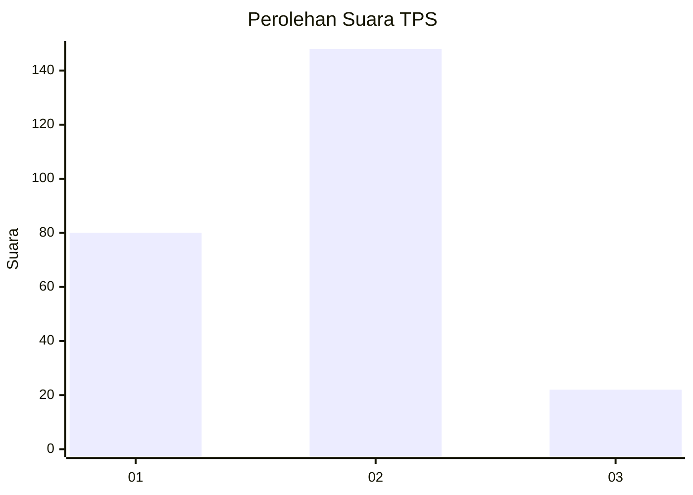
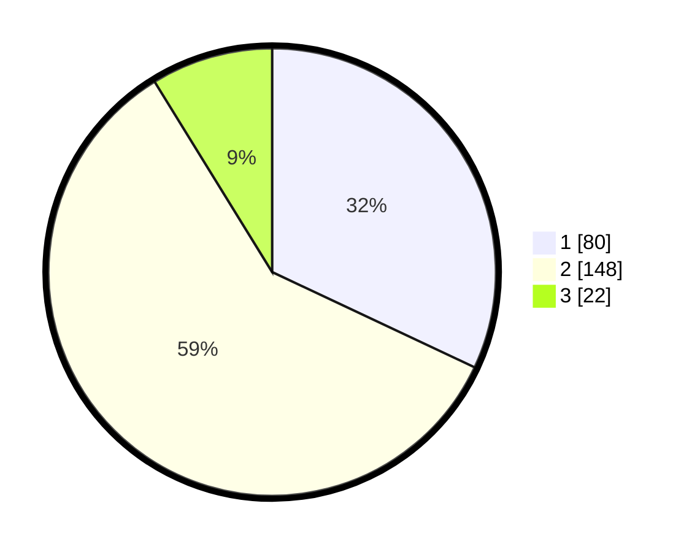

# Hasil

## Grafik

## Tabel

| No. | Nama Paslon    | Suara | Suara (raw) | Persentase |
|:--- |:-------------- | -----:| -----------:| ----------:|
| 1   | ANIES MUHAIMIN | 80    | [80][p-1]   | 32,00      |
| 2   | PRABOWO GIBRAN | 148   | [148][p-2]  | 59,20      |
| 3   | GANJAR MAHFUD  | 22    | [22][p-3]   | 8,80       |

[p-1]: https://github.com/gigit-pemilu/pemilu-2024-35-jawa-timur/blob/main/pilpres/hitung-suara/sub/35-jawa-timur/sub/11-bondowoso/sub/09-wonosari/sub/2007-bendoarum/sub/002-tps/sub/paslon-1.txt
[p-2]: https://github.com/gigit-pemilu/pemilu-2024-35-jawa-timur/blob/main/pilpres/hitung-suara/sub/35-jawa-timur/sub/11-bondowoso/sub/09-wonosari/sub/2007-bendoarum/sub/002-tps/sub/paslon-2.txt
[p-3]: https://github.com/gigit-pemilu/pemilu-2024-35-jawa-timur/blob/main/pilpres/hitung-suara/sub/35-jawa-timur/sub/11-bondowoso/sub/09-wonosari/sub/2007-bendoarum/sub/002-tps/sub/paslon-3.txt

## Foto C Plano

https://sirekap-obj-formc.kpu.go.id/0284/pemilu/ppwp/35/11/09/20/07/3511092007002-20240220-224531--b5a0e97f-d180-410f-8542-034f711a39d7.jpg

https://sirekap-obj-formc.kpu.go.id/0284/pemilu/ppwp/35/11/09/20/07/3511092007002-20240220-224610--193a7be9-07d3-4a78-85d8-167b6b6e8843.jpg

https://sirekap-obj-formc.kpu.go.id/0284/pemilu/ppwp/35/11/09/20/07/3511092007002-20240220-224719--2cd974ce-b7cf-4294-9399-0d51b4e6d141.jpg

## Metadata

| Key        | Value               |
| ---------- | ------------------- |
| Time Stamp | 2024-02-24 22:31:28 |

