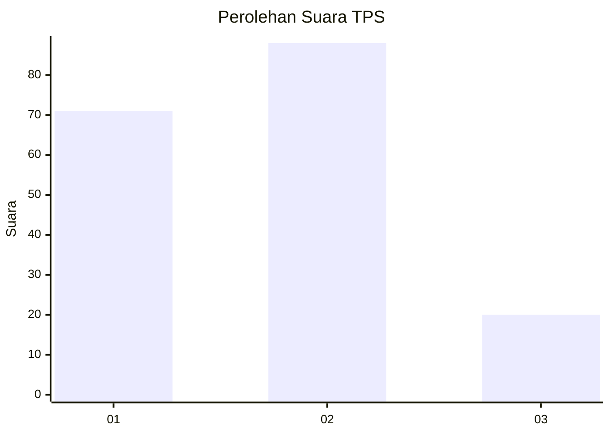
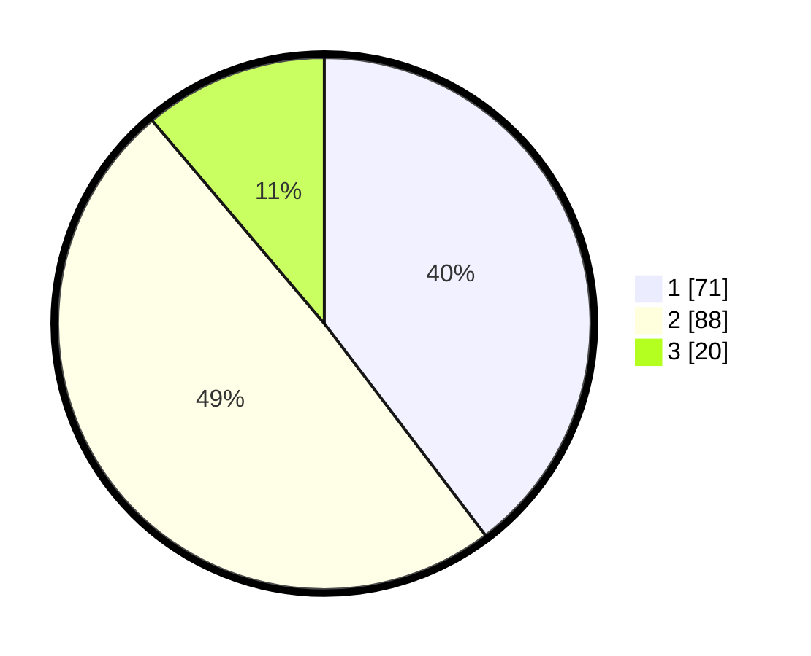

# Hasil

## Grafik

## Tabel

| No. | Nama Paslon    | Suara | Suara (raw) | Persentase |
|:--- |:-------------- | -----:| -----------:| ----------:|
| 1   | ANIES MUHAIMIN | 71    | [71][p-1]   | 39,66      |
| 2   | PRABOWO GIBRAN | 88    | [88][p-2]   | 49,16      |
| 3   | GANJAR MAHFUD  | 20    | [20][p-3]   | 11,17      |

[p-1]: https://github.com/gigit-pemilu/pemilu-2024/blob/main/pilpres/hitung-suara/sub/35-jawa-timur/sub/11-bondowoso/sub/09-wonosari/sub/2007-bendoarum/sub/006-tps/sub/paslon-1.txt
[p-2]: https://github.com/gigit-pemilu/pemilu-2024/blob/main/pilpres/hitung-suara/sub/35-jawa-timur/sub/11-bondowoso/sub/09-wonosari/sub/2007-bendoarum/sub/006-tps/sub/paslon-2.txt
[p-3]: https://github.com/gigit-pemilu/pemilu-2024/blob/main/pilpres/hitung-suara/sub/35-jawa-timur/sub/11-bondowoso/sub/09-wonosari/sub/2007-bendoarum/sub/006-tps/sub/paslon-3.txt

## Foto C Plano

https://sirekap-obj-formc.kpu.go.id/2bd4/pemilu/ppwp/35/11/09/20/07/3511092007006-20240216-123026--7572447b-cb96-4027-9d6a-8762afa7c611.jpg

https://sirekap-obj-formc.kpu.go.id/2bd4/pemilu/ppwp/35/11/09/20/07/3511092007006-20240216-123037--c09d4146-60f5-43e8-a8d6-199c1dc3ba3b.jpg

https://sirekap-obj-formc.kpu.go.id/2bd4/pemilu/ppwp/35/11/09/20/07/3511092007006-20240216-123044--3a1f5aa0-578b-4f00-b130-560fe3dc3c5a.jpg

## Metadata

| Key        | Value               |
| ---------- | ------------------- |
| Time Stamp | 2024-02-19 06:16:00 |

