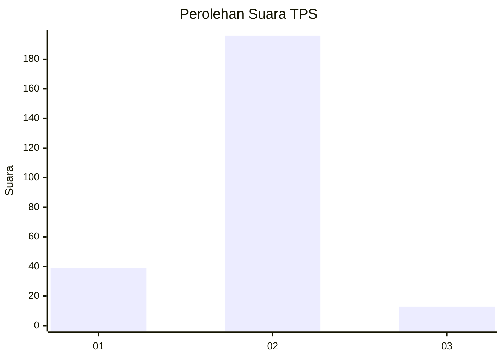
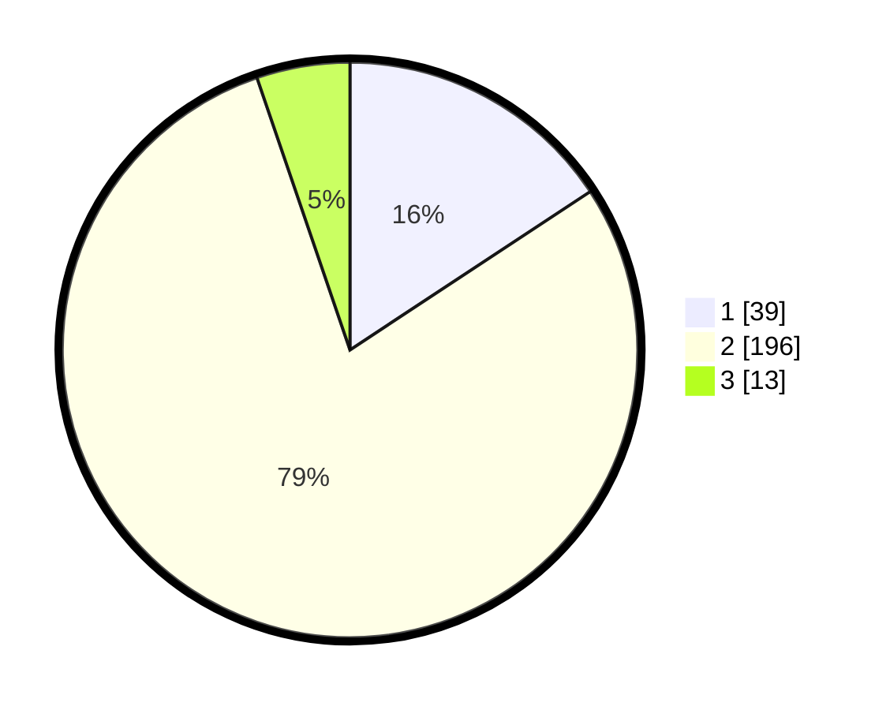

# Hasil

## Grafik

## Tabel

| No. | Nama Paslon    | Suara | Suara (raw) | Persentase |
|:--- |:-------------- | -----:| -----------:| ----------:|
| 1   | ANIES MUHAIMIN | 39    | [39][p-1]   | 15,73      |
| 2   | PRABOWO GIBRAN | 196   | [196][p-2]  | 79,03      |
| 3   | GANJAR MAHFUD  | 13    | [13][p-3]   | 5,24       |

[p-1]: https://github.com/gigit-pemilu/pemilu-2024/blob/main/pilpres/hitung-suara/sub/35-jawa-timur/sub/11-bondowoso/sub/09-wonosari/sub/2007-bendoarum/sub/012-tps/sub/paslon-1.txt
[p-2]: https://github.com/gigit-pemilu/pemilu-2024/blob/main/pilpres/hitung-suara/sub/35-jawa-timur/sub/11-bondowoso/sub/09-wonosari/sub/2007-bendoarum/sub/012-tps/sub/paslon-2.txt
[p-3]: https://github.com/gigit-pemilu/pemilu-2024/blob/main/pilpres/hitung-suara/sub/35-jawa-timur/sub/11-bondowoso/sub/09-wonosari/sub/2007-bendoarum/sub/012-tps/sub/paslon-3.txt

## Foto C Plano

https://sirekap-obj-formc.kpu.go.id/aeb9/pemilu/ppwp/35/11/09/20/07/3511092007012-20240215-051631--618d55c0-e50b-4333-9c91-9c4686d3f1f8.jpg

https://sirekap-obj-formc.kpu.go.id/aeb9/pemilu/ppwp/35/11/09/20/07/3511092007012-20240215-051724--1a764011-fbe8-4ed8-886c-d12187e0aead.jpg

https://sirekap-obj-formc.kpu.go.id/aeb9/pemilu/ppwp/35/11/09/20/07/3511092007012-20240215-051846--ae8c045d-b616-451a-830a-fb630906eeb9.jpg

## Metadata

| Key        | Value               |
| ---------- | ------------------- |
| Time Stamp | 2024-02-19 06:16:00 |

