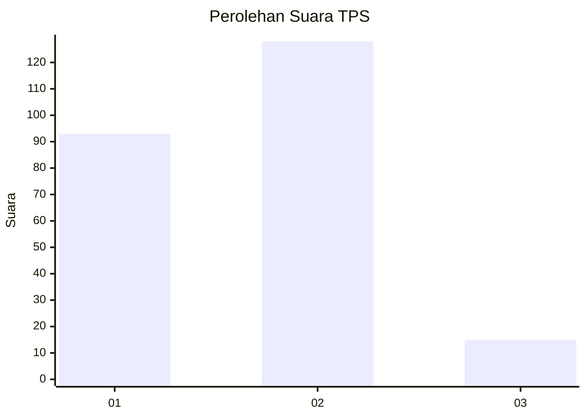

# Hasil

## Grafik

## Tabel

| No. | Nama Paslon    | Suara | Suara (raw) | Persentase |
|:--- |:-------------- | -----:| -----------:| ----------:|
| 1   | ANIES MUHAIMIN | 93    | [93][p-1]   | 39,41      |
| 2   | PRABOWO GIBRAN | 128   | [128][p-2]  | 54,24      |
| 3   | GANJAR MAHFUD  | 15    | [15][p-3]   | 6,36       |

[p-1]: https://github.com/gigit-pemilu/pemilu-2024-35-jawa-timur/blob/main/pilpres/hitung-suara/sub/35-jawa-timur/sub/11-bondowoso/sub/09-wonosari/sub/2008-kapuran/sub/007-tps/sub/paslon-1.txt
[p-2]: https://github.com/gigit-pemilu/pemilu-2024-35-jawa-timur/blob/main/pilpres/hitung-suara/sub/35-jawa-timur/sub/11-bondowoso/sub/09-wonosari/sub/2008-kapuran/sub/007-tps/sub/paslon-2.txt
[p-3]: https://github.com/gigit-pemilu/pemilu-2024-35-jawa-timur/blob/main/pilpres/hitung-suara/sub/35-jawa-timur/sub/11-bondowoso/sub/09-wonosari/sub/2008-kapuran/sub/007-tps/sub/paslon-3.txt

## Foto C Plano

https://sirekap-obj-formc.kpu.go.id/9d73/pemilu/ppwp/35/11/09/20/08/3511092008007-20240218-162234--748a67db-1195-48e2-9003-ea183c4a51d6.jpg

https://sirekap-obj-formc.kpu.go.id/9d73/pemilu/ppwp/35/11/09/20/08/3511092008007-20240219-145843--23415f81-b951-4714-852c-ff1a4950a9c3.jpg

https://sirekap-obj-formc.kpu.go.id/9d73/pemilu/ppwp/35/11/09/20/08/3511092008007-20240218-132233--d572a2ba-f150-4683-af00-ed903671935f.jpg

## Metadata

| Key        | Value               |
| ---------- | ------------------- |
| Time Stamp | 2024-02-19 15:00:00 |

