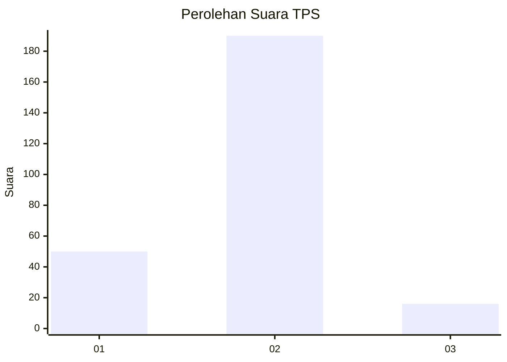
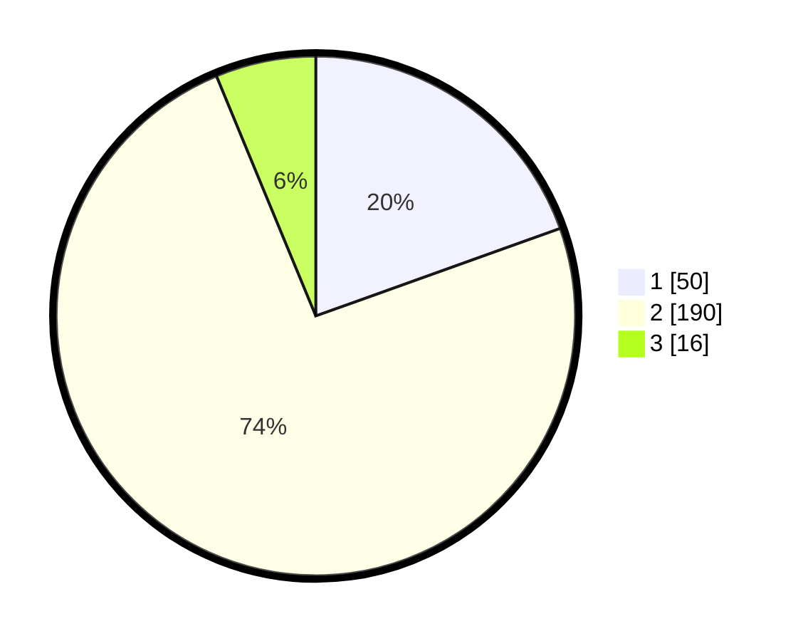

# Hasil

## Grafik

## Tabel

| No. | Nama Paslon    | Suara | Suara (raw) | Persentase |
|:--- |:-------------- | -----:| -----------:| ----------:|
| 1   | ANIES MUHAIMIN | 50    | [50][p-1]   | 19,53      |
| 2   | PRABOWO GIBRAN | 190   | [190][p-2]  | 74,22      |
| 3   | GANJAR MAHFUD  | 16    | [16][p-3]   | 6,25       |

[p-1]: https://github.com/gigit-pemilu/pemilu-2024-35-jawa-timur/blob/main/pilpres/hitung-suara/sub/35-jawa-timur/sub/11-bondowoso/sub/09-wonosari/sub/2009-sumberkalong/sub/011-tps/sub/paslon-1.txt
[p-2]: https://github.com/gigit-pemilu/pemilu-2024-35-jawa-timur/blob/main/pilpres/hitung-suara/sub/35-jawa-timur/sub/11-bondowoso/sub/09-wonosari/sub/2009-sumberkalong/sub/011-tps/sub/paslon-2.txt
[p-3]: https://github.com/gigit-pemilu/pemilu-2024-35-jawa-timur/blob/main/pilpres/hitung-suara/sub/35-jawa-timur/sub/11-bondowoso/sub/09-wonosari/sub/2009-sumberkalong/sub/011-tps/sub/paslon-3.txt

## Foto C Plano

https://sirekap-obj-formc.kpu.go.id/8d19/pemilu/ppwp/35/11/09/20/09/3511092009011-20240214-210404--b784fb7c-8e18-4f68-8011-2755439dce0c.jpg

https://sirekap-obj-formc.kpu.go.id/8d19/pemilu/ppwp/35/11/09/20/09/3511092009011-20240214-223930--66ea31ac-6ad9-4553-8e68-25228f3e11f1.jpg

https://sirekap-obj-formc.kpu.go.id/8d19/pemilu/ppwp/35/11/09/20/09/3511092009011-20240214-205953--fd800b6e-b6b3-4ad4-852e-e93b59d77a44.jpg

## Metadata

| Key        | Value               |
| ---------- | ------------------- |
| Time Stamp | 2024-02-15 12:00:28 |

