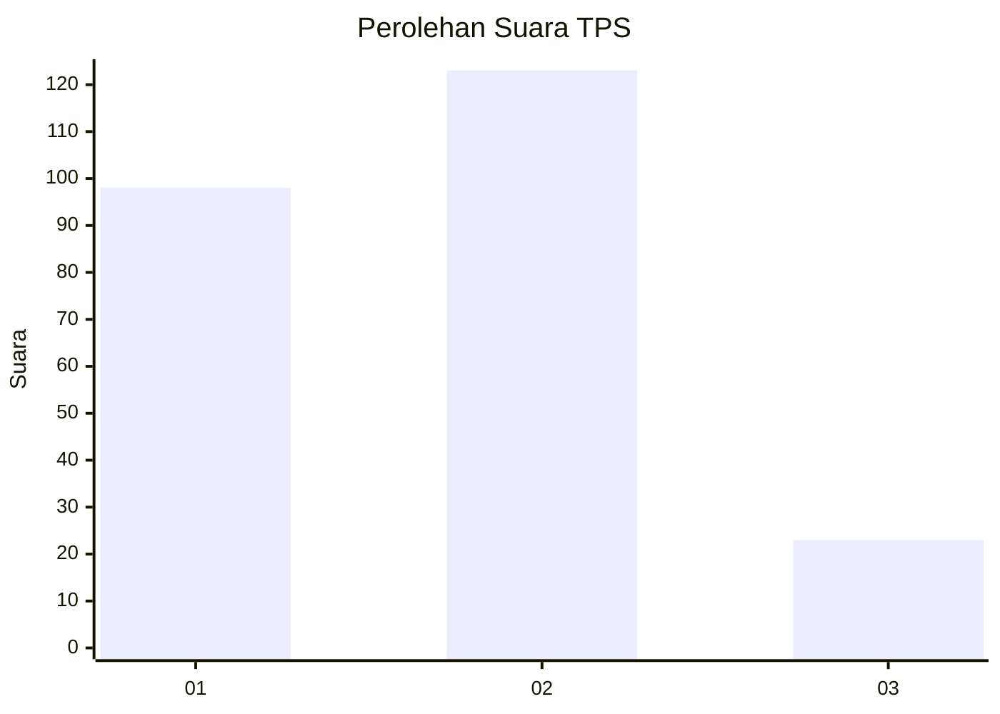
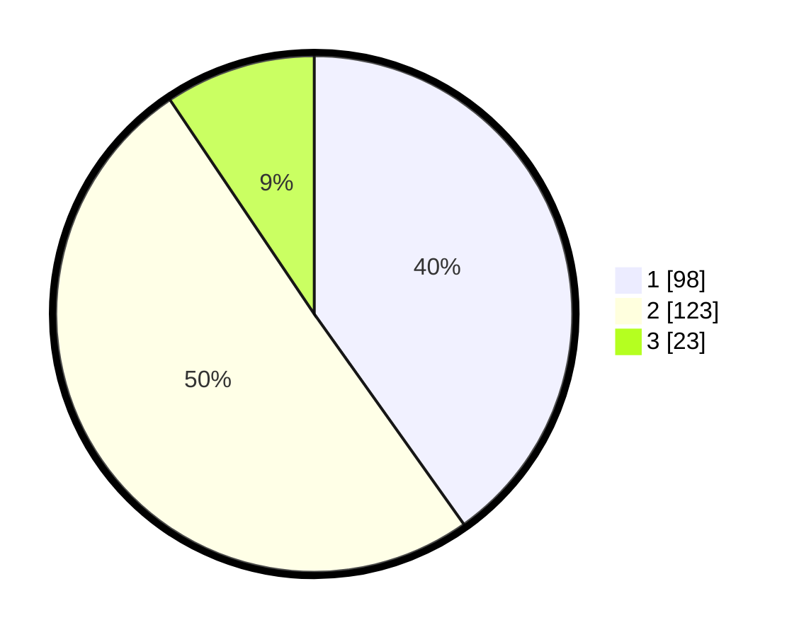

# Hasil

## Grafik

## Tabel

| No. | Nama Paslon    | Suara | Suara (raw) | Persentase |
|:--- |:-------------- | -----:| -----------:| ----------:|
| 1   | ANIES MUHAIMIN | 98    | [98][p-1]   | 40,16      |
| 2   | PRABOWO GIBRAN | 123   | [123][p-2]  | 50,41      |
| 3   | GANJAR MAHFUD  | 23    | [23][p-3]   | 9,43       |

[p-1]: https://github.com/gigit-pemilu/pemilu-2024/blob/main/pilpres/hitung-suara/sub/35-jawa-timur/sub/11-bondowoso/sub/09-wonosari/sub/2010-traktakan/sub/002-tps/sub/paslon-1.txt
[p-2]: https://github.com/gigit-pemilu/pemilu-2024/blob/main/pilpres/hitung-suara/sub/35-jawa-timur/sub/11-bondowoso/sub/09-wonosari/sub/2010-traktakan/sub/002-tps/sub/paslon-2.txt
[p-3]: https://github.com/gigit-pemilu/pemilu-2024/blob/main/pilpres/hitung-suara/sub/35-jawa-timur/sub/11-bondowoso/sub/09-wonosari/sub/2010-traktakan/sub/002-tps/sub/paslon-3.txt

## Foto C Plano

https://sirekap-obj-formc.kpu.go.id/2527/pemilu/ppwp/35/11/09/20/10/3511092010002-20240214-204330--c61cc701-cfb6-4abd-8bfa-71fdae31d42b.jpg

https://sirekap-obj-formc.kpu.go.id/2527/pemilu/ppwp/35/11/09/20/10/3511092010002-20240214-204403--ca75ee10-3133-454a-b65d-278cf1a024b9.jpg

https://sirekap-obj-formc.kpu.go.id/2527/pemilu/ppwp/35/11/09/20/10/3511092010002-20240214-204450--1a0e7328-1f09-4273-a586-f994404c267e.jpg

## Metadata

| Key        | Value               |
| ---------- | ------------------- |
| Time Stamp | 2024-02-19 06:16:00 |

