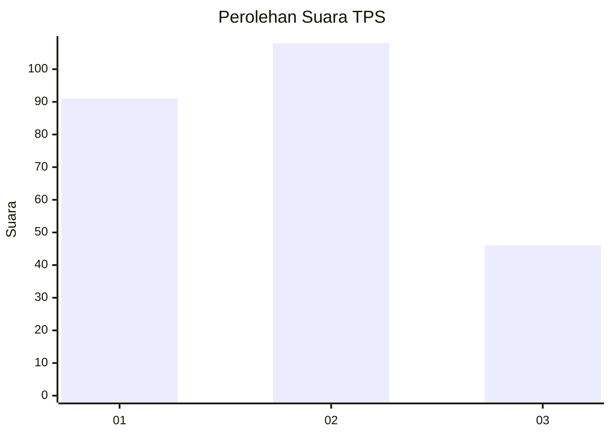
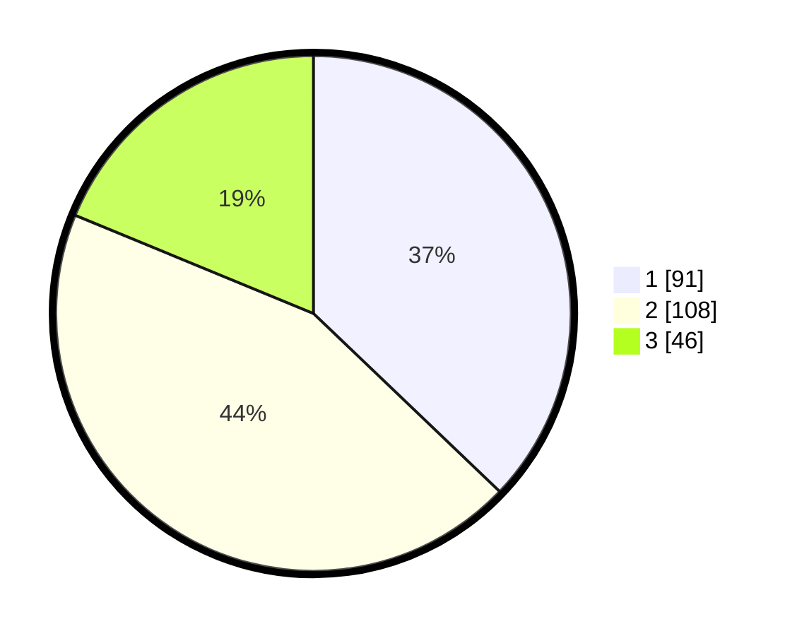

# Hasil

## Grafik

## Tabel

| No. | Nama Paslon    | Suara | Suara (raw) | Persentase |
|:--- |:-------------- | -----:| -----------:| ----------:|
| 1   | ANIES MUHAIMIN | 91    | [91][p-1]   | 37,14      |
| 2   | PRABOWO GIBRAN | 108   | [108][p-2]  | 44,08      |
| 3   | GANJAR MAHFUD  | 46    | [46][p-3]   | 18,78      |

[p-1]: https://github.com/gigit-pemilu/pemilu-2024/blob/main/pilpres/hitung-suara/sub/35-jawa-timur/sub/11-bondowoso/sub/09-wonosari/sub/2010-traktakan/sub/003-tps/sub/paslon-1.txt
[p-2]: https://github.com/gigit-pemilu/pemilu-2024/blob/main/pilpres/hitung-suara/sub/35-jawa-timur/sub/11-bondowoso/sub/09-wonosari/sub/2010-traktakan/sub/003-tps/sub/paslon-2.txt
[p-3]: https://github.com/gigit-pemilu/pemilu-2024/blob/main/pilpres/hitung-suara/sub/35-jawa-timur/sub/11-bondowoso/sub/09-wonosari/sub/2010-traktakan/sub/003-tps/sub/paslon-3.txt

## Foto C Plano

https://sirekap-obj-formc.kpu.go.id/f7a0/pemilu/ppwp/35/11/09/20/10/3511092010003-20240218-152939--c6f2e29b-7c7c-465d-8048-45b5dccc1785.jpg

https://sirekap-obj-formc.kpu.go.id/f7a0/pemilu/ppwp/35/11/09/20/10/3511092010003-20240219-141301--a3fa9198-37d9-49c4-9d40-2ab1d99de833.jpg

https://sirekap-obj-formc.kpu.go.id/f7a0/pemilu/ppwp/35/11/09/20/10/3511092010003-20240219-141453--f6749ce6-aeb5-417f-99e7-82d0f2763c53.jpg

## Metadata

| Key        | Value               |
| ---------- | ------------------- |
| Time Stamp | 2024-02-19 22:00:00 |

