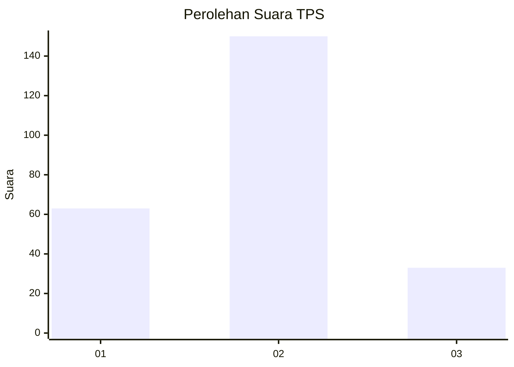
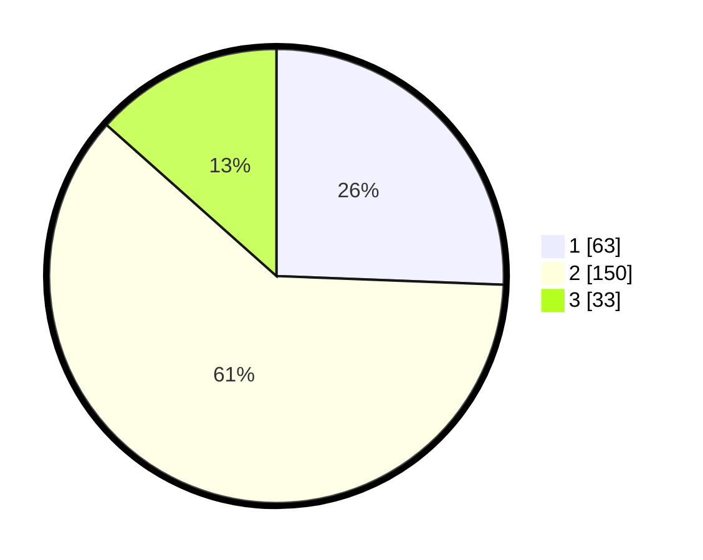

# Hasil

## Grafik

## Tabel

| No. | Nama Paslon    | Suara | Suara (raw) | Persentase |
|:--- |:-------------- | -----:| -----------:| ----------:|
| 1   | ANIES MUHAIMIN | 63    | [63][p-1]   | 25,61      |
| 2   | PRABOWO GIBRAN | 150   | [150][p-2]  | 60,98      |
| 3   | GANJAR MAHFUD  | 33    | [33][p-3]   | 13,41      |

[p-1]: https://github.com/gigit-pemilu/pemilu-2024-35-jawa-timur/blob/main/pilpres/hitung-suara/sub/35-jawa-timur/sub/11-bondowoso/sub/11-bondowoso/sub/1004-nangkaan/sub/002-tps/sub/paslon-1.txt
[p-2]: https://github.com/gigit-pemilu/pemilu-2024-35-jawa-timur/blob/main/pilpres/hitung-suara/sub/35-jawa-timur/sub/11-bondowoso/sub/11-bondowoso/sub/1004-nangkaan/sub/002-tps/sub/paslon-2.txt
[p-3]: https://github.com/gigit-pemilu/pemilu-2024-35-jawa-timur/blob/main/pilpres/hitung-suara/sub/35-jawa-timur/sub/11-bondowoso/sub/11-bondowoso/sub/1004-nangkaan/sub/002-tps/sub/paslon-3.txt

## Foto C Plano

https://sirekap-obj-formc.kpu.go.id/9a6f/pemilu/ppwp/35/11/11/10/04/3511111004002-20240214-212527--d4e1311d-345b-48a5-a7b4-086075254212.jpg

https://sirekap-obj-formc.kpu.go.id/9a6f/pemilu/ppwp/35/11/11/10/04/3511111004002-20240214-212938--26e25cde-6723-495c-a155-c90a4a49827d.jpg

https://sirekap-obj-formc.kpu.go.id/9a6f/pemilu/ppwp/35/11/11/10/04/3511111004002-20240214-213203--a02fb60c-2271-4e3a-b3e2-3ec1e70028df.jpg

## Metadata

| Key        | Value               |
| ---------- | ------------------- |
| Time Stamp | 2024-02-19 06:16:00 |

