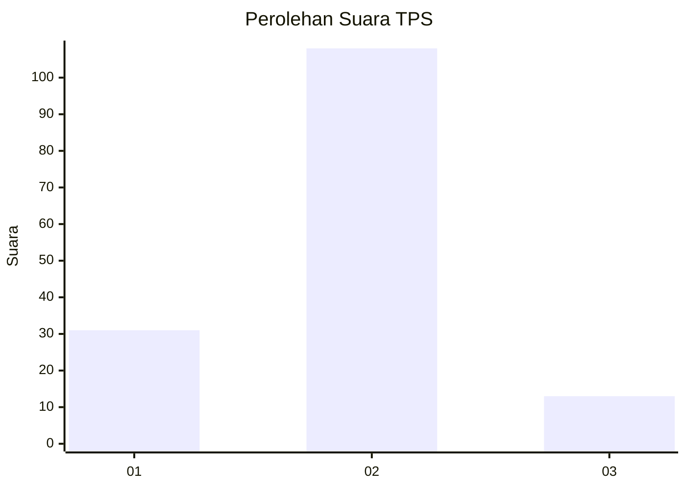
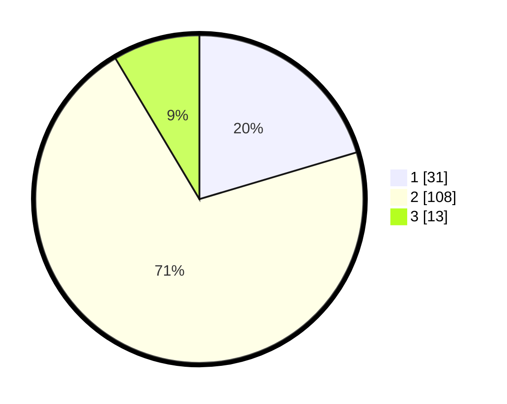

# Hasil

## Grafik

## Tabel

| No. | Nama Paslon    | Suara | Suara (raw) | Persentase |
|:--- |:-------------- | -----:| -----------:| ----------:|
| 1   | ANIES MUHAIMIN | 31    | [31][p-1]   | 20,39      |
| 2   | PRABOWO GIBRAN | 108   | [108][p-2]  | 71,05      |
| 3   | GANJAR MAHFUD  | 13    | [13][p-3]   | 8,55       |

[p-1]: https://github.com/gigit-pemilu/pemilu-2024/blob/main/pilpres/hitung-suara/sub/35-jawa-timur/sub/11-bondowoso/sub/11-bondowoso/sub/1004-nangkaan/sub/005-tps/sub/paslon-1.txt
[p-2]: https://github.com/gigit-pemilu/pemilu-2024/blob/main/pilpres/hitung-suara/sub/35-jawa-timur/sub/11-bondowoso/sub/11-bondowoso/sub/1004-nangkaan/sub/005-tps/sub/paslon-2.txt
[p-3]: https://github.com/gigit-pemilu/pemilu-2024/blob/main/pilpres/hitung-suara/sub/35-jawa-timur/sub/11-bondowoso/sub/11-bondowoso/sub/1004-nangkaan/sub/005-tps/sub/paslon-3.txt

## Foto C Plano

https://sirekap-obj-formc.kpu.go.id/71af/pemilu/ppwp/35/11/11/10/04/3511111004005-20240214-232833--b11bad7f-bcba-4d1b-815f-dbb50e989841.jpg

https://sirekap-obj-formc.kpu.go.id/71af/pemilu/ppwp/35/11/11/10/04/3511111004005-20240214-233114--5a08cbb9-8bee-4e27-b53c-e59e76bdc90e.jpg

https://sirekap-obj-formc.kpu.go.id/71af/pemilu/ppwp/35/11/11/10/04/3511111004005-20240214-233306--e666efe4-c03a-41c4-b878-129300404ab0.jpg

## Metadata

| Key        | Value               |
| ---------- | ------------------- |
| Time Stamp | 2024-02-16 21:01:00 |

## DATA PEMILIH TETAP

Jumlah pemilih dalam DPT: **162**.
 * L: **75**.
 * P: **87**.

## DATA PENGGUNA HAK PILIH

Jumlah pengguna hak pilih dalam DPT: **143**.
 * L: **69**.
 * P: **79**.

Jumlah pengguna hak pilih dalam DPTb: **7**.
 * L: **5**.
 * P: **0**.

Jumlah pengguna hak pilih dalam DPK: **4**.
 * L: **2**.
 * P: **2**.

Jumlah pengguna hak pilih: **154**.
 * L: **76**.
 * P: **78**.

## JUMLAH SUARA SAH DAN TIDAK SAH

JUMLAH SELURUH SUARA SAH: **152**.

JUMLAH SUARA TIDAK SAH: **2**.

JUMLAH SELURUH SUARA SAH DAN SUARA TIDAK SAH: **154**.

