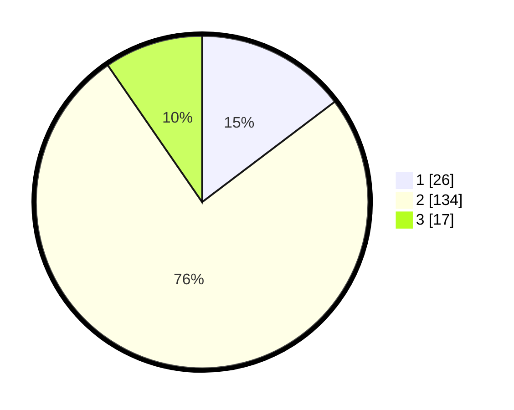

# Hasil

## Grafik

## Tabel

| No. | Nama Paslon    | Suara | Suara (raw) | Persentase |
|:--- |:-------------- | -----:| -----------:| ----------:|
| 1   | ANIES MUHAIMIN | 26    | [26][p-1]   | 14,69      |
| 2   | PRABOWO GIBRAN | 134   | [134][p-2]  | 75,71      |
| 3   | GANJAR MAHFUD  | 17    | [17][p-3]   | 9,60       |

[p-1]: https://github.com/gigit-pemilu/pemilu-2024-35-jawa-timur/blob/main/pilpres/hitung-suara/sub/35-jawa-timur/sub/11-bondowoso/sub/11-bondowoso/sub/1004-nangkaan/sub/009-tps/sub/paslon-1.txt
[p-2]: https://github.com/gigit-pemilu/pemilu-2024-35-jawa-timur/blob/main/pilpres/hitung-suara/sub/35-jawa-timur/sub/11-bondowoso/sub/11-bondowoso/sub/1004-nangkaan/sub/009-tps/sub/paslon-2.txt
[p-3]: https://github.com/gigit-pemilu/pemilu-2024-35-jawa-timur/blob/main/pilpres/hitung-suara/sub/35-jawa-timur/sub/11-bondowoso/sub/11-bondowoso/sub/1004-nangkaan/sub/009-tps/sub/paslon-3.txt

## Foto C Plano

https://sirekap-obj-formc.kpu.go.id/49ec/pemilu/ppwp/35/11/11/10/04/3511111004009-20240215-002134--4d2072ea-c32b-4cf4-a644-f955683681a6.jpg

https://sirekap-obj-formc.kpu.go.id/49ec/pemilu/ppwp/35/11/11/10/04/3511111004009-20240215-002343--9c950752-d931-4176-856d-ab3b2e4f33ad.jpg

https://sirekap-obj-formc.kpu.go.id/49ec/pemilu/ppwp/35/11/11/10/04/3511111004009-20240215-002508--eacbeb8a-f5f7-4d8f-b234-a21c36bac925.jpg

## Metadata

| Key        | Value               |
| ---------- | ------------------- |
| Time Stamp | 2024-02-19 06:16:00 |

