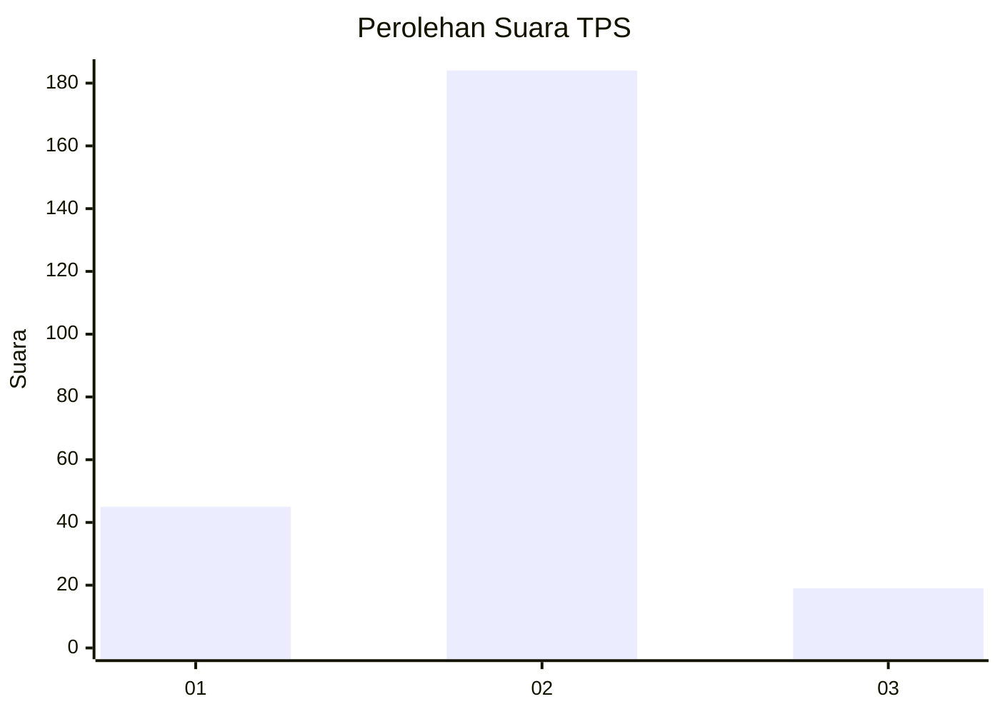
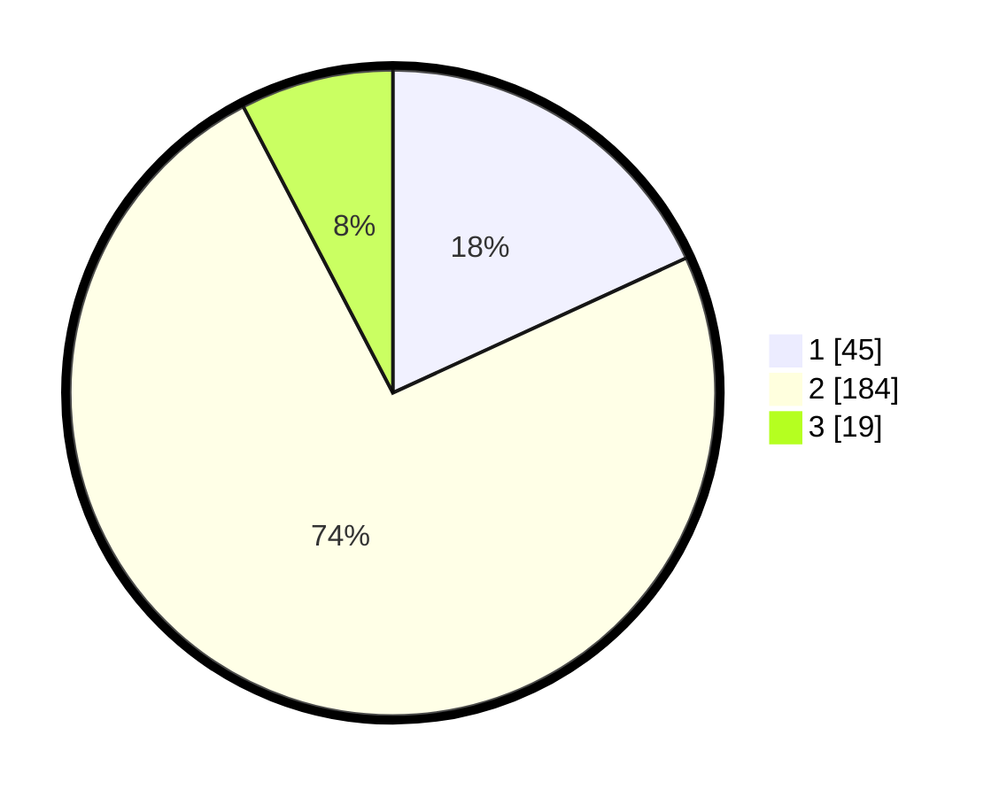

# Hasil

## Grafik

## Tabel

| No. | Nama Paslon    | Suara | Suara (raw) | Persentase |
|:--- |:-------------- | -----:| -----------:| ----------:|
| 1   | ANIES MUHAIMIN | 45    | [45][p-1]   | 18,15      |
| 2   | PRABOWO GIBRAN | 184   | [184][p-2]  | 74,19      |
| 3   | GANJAR MAHFUD  | 19    | [19][p-3]   | 7,66       |

[p-1]: https://github.com/gigit-pemilu/pemilu-2024/blob/main/pilpres/hitung-suara/sub/35-jawa-timur/sub/11-bondowoso/sub/11-bondowoso/sub/1004-nangkaan/sub/014-tps/sub/paslon-1.txt
[p-2]: https://github.com/gigit-pemilu/pemilu-2024/blob/main/pilpres/hitung-suara/sub/35-jawa-timur/sub/11-bondowoso/sub/11-bondowoso/sub/1004-nangkaan/sub/014-tps/sub/paslon-2.txt
[p-3]: https://github.com/gigit-pemilu/pemilu-2024/blob/main/pilpres/hitung-suara/sub/35-jawa-timur/sub/11-bondowoso/sub/11-bondowoso/sub/1004-nangkaan/sub/014-tps/sub/paslon-3.txt

## Foto C Plano

https://sirekap-obj-formc.kpu.go.id/7bf1/pemilu/ppwp/35/11/11/10/04/3511111004014-20240216-185935--91b0575f-cea6-4511-87d0-cd2556861a93.jpg

https://sirekap-obj-formc.kpu.go.id/7bf1/pemilu/ppwp/35/11/11/10/04/3511111004014-20240215-005955--59234c61-619e-4b31-84e5-8875ea6cbd69.jpg

https://sirekap-obj-formc.kpu.go.id/7bf1/pemilu/ppwp/35/11/11/10/04/3511111004014-20240215-010122--068e4dea-e373-48c6-bb9f-a53b3d7bc041.jpg

## Metadata

| Key        | Value               |
| ---------- | ------------------- |
| Time Stamp | 2024-02-19 10:00:00 |

