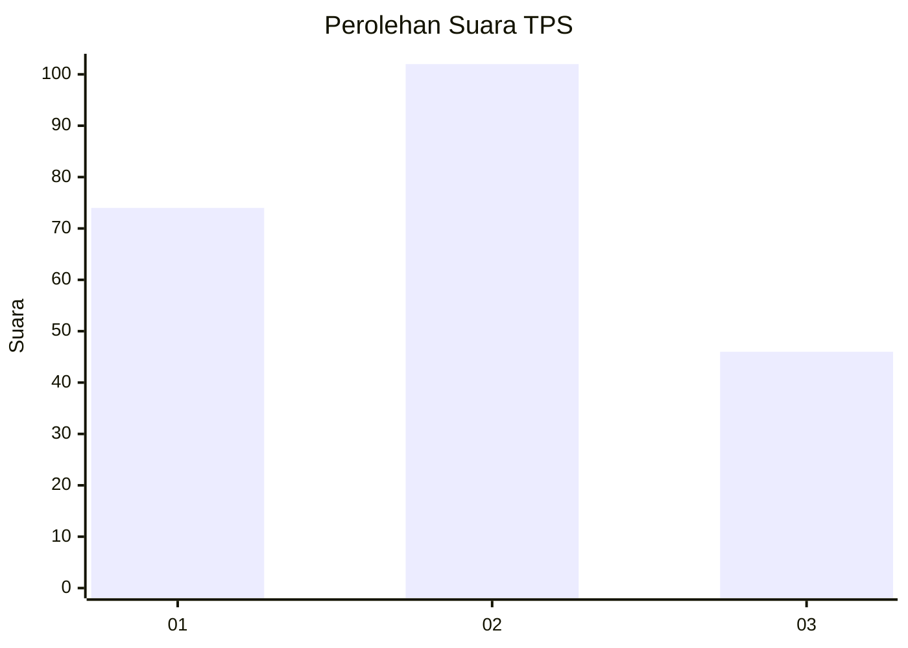
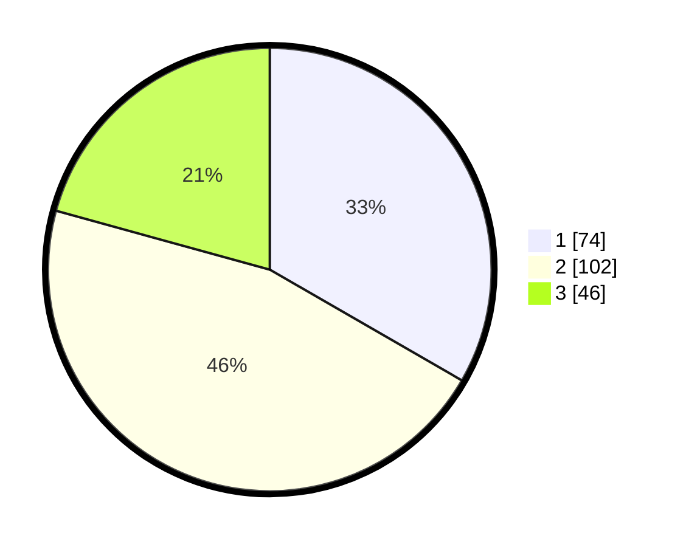

# Hasil

## Grafik

## Tabel

| No. | Nama Paslon    | Suara | Suara (raw) | Persentase |
|:--- |:-------------- | -----:| -----------:| ----------:|
| 1   | ANIES MUHAIMIN | 74    | [74][p-1]   | 33,33      |
| 2   | PRABOWO GIBRAN | 102   | [102][p-2]  | 45,95      |
| 3   | GANJAR MAHFUD  | 46    | [46][p-3]   | 20,72      |

[p-1]: https://github.com/gigit-pemilu/pemilu-2024/blob/main/pilpres/hitung-suara/sub/35-jawa-timur/sub/11-bondowoso/sub/11-bondowoso/sub/1005-tamansari/sub/009-tps/sub/paslon-1.txt
[p-2]: https://github.com/gigit-pemilu/pemilu-2024/blob/main/pilpres/hitung-suara/sub/35-jawa-timur/sub/11-bondowoso/sub/11-bondowoso/sub/1005-tamansari/sub/009-tps/sub/paslon-2.txt
[p-3]: https://github.com/gigit-pemilu/pemilu-2024/blob/main/pilpres/hitung-suara/sub/35-jawa-timur/sub/11-bondowoso/sub/11-bondowoso/sub/1005-tamansari/sub/009-tps/sub/paslon-3.txt

## Foto C Plano

https://sirekap-obj-formc.kpu.go.id/32d5/pemilu/ppwp/35/11/11/10/05/3511111005009-20240214-223109--6a793f62-cf76-4c09-91f8-b4a42c821522.jpg

https://sirekap-obj-formc.kpu.go.id/32d5/pemilu/ppwp/35/11/11/10/05/3511111005009-20240214-233113--3bab818e-d7ed-4006-bc7c-73114008f87e.jpg

https://sirekap-obj-formc.kpu.go.id/32d5/pemilu/ppwp/35/11/11/10/05/3511111005009-20240214-233219--cf14c6b5-7f42-404e-8ec2-31aa3b631cbf.jpg

## Metadata

| Key        | Value               |
| ---------- | ------------------- |
| Time Stamp | 2024-02-16 13:30:32 |

