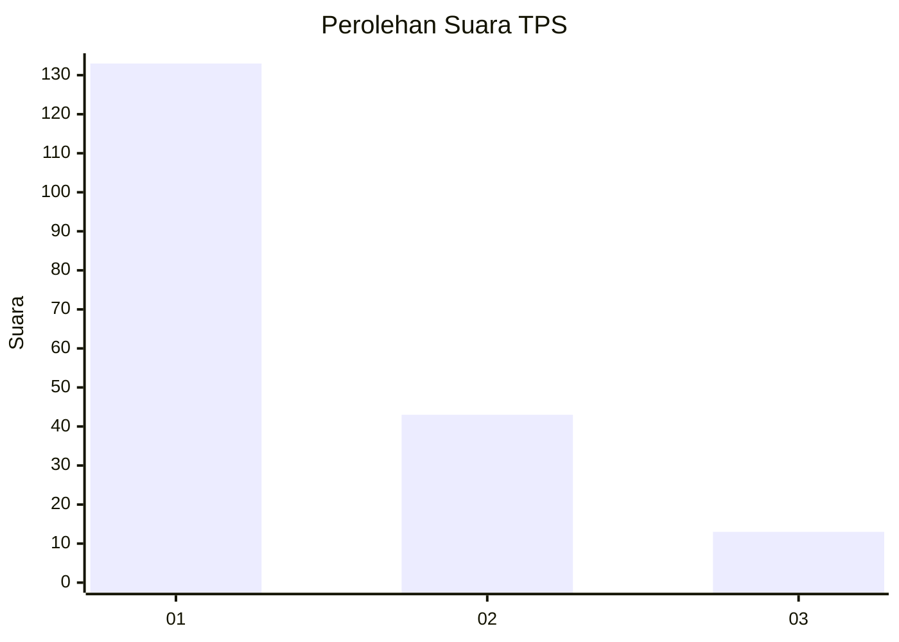
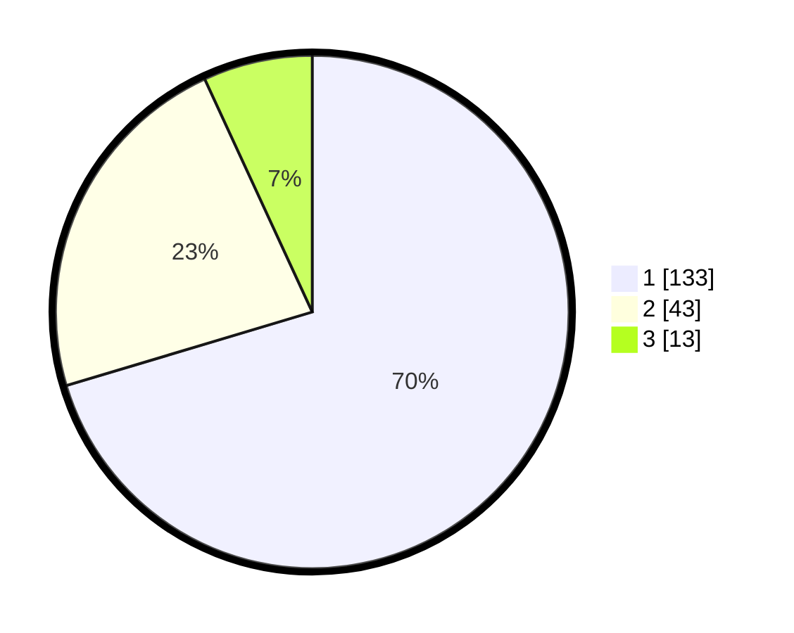

# Hasil

## Grafik

## Tabel

| No. | Nama Paslon    | Suara | Suara (raw) | Persentase |
|:--- |:-------------- | -----:| -----------:| ----------:|
| 1   | ANIES MUHAIMIN | 133   | [133][p-1]  | 70,37      |
| 2   | PRABOWO GIBRAN | 43    | [43][p-2]   | 22,75      |
| 3   | GANJAR MAHFUD  | 13    | [13][p-3]   | 6,88       |

[p-1]: https://github.com/gigit-pemilu/pemilu-2024-35-jawa-timur/blob/main/pilpres/hitung-suara/sub/35-jawa-timur/sub/11-bondowoso/sub/11-bondowoso/sub/1006-kademangan/sub/014-tps/sub/paslon-1.txt
[p-2]: https://github.com/gigit-pemilu/pemilu-2024-35-jawa-timur/blob/main/pilpres/hitung-suara/sub/35-jawa-timur/sub/11-bondowoso/sub/11-bondowoso/sub/1006-kademangan/sub/014-tps/sub/paslon-2.txt
[p-3]: https://github.com/gigit-pemilu/pemilu-2024-35-jawa-timur/blob/main/pilpres/hitung-suara/sub/35-jawa-timur/sub/11-bondowoso/sub/11-bondowoso/sub/1006-kademangan/sub/014-tps/sub/paslon-3.txt

## Foto C Plano

https://sirekap-obj-formc.kpu.go.id/ab23/pemilu/ppwp/35/11/11/10/06/3511111006014-20240214-214708--420e34eb-d503-4da4-a6ea-8c1fc51cf68b.jpg

https://sirekap-obj-formc.kpu.go.id/ab23/pemilu/ppwp/35/11/11/10/06/3511111006014-20240214-215043--2dd26c9c-0a7e-437e-8f15-bcb651d42066.jpg

https://sirekap-obj-formc.kpu.go.id/ab23/pemilu/ppwp/35/11/11/10/06/3511111006014-20240214-215127--79fb474d-7da0-44f7-b286-9a1ce1e82f10.jpg

## Metadata

| Key        | Value               |
| ---------- | ------------------- |
| Time Stamp | 2024-02-16 13:30:32 |

