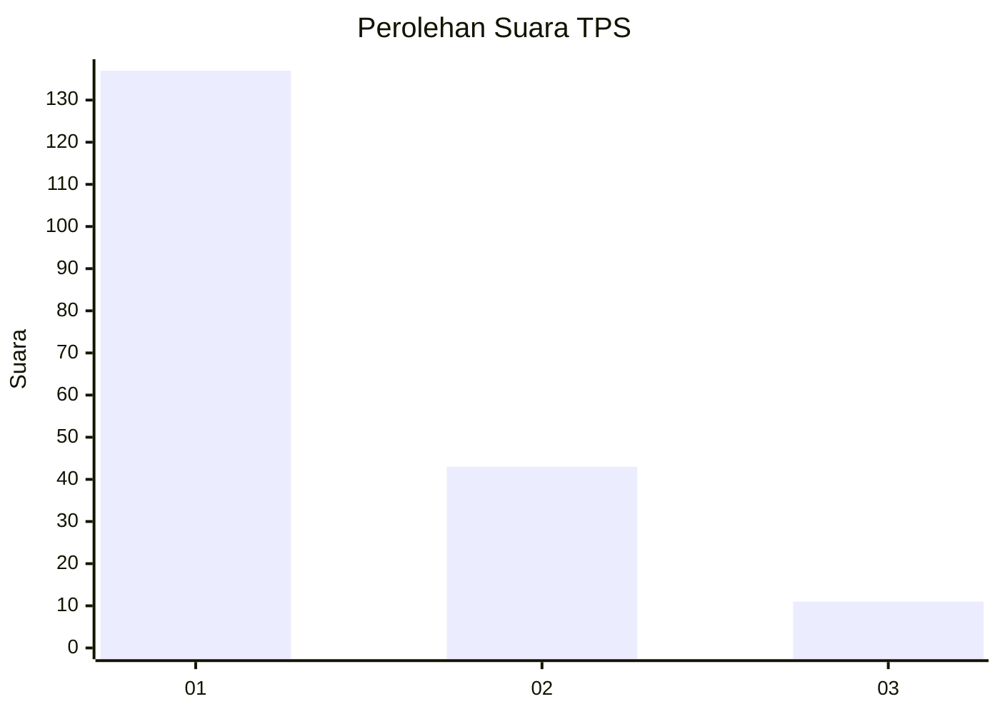
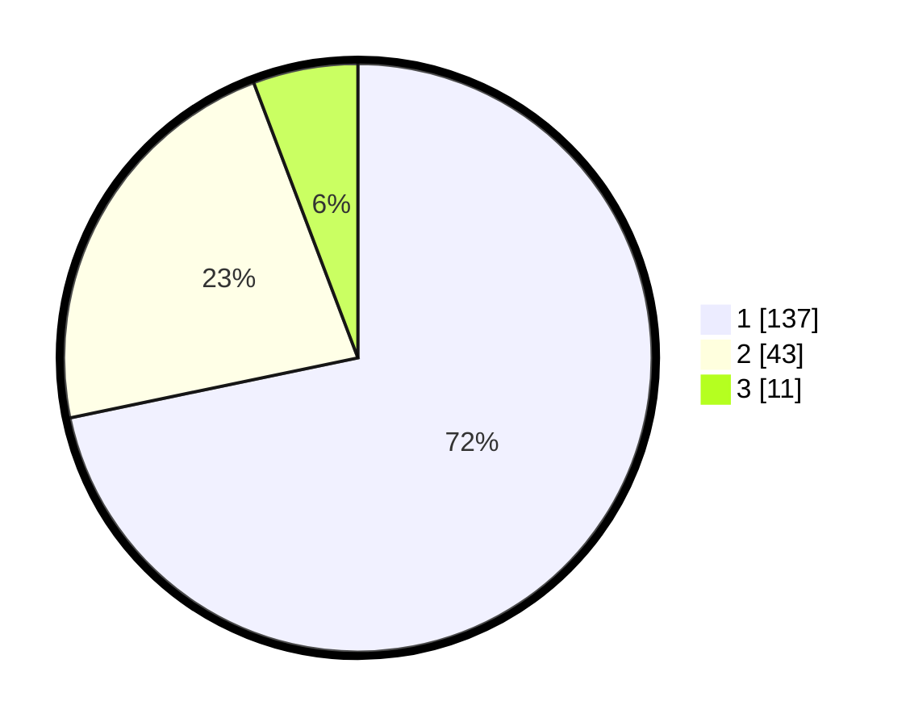

# Hasil

## Grafik

## Tabel

| No. | Nama Paslon    | Suara | Suara (raw) | Persentase |
|:--- |:-------------- | -----:| -----------:| ----------:|
| 1   | ANIES MUHAIMIN | 137   | [137][p-1]  | 71,73      |
| 2   | PRABOWO GIBRAN | 43    | [43][p-2]   | 22,51      |
| 3   | GANJAR MAHFUD  | 11    | [11][p-3]   | 5,76       |

[p-1]: https://github.com/gigit-pemilu/pemilu-2024/blob/main/pilpres/hitung-suara/sub/35-jawa-timur/sub/11-bondowoso/sub/11-bondowoso/sub/1006-kademangan/sub/019-tps/sub/paslon-1.txt
[p-2]: https://github.com/gigit-pemilu/pemilu-2024/blob/main/pilpres/hitung-suara/sub/35-jawa-timur/sub/11-bondowoso/sub/11-bondowoso/sub/1006-kademangan/sub/019-tps/sub/paslon-2.txt
[p-3]: https://github.com/gigit-pemilu/pemilu-2024/blob/main/pilpres/hitung-suara/sub/35-jawa-timur/sub/11-bondowoso/sub/11-bondowoso/sub/1006-kademangan/sub/019-tps/sub/paslon-3.txt

## Foto C Plano

https://sirekap-obj-formc.kpu.go.id/2cad/pemilu/ppwp/35/11/11/10/06/3511111006019-20240216-191519--8c42ecf5-6556-427a-a0f2-04dc1df1444f.jpg

https://sirekap-obj-formc.kpu.go.id/2cad/pemilu/ppwp/35/11/11/10/06/3511111006019-20240216-191719--6d7d5aeb-6bd9-4000-b88e-fca640a05106.jpg

https://sirekap-obj-formc.kpu.go.id/2cad/pemilu/ppwp/35/11/11/10/06/3511111006019-20240215-034429--ed8ae435-045c-4642-96e4-d96a408f15be.jpg

## Metadata

| Key        | Value               |
| ---------- | ------------------- |
| Time Stamp | 2024-02-19 10:00:00 |

