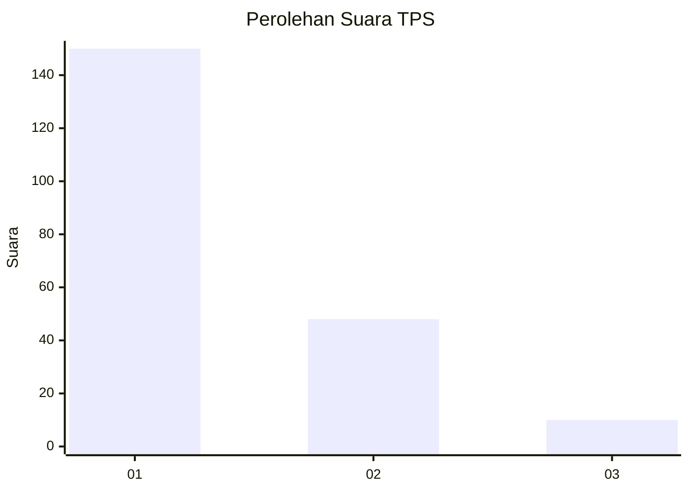
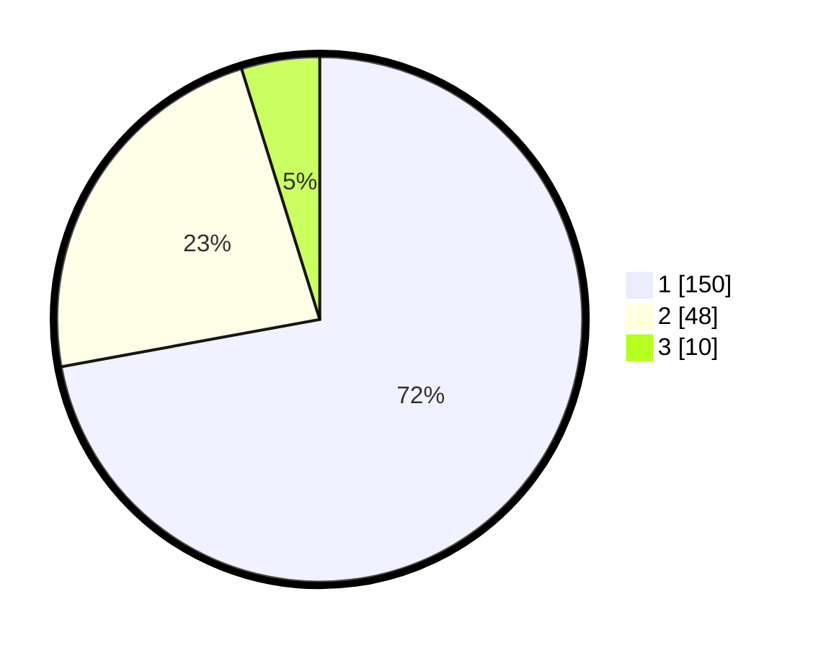

# Hasil

## Grafik

## Tabel

| No. | Nama Paslon    | Suara | Suara (raw) | Persentase |
|:--- |:-------------- | -----:| -----------:| ----------:|
| 1   | ANIES MUHAIMIN | 150   | [150][p-1]  | 72,12      |
| 2   | PRABOWO GIBRAN | 48    | [48][p-2]   | 23,08      |
| 3   | GANJAR MAHFUD  | 10    | [10][p-3]   | 4,81       |

[p-1]: https://github.com/gigit-pemilu/pemilu-2024/blob/main/pilpres/hitung-suara/sub/35-jawa-timur/sub/11-bondowoso/sub/11-bondowoso/sub/1006-kademangan/sub/020-tps/sub/paslon-1.txt
[p-2]: https://github.com/gigit-pemilu/pemilu-2024/blob/main/pilpres/hitung-suara/sub/35-jawa-timur/sub/11-bondowoso/sub/11-bondowoso/sub/1006-kademangan/sub/020-tps/sub/paslon-2.txt
[p-3]: https://github.com/gigit-pemilu/pemilu-2024/blob/main/pilpres/hitung-suara/sub/35-jawa-timur/sub/11-bondowoso/sub/11-bondowoso/sub/1006-kademangan/sub/020-tps/sub/paslon-3.txt

## Foto C Plano

https://sirekap-obj-formc.kpu.go.id/3d21/pemilu/ppwp/35/11/11/10/06/3511111006020-20240215-014509--bb0f18fb-989c-49db-b265-a0048caccf13.jpg

https://sirekap-obj-formc.kpu.go.id/3d21/pemilu/ppwp/35/11/11/10/06/3511111006020-20240215-014353--7c157606-f5d5-4a5b-a9b8-ebda43f355fb.jpg

https://sirekap-obj-formc.kpu.go.id/3d21/pemilu/ppwp/35/11/11/10/06/3511111006020-20240215-014217--ba123ef6-e9e0-43e1-abc0-a9624cbf19a3.jpg

## Metadata

| Key        | Value               |
| ---------- | ------------------- |
| Time Stamp | 2024-02-16 13:30:32 |

