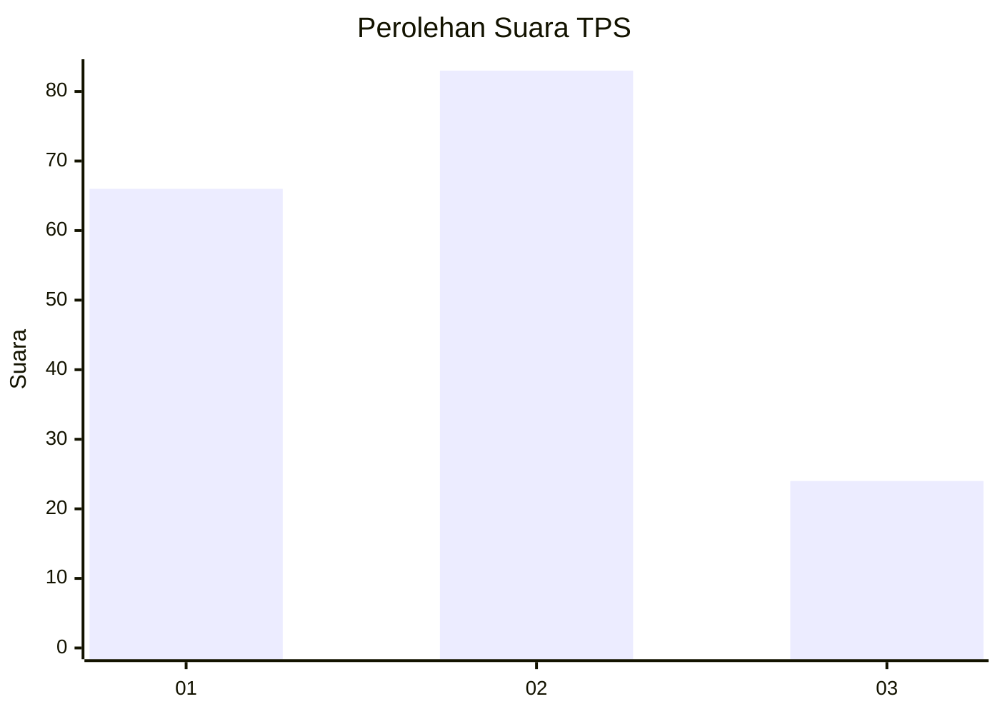
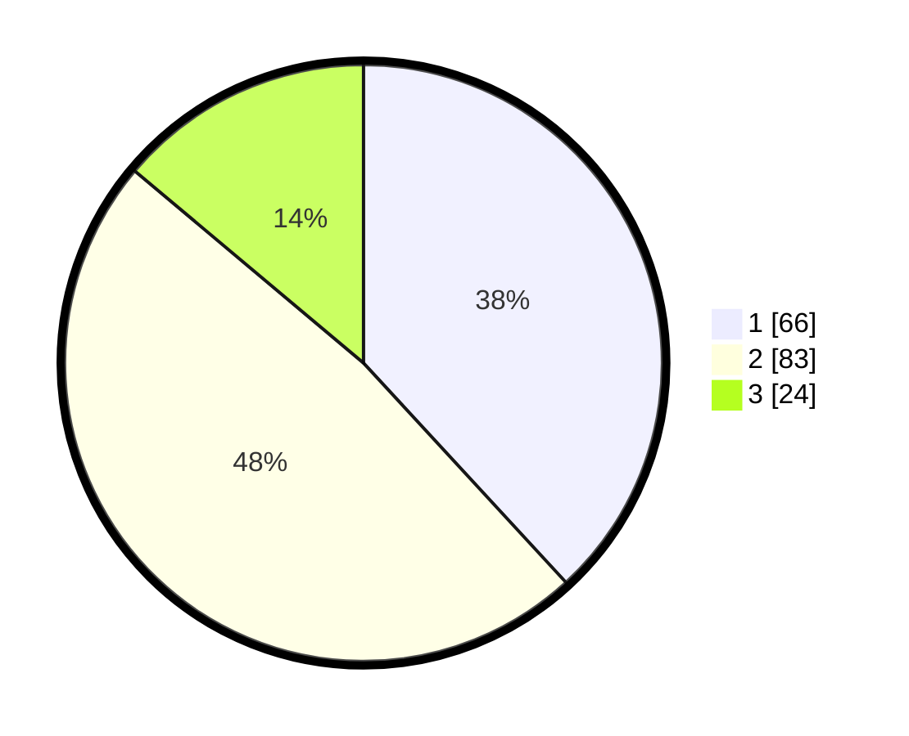

# Hasil

## Grafik

## Tabel

| No. | Nama Paslon    | Suara | Suara (raw) | Persentase |
|:--- |:-------------- | -----:| -----------:| ----------:|
| 1   | ANIES MUHAIMIN | 66    | [66][p-1]   | 38,15      |
| 2   | PRABOWO GIBRAN | 83    | [83][p-2]   | 47,98      |
| 3   | GANJAR MAHFUD  | 24    | [24][p-3]   | 13,87      |

[p-1]: https://github.com/gigit-pemilu/pemilu-2024-35-jawa-timur/blob/main/pilpres/hitung-suara/sub/35-jawa-timur/sub/11-bondowoso/sub/11-bondowoso/sub/1006-kademangan/sub/021-tps/sub/paslon-1.txt
[p-2]: https://github.com/gigit-pemilu/pemilu-2024-35-jawa-timur/blob/main/pilpres/hitung-suara/sub/35-jawa-timur/sub/11-bondowoso/sub/11-bondowoso/sub/1006-kademangan/sub/021-tps/sub/paslon-2.txt
[p-3]: https://github.com/gigit-pemilu/pemilu-2024-35-jawa-timur/blob/main/pilpres/hitung-suara/sub/35-jawa-timur/sub/11-bondowoso/sub/11-bondowoso/sub/1006-kademangan/sub/021-tps/sub/paslon-3.txt

## Foto C Plano

https://sirekap-obj-formc.kpu.go.id/8e8d/pemilu/ppwp/35/11/11/10/06/3511111006021-20240214-221918--ee1c5111-706e-43e0-8869-d174eb8708e4.jpg

https://sirekap-obj-formc.kpu.go.id/8e8d/pemilu/ppwp/35/11/11/10/06/3511111006021-20240214-222117--bbe8e7e5-faaa-4187-b0f0-7e240884b127.jpg

https://sirekap-obj-formc.kpu.go.id/8e8d/pemilu/ppwp/35/11/11/10/06/3511111006021-20240214-222211--3a527f34-07f4-4225-9526-b49851b868dd.jpg

## Metadata

| Key        | Value               |
| ---------- | ------------------- |
| Time Stamp | 2024-02-16 13:30:32 |

