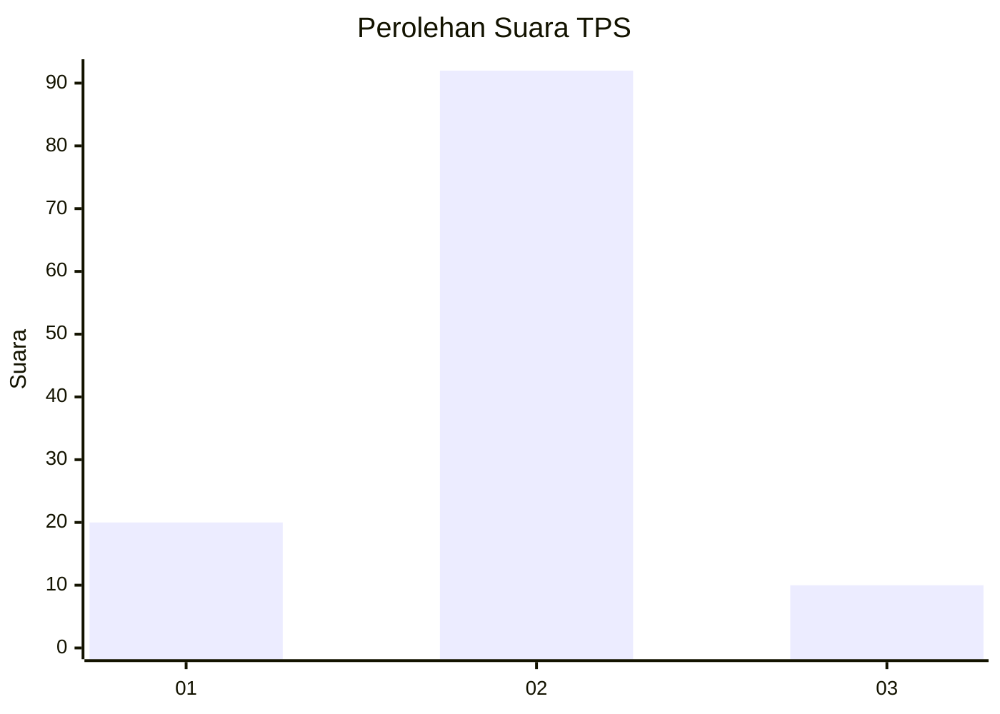
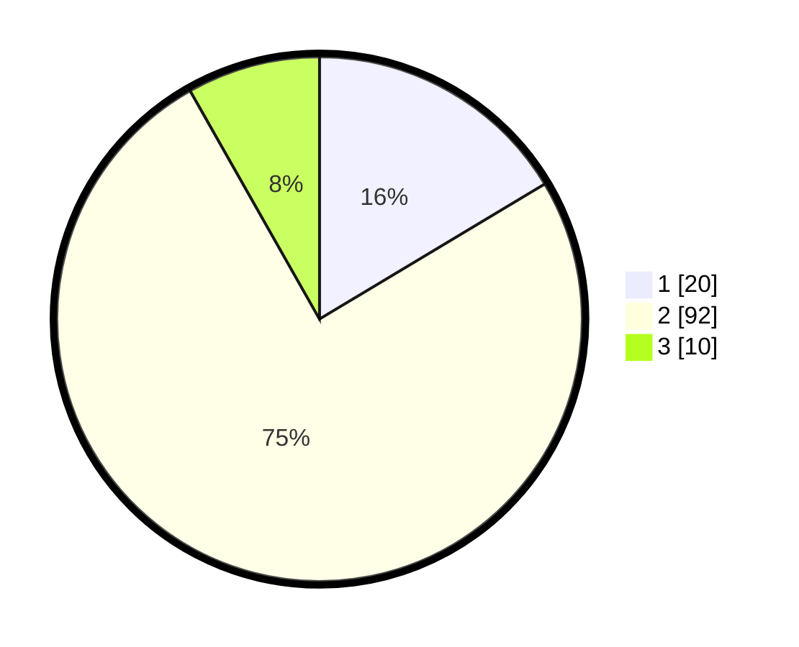

# Hasil

## Grafik

## Tabel

| No. | Nama Paslon    | Suara | Suara (raw) | Persentase |
|:--- |:-------------- | -----:| -----------:| ----------:|
| 1   | ANIES MUHAIMIN | 20    | [20][p-1]   | 16,39      |
| 2   | PRABOWO GIBRAN | 92    | [92][p-2]   | 75,41      |
| 3   | GANJAR MAHFUD  | 10    | [10][p-3]   | 8,20       |

[p-1]: https://github.com/gigit-pemilu/pemilu-2024/blob/main/pilpres/hitung-suara/sub/35-jawa-timur/sub/11-bondowoso/sub/11-bondowoso/sub/1008-badean/sub/002-tps/sub/paslon-1.txt
[p-2]: https://github.com/gigit-pemilu/pemilu-2024/blob/main/pilpres/hitung-suara/sub/35-jawa-timur/sub/11-bondowoso/sub/11-bondowoso/sub/1008-badean/sub/002-tps/sub/paslon-2.txt
[p-3]: https://github.com/gigit-pemilu/pemilu-2024/blob/main/pilpres/hitung-suara/sub/35-jawa-timur/sub/11-bondowoso/sub/11-bondowoso/sub/1008-badean/sub/002-tps/sub/paslon-3.txt

## Foto C Plano

https://sirekap-obj-formc.kpu.go.id/22f1/pemilu/ppwp/35/11/11/10/08/3511111008002-20240217-131016--be731ca6-62f0-454d-be14-363269f77770.jpg

https://sirekap-obj-formc.kpu.go.id/22f1/pemilu/ppwp/35/11/11/10/08/3511111008002-20240217-131259--97664715-2f83-4f7b-b3af-82013b74cc3a.jpg

https://sirekap-obj-formc.kpu.go.id/22f1/pemilu/ppwp/35/11/11/10/08/3511111008002-20240217-131324--fb72a416-a935-453d-83d0-62e72bd11ba8.jpg

## Metadata

| Key        | Value               |
| ---------- | ------------------- |
| Time Stamp | 2024-02-19 06:16:00 |

