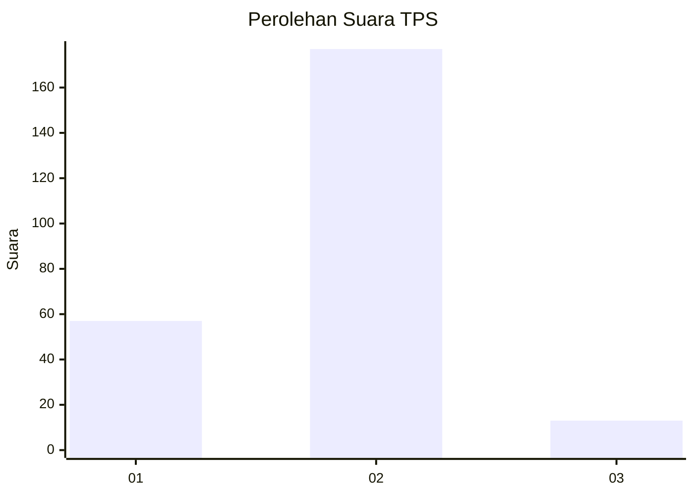
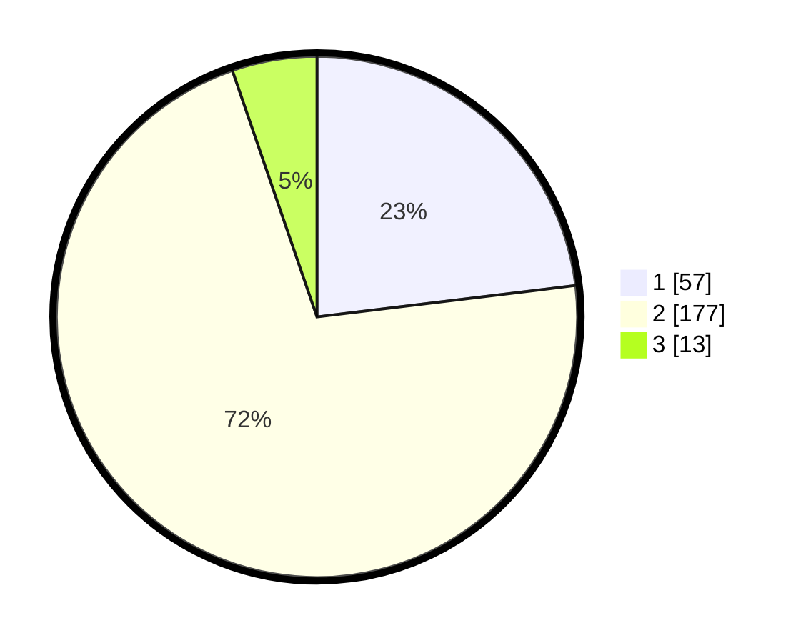

# Hasil

## Grafik

## Tabel

| No. | Nama Paslon    | Suara | Suara (raw) | Persentase |
|:--- |:-------------- | -----:| -----------:| ----------:|
| 1   | ANIES MUHAIMIN | 57    | [57][p-1]   | 23,08      |
| 2   | PRABOWO GIBRAN | 177   | [177][p-2]  | 71,66      |
| 3   | GANJAR MAHFUD  | 13    | [13][p-3]   | 5,26       |

[p-1]: https://github.com/gigit-pemilu/pemilu-2024/blob/main/pilpres/hitung-suara/sub/35-jawa-timur/sub/11-bondowoso/sub/11-bondowoso/sub/2001-pancoran/sub/002-tps/sub/paslon-1.txt
[p-2]: https://github.com/gigit-pemilu/pemilu-2024/blob/main/pilpres/hitung-suara/sub/35-jawa-timur/sub/11-bondowoso/sub/11-bondowoso/sub/2001-pancoran/sub/002-tps/sub/paslon-2.txt
[p-3]: https://github.com/gigit-pemilu/pemilu-2024/blob/main/pilpres/hitung-suara/sub/35-jawa-timur/sub/11-bondowoso/sub/11-bondowoso/sub/2001-pancoran/sub/002-tps/sub/paslon-3.txt

## Foto C Plano

https://sirekap-obj-formc.kpu.go.id/a1c1/pemilu/ppwp/35/11/11/20/01/3511112001002-20240215-010059--8166cbcf-ef71-405c-947f-91f3172de562.jpg

https://sirekap-obj-formc.kpu.go.id/a1c1/pemilu/ppwp/35/11/11/20/01/3511112001002-20240215-010348--6214723d-5329-42c7-aeee-ff1f6e4244c6.jpg

https://sirekap-obj-formc.kpu.go.id/a1c1/pemilu/ppwp/35/11/11/20/01/3511112001002-20240215-010454--74e3a5a7-e672-45be-af05-1eebd31b4fb1.jpg

## Metadata

| Key        | Value               |
| ---------- | ------------------- |
| Time Stamp | 2024-02-16 14:30:33 |

