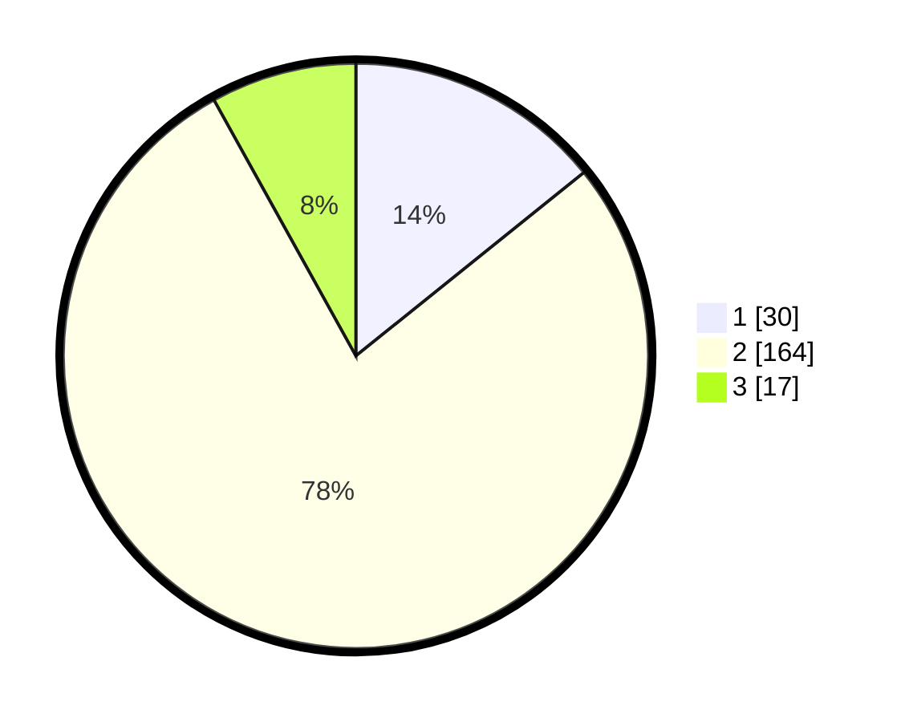

# Hasil

## Grafik

## Tabel

| No. | Nama Paslon    | Suara | Suara (raw) | Persentase |
|:--- |:-------------- | -----:| -----------:| ----------:|
| 1   | ANIES MUHAIMIN | 30    | [30][p-1]   | 14,22      |
| 2   | PRABOWO GIBRAN | 164   | [164][p-2]  | 77,73      |
| 3   | GANJAR MAHFUD  | 17    | [17][p-3]   | 8,06       |

[p-1]: https://github.com/gigit-pemilu/pemilu-2024-35-jawa-timur/blob/main/pilpres/hitung-suara/sub/35-jawa-timur/sub/11-bondowoso/sub/11-bondowoso/sub/2002-sukowiryo/sub/009-tps/sub/paslon-1.txt
[p-2]: https://github.com/gigit-pemilu/pemilu-2024-35-jawa-timur/blob/main/pilpres/hitung-suara/sub/35-jawa-timur/sub/11-bondowoso/sub/11-bondowoso/sub/2002-sukowiryo/sub/009-tps/sub/paslon-2.txt
[p-3]: https://github.com/gigit-pemilu/pemilu-2024-35-jawa-timur/blob/main/pilpres/hitung-suara/sub/35-jawa-timur/sub/11-bondowoso/sub/11-bondowoso/sub/2002-sukowiryo/sub/009-tps/sub/paslon-3.txt

## Foto C Plano

https://sirekap-obj-formc.kpu.go.id/16f8/pemilu/ppwp/35/11/11/20/02/3511112002009-20240215-071126--d77f7929-fba1-47f7-b12d-f9f53961b45e.jpg

https://sirekap-obj-formc.kpu.go.id/16f8/pemilu/ppwp/35/11/11/20/02/3511112002009-20240215-071315--f8ee9de7-a082-43bb-8555-70e21f35f831.jpg

https://sirekap-obj-formc.kpu.go.id/16f8/pemilu/ppwp/35/11/11/20/02/3511112002009-20240215-071625--5125f1cb-508e-4b5f-982e-16f12fbbc45d.jpg

## Metadata

| Key        | Value               |
| ---------- | ------------------- |
| Time Stamp | 2024-02-16 16:25:10 |

