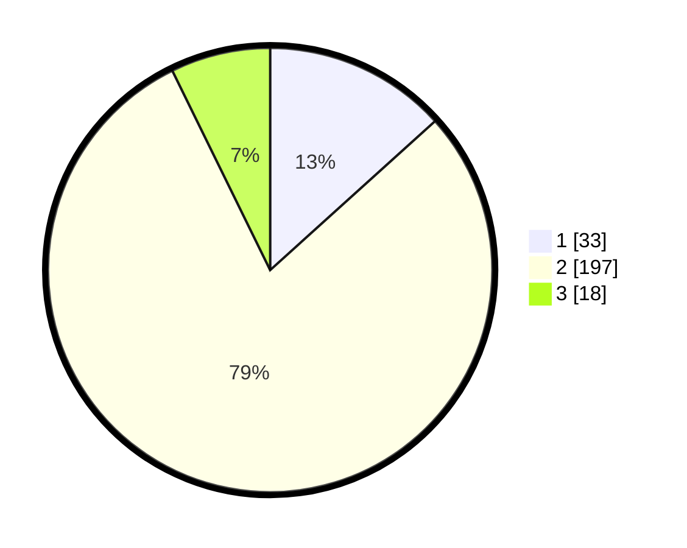

# Hasil

## Grafik

## Tabel

| No. | Nama Paslon    | Suara | Suara (raw) | Persentase |
|:--- |:-------------- | -----:| -----------:| ----------:|
| 1   | ANIES MUHAIMIN | 33    | [33][p-1]   | 13,31      |
| 2   | PRABOWO GIBRAN | 197   | [197][p-2]  | 79,44      |
| 3   | GANJAR MAHFUD  | 18    | [18][p-3]   | 7,26       |

[p-1]: https://github.com/gigit-pemilu/pemilu-2024-35-jawa-timur/blob/main/pilpres/hitung-suara/sub/35-jawa-timur/sub/11-bondowoso/sub/11-bondowoso/sub/2003-kembang/sub/001-tps/sub/paslon-1.txt
[p-2]: https://github.com/gigit-pemilu/pemilu-2024-35-jawa-timur/blob/main/pilpres/hitung-suara/sub/35-jawa-timur/sub/11-bondowoso/sub/11-bondowoso/sub/2003-kembang/sub/001-tps/sub/paslon-2.txt
[p-3]: https://github.com/gigit-pemilu/pemilu-2024-35-jawa-timur/blob/main/pilpres/hitung-suara/sub/35-jawa-timur/sub/11-bondowoso/sub/11-bondowoso/sub/2003-kembang/sub/001-tps/sub/paslon-3.txt

## Foto C Plano

https://sirekap-obj-formc.kpu.go.id/55cf/pemilu/ppwp/35/11/11/20/03/3511112003001-20240216-191133--271796e8-e3de-45b7-9d19-5d5e0613b70a.jpg

https://sirekap-obj-formc.kpu.go.id/55cf/pemilu/ppwp/35/11/11/20/03/3511112003001-20240216-191516--f54c2086-1803-4a80-9192-f3319a89775a.jpg

https://sirekap-obj-formc.kpu.go.id/55cf/pemilu/ppwp/35/11/11/20/03/3511112003001-20240216-191601--5d8fc70d-e504-4c77-a13a-3af23d654afc.jpg

## Metadata

| Key        | Value               |
| ---------- | ------------------- |
| Time Stamp | 2024-02-19 10:00:00 |

