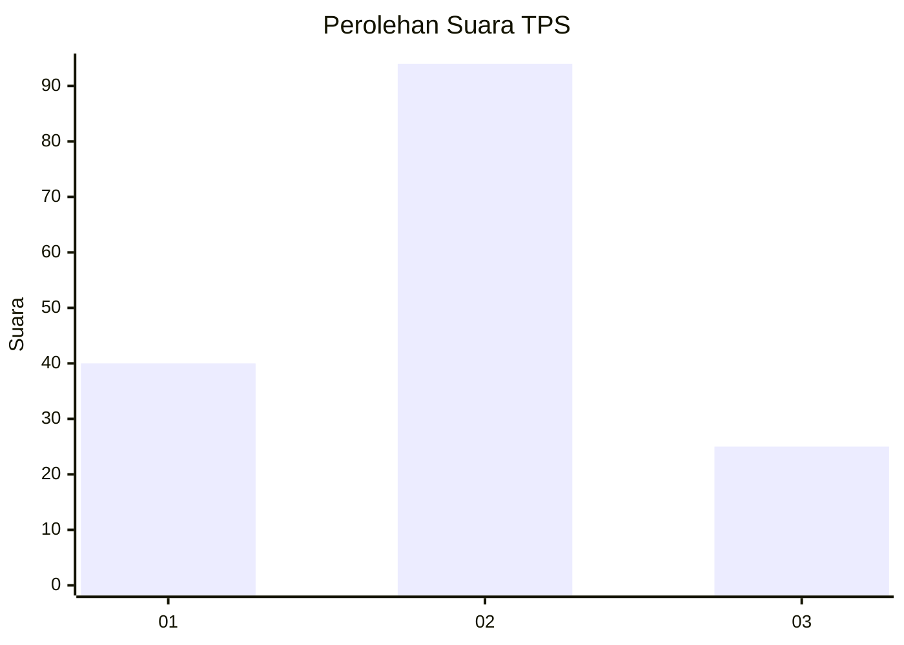
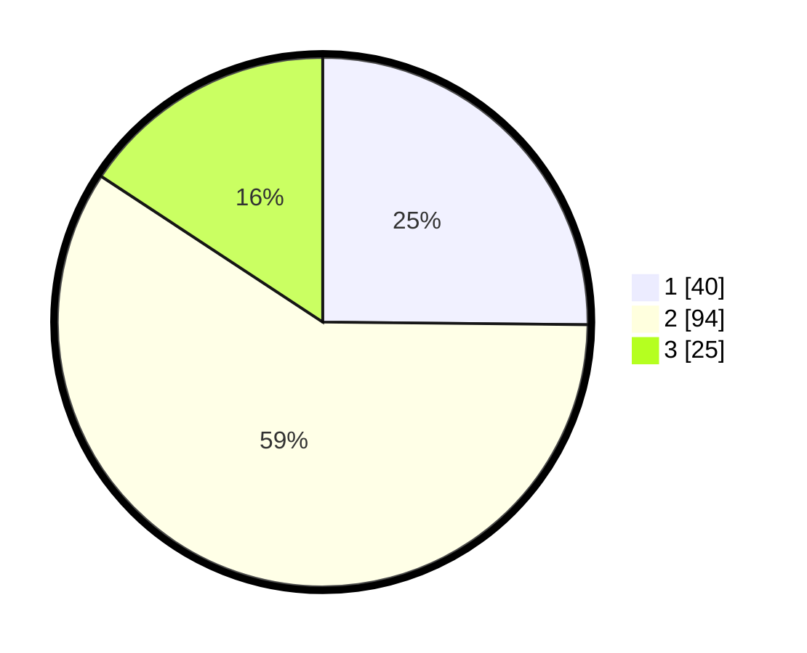

# Hasil

## Grafik

## Tabel

| No. | Nama Paslon    | Suara | Suara (raw) | Persentase |
|:--- |:-------------- | -----:| -----------:| ----------:|
| 1   | ANIES MUHAIMIN | 40    | [40][p-1]   | 25,16      |
| 2   | PRABOWO GIBRAN | 94    | [94][p-2]   | 59,12      |
| 3   | GANJAR MAHFUD  | 25    | [25][p-3]   | 15,72      |

[p-1]: https://github.com/gigit-pemilu/pemilu-2024/blob/main/pilpres/hitung-suara/sub/35-jawa-timur/sub/11-bondowoso/sub/12-wringin/sub/2013-sumbercanting/sub/005-tps/sub/paslon-1.txt
[p-2]: https://github.com/gigit-pemilu/pemilu-2024/blob/main/pilpres/hitung-suara/sub/35-jawa-timur/sub/11-bondowoso/sub/12-wringin/sub/2013-sumbercanting/sub/005-tps/sub/paslon-2.txt
[p-3]: https://github.com/gigit-pemilu/pemilu-2024/blob/main/pilpres/hitung-suara/sub/35-jawa-timur/sub/11-bondowoso/sub/12-wringin/sub/2013-sumbercanting/sub/005-tps/sub/paslon-3.txt

## Foto C Plano

https://sirekap-obj-formc.kpu.go.id/10f0/pemilu/ppwp/35/11/12/20/13/3511122013005-20240217-095632--85755774-d816-46ac-aa49-cf90d8001904.jpg

https://sirekap-obj-formc.kpu.go.id/10f0/pemilu/ppwp/35/11/12/20/13/3511122013005-20240217-095252--9a9cc72d-dffd-40c0-bfcf-508fdb779a38.jpg

https://sirekap-obj-formc.kpu.go.id/10f0/pemilu/ppwp/35/11/12/20/13/3511122013005-20240214-190938--13b9b54b-449a-4465-88fc-0f2e18c8ccf2.jpg

## Metadata

| Key        | Value               |
| ---------- | ------------------- |
| Time Stamp | 2024-02-17 10:30:03 |

