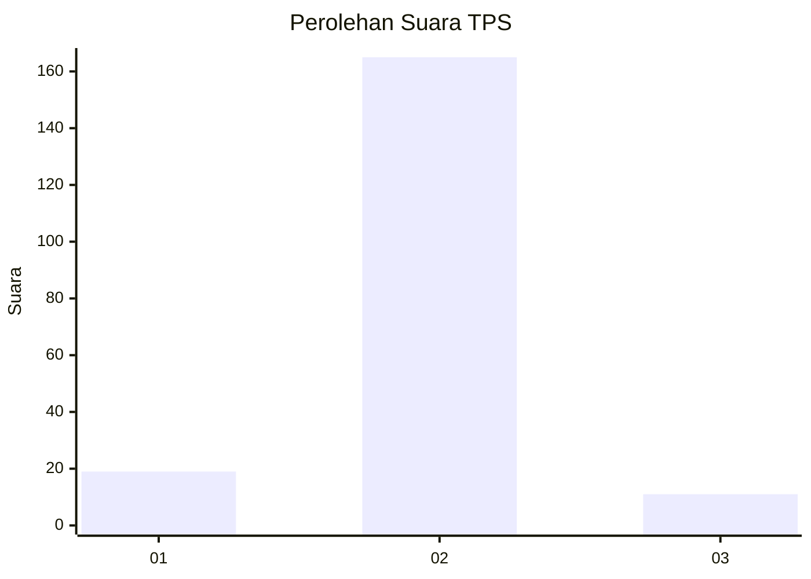
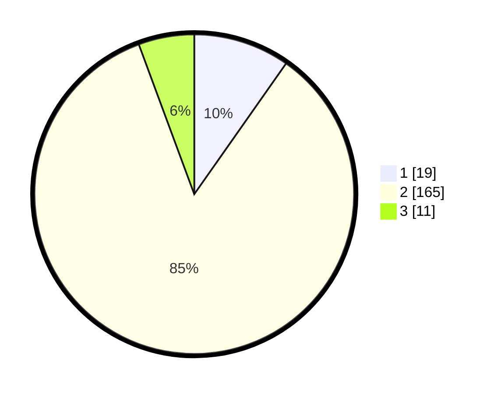

# Hasil

## Grafik

## Tabel

| No. | Nama Paslon    | Suara | Suara (raw) | Persentase |
|:--- |:-------------- | -----:| -----------:| ----------:|
| 1   | ANIES MUHAIMIN | 19    | [19][p-1]   | 9,74       |
| 2   | PRABOWO GIBRAN | 165   | [165][p-2]  | 84,62      |
| 3   | GANJAR MAHFUD  | 11    | [11][p-3]   | 5,64       |

[p-1]: https://github.com/gigit-pemilu/pemilu-2024/blob/main/pilpres/hitung-suara/sub/35-jawa-timur/sub/11-bondowoso/sub/13-tegalampel/sub/2003-tanggulangin/sub/002-tps/sub/paslon-1.txt
[p-2]: https://github.com/gigit-pemilu/pemilu-2024/blob/main/pilpres/hitung-suara/sub/35-jawa-timur/sub/11-bondowoso/sub/13-tegalampel/sub/2003-tanggulangin/sub/002-tps/sub/paslon-2.txt
[p-3]: https://github.com/gigit-pemilu/pemilu-2024/blob/main/pilpres/hitung-suara/sub/35-jawa-timur/sub/11-bondowoso/sub/13-tegalampel/sub/2003-tanggulangin/sub/002-tps/sub/paslon-3.txt

## Foto C Plano

https://sirekap-obj-formc.kpu.go.id/1078/pemilu/ppwp/35/11/13/20/03/3511132003002-20240214-235617--5bc891b1-337d-424b-9b23-057a18e3a065.jpg

https://sirekap-obj-formc.kpu.go.id/1078/pemilu/ppwp/35/11/13/20/03/3511132003002-20240214-235723--09672076-c28b-42f6-a473-7e37db2f4888.jpg

https://sirekap-obj-formc.kpu.go.id/1078/pemilu/ppwp/35/11/13/20/03/3511132003002-20240214-235826--24ddf064-6fd3-4d50-b82b-26f712a762cb.jpg

## Metadata

| Key        | Value               |
| ---------- | ------------------- |
| Time Stamp | 2024-02-17 03:30:02 |

