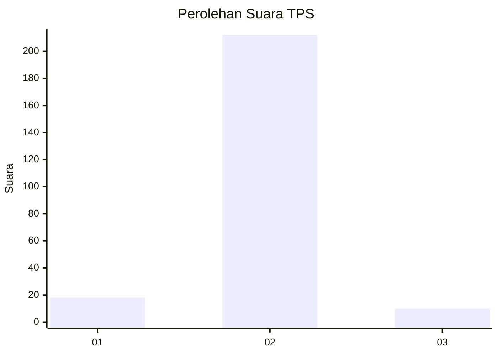
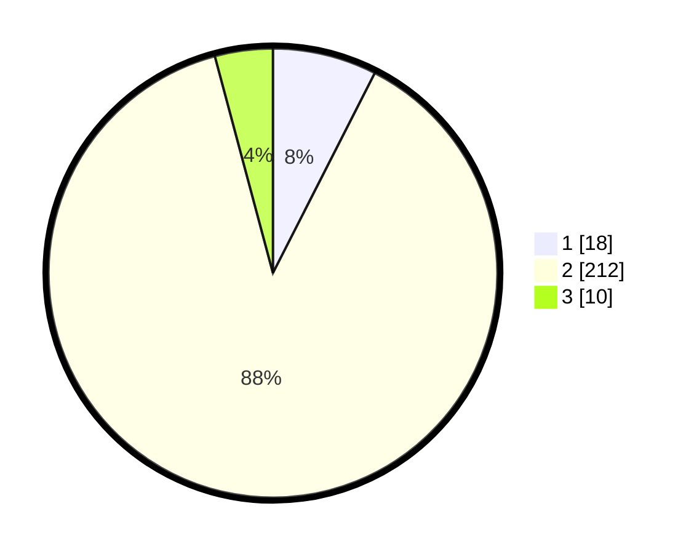

# Hasil

## Grafik

## Tabel

| No. | Nama Paslon    | Suara | Suara (raw) | Persentase |
|:--- |:-------------- | -----:| -----------:| ----------:|
| 1   | ANIES MUHAIMIN | 18    | [18][p-1]   | 7,50       |
| 2   | PRABOWO GIBRAN | 212   | [212][p-2]  | 88,33      |
| 3   | GANJAR MAHFUD  | 10    | [10][p-3]   | 4,17       |

[p-1]: https://github.com/gigit-pemilu/pemilu-2024-35-jawa-timur/blob/main/pilpres/hitung-suara/sub/35-jawa-timur/sub/11-bondowoso/sub/13-tegalampel/sub/2006-tegalampel/sub/001-tps/sub/paslon-1.txt
[p-2]: https://github.com/gigit-pemilu/pemilu-2024-35-jawa-timur/blob/main/pilpres/hitung-suara/sub/35-jawa-timur/sub/11-bondowoso/sub/13-tegalampel/sub/2006-tegalampel/sub/001-tps/sub/paslon-2.txt
[p-3]: https://github.com/gigit-pemilu/pemilu-2024-35-jawa-timur/blob/main/pilpres/hitung-suara/sub/35-jawa-timur/sub/11-bondowoso/sub/13-tegalampel/sub/2006-tegalampel/sub/001-tps/sub/paslon-3.txt

## Foto C Plano

https://sirekap-obj-formc.kpu.go.id/506d/pemilu/ppwp/35/11/13/20/06/3511132006001-20240217-103013--fee53ab1-5eb8-4a58-a0da-701b6da045ed.jpg

https://sirekap-obj-formc.kpu.go.id/506d/pemilu/ppwp/35/11/13/20/06/3511132006001-20240217-103137--116a0acd-0ef6-48d1-85e6-b0f3c1a5f5db.jpg

https://sirekap-obj-formc.kpu.go.id/506d/pemilu/ppwp/35/11/13/20/06/3511132006001-20240215-010407--57e20133-3e44-4c20-9204-172e062fc27c.jpg

## Metadata

| Key        | Value               |
| ---------- | ------------------- |
| Time Stamp | 2024-02-17 13:37:34 |

