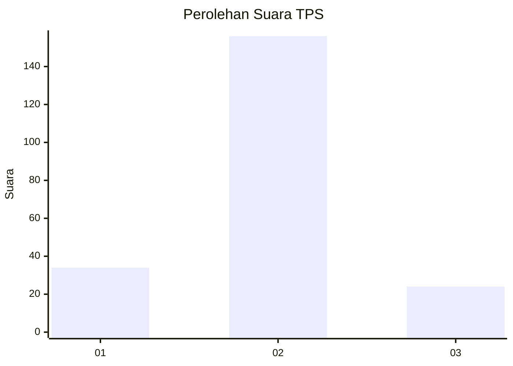
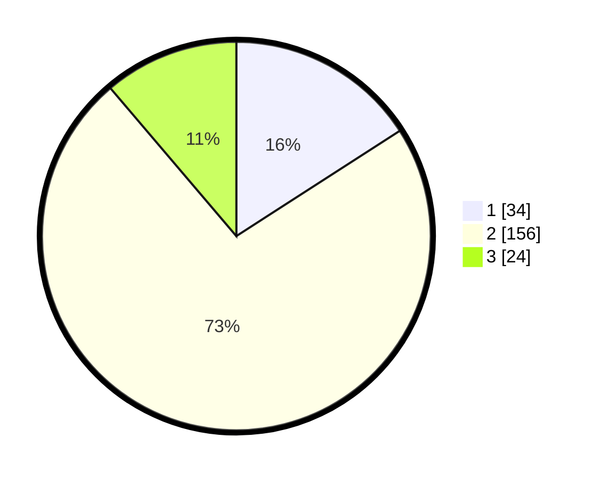

# Hasil

## Grafik

## Tabel

| No. | Nama Paslon    | Suara | Suara (raw) | Persentase |
|:--- |:-------------- | -----:| -----------:| ----------:|
| 1   | ANIES MUHAIMIN | 34    | [34][p-1]   | 15,89      |
| 2   | PRABOWO GIBRAN | 156   | [156][p-2]  | 72,90      |
| 3   | GANJAR MAHFUD  | 24    | [24][p-3]   | 11,21      |

[p-1]: https://github.com/gigit-pemilu/pemilu-2024-35-jawa-timur/blob/main/pilpres/hitung-suara/sub/35-jawa-timur/sub/11-bondowoso/sub/14-klabang/sub/2005-karang-anyar/sub/001-tps/sub/paslon-1.txt
[p-2]: https://github.com/gigit-pemilu/pemilu-2024-35-jawa-timur/blob/main/pilpres/hitung-suara/sub/35-jawa-timur/sub/11-bondowoso/sub/14-klabang/sub/2005-karang-anyar/sub/001-tps/sub/paslon-2.txt
[p-3]: https://github.com/gigit-pemilu/pemilu-2024-35-jawa-timur/blob/main/pilpres/hitung-suara/sub/35-jawa-timur/sub/11-bondowoso/sub/14-klabang/sub/2005-karang-anyar/sub/001-tps/sub/paslon-3.txt

## Foto C Plano

https://sirekap-obj-formc.kpu.go.id/ec55/pemilu/ppwp/35/11/14/20/05/3511142005001-20240215-083002--50fca13f-d07d-4e27-869f-9352ea3bf059.jpg

https://sirekap-obj-formc.kpu.go.id/ec55/pemilu/ppwp/35/11/14/20/05/3511142005001-20240215-083057--4b14d2b0-cebd-49f2-b2d8-5c56d319d8f9.jpg

https://sirekap-obj-formc.kpu.go.id/ec55/pemilu/ppwp/35/11/14/20/05/3511142005001-20240216-191052--06e3ed93-535d-47dc-94e9-3dc52c6cec5b.jpg

## Metadata

| Key        | Value               |
| ---------- | ------------------- |
| Time Stamp | 2024-02-16 21:01:00 |

