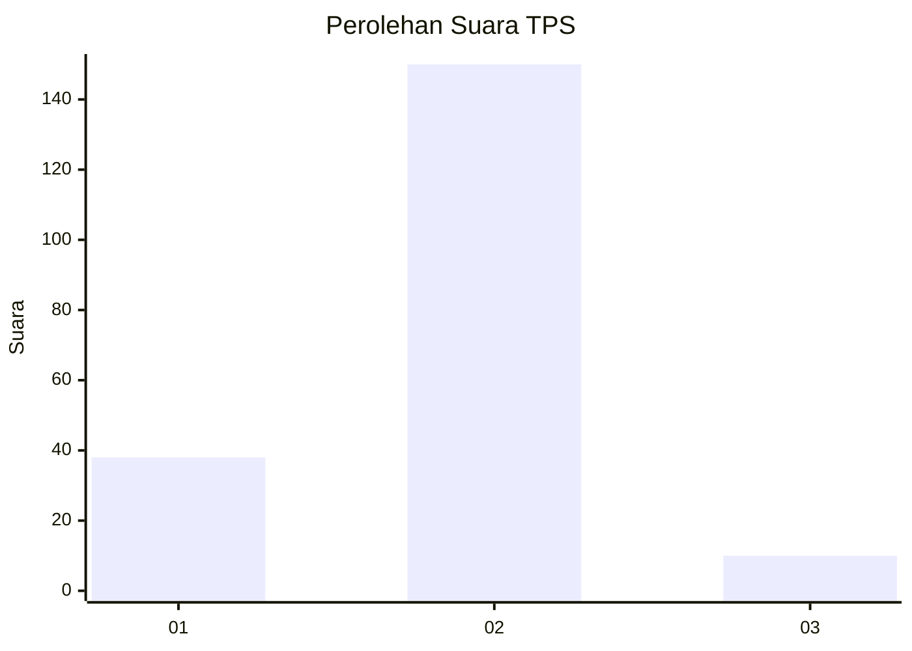
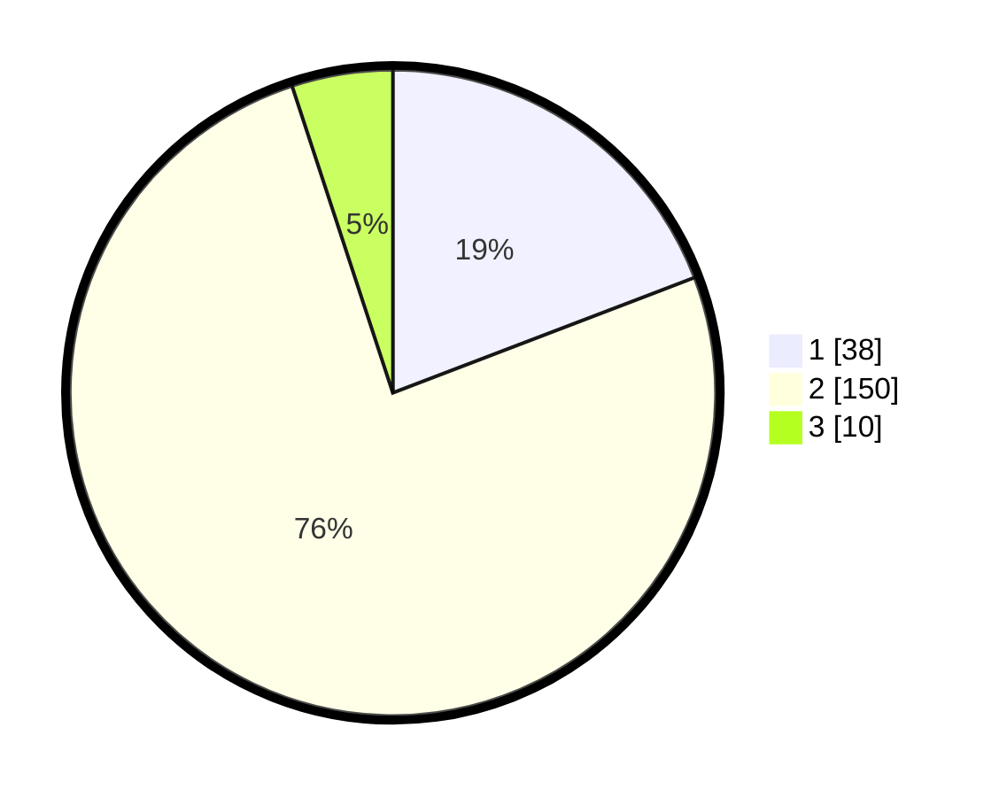

# Hasil

## Grafik

## Tabel

| No. | Nama Paslon    | Suara | Suara (raw) | Persentase |
|:--- |:-------------- | -----:| -----------:| ----------:|
| 1   | ANIES MUHAIMIN | 38    | [38][p-1]   | 19,19      |
| 2   | PRABOWO GIBRAN | 150   | [150][p-2]  | 75,76      |
| 3   | GANJAR MAHFUD  | 10    | [10][p-3]   | 5,05       |

[p-1]: https://github.com/gigit-pemilu/pemilu-2024-35-jawa-timur/blob/main/pilpres/hitung-suara/sub/35-jawa-timur/sub/11-bondowoso/sub/14-klabang/sub/2005-karang-anyar/sub/002-tps/sub/paslon-1.txt
[p-2]: https://github.com/gigit-pemilu/pemilu-2024-35-jawa-timur/blob/main/pilpres/hitung-suara/sub/35-jawa-timur/sub/11-bondowoso/sub/14-klabang/sub/2005-karang-anyar/sub/002-tps/sub/paslon-2.txt
[p-3]: https://github.com/gigit-pemilu/pemilu-2024-35-jawa-timur/blob/main/pilpres/hitung-suara/sub/35-jawa-timur/sub/11-bondowoso/sub/14-klabang/sub/2005-karang-anyar/sub/002-tps/sub/paslon-3.txt

## Foto C Plano

https://sirekap-obj-formc.kpu.go.id/0122/pemilu/ppwp/35/11/14/20/05/3511142005002-20240214-211236--25108d39-49d7-4d2a-9aab-05d205613a8e.jpg

https://sirekap-obj-formc.kpu.go.id/0122/pemilu/ppwp/35/11/14/20/05/3511142005002-20240214-202826--b6895a60-9d9d-4484-a37b-e84ccbb71006.jpg

https://sirekap-obj-formc.kpu.go.id/0122/pemilu/ppwp/35/11/14/20/05/3511142005002-20240214-202900--516704c7-9c94-4773-a679-b884527117f2.jpg

## Metadata

| Key        | Value               |
| ---------- | ------------------- |
| Time Stamp | 2024-02-15 19:00:26 |

