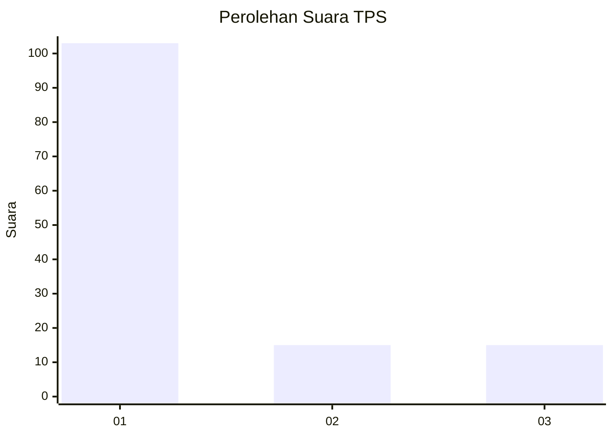
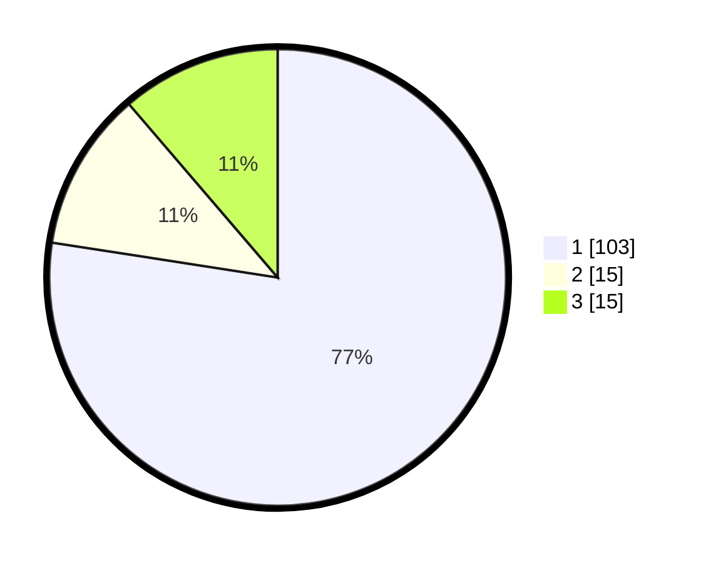

# Hasil

## Grafik

## Tabel

| No. | Nama Paslon    | Suara | Suara (raw) | Persentase |
|:--- |:-------------- | -----:| -----------:| ----------:|
| 1   | ANIES MUHAIMIN | 103   | [103][p-1]  | 77,44      |
| 2   | PRABOWO GIBRAN | 15    | [15][p-2]   | 11,28      |
| 3   | GANJAR MAHFUD  | 15    | [15][p-3]   | 11,28      |

[p-1]: https://github.com/gigit-pemilu/pemilu-2024/blob/main/pilpres/hitung-suara/sub/35-jawa-timur/sub/11-bondowoso/sub/14-klabang/sub/2014-leprak/sub/010-tps/sub/paslon-1.txt
[p-2]: https://github.com/gigit-pemilu/pemilu-2024/blob/main/pilpres/hitung-suara/sub/35-jawa-timur/sub/11-bondowoso/sub/14-klabang/sub/2014-leprak/sub/010-tps/sub/paslon-2.txt
[p-3]: https://github.com/gigit-pemilu/pemilu-2024/blob/main/pilpres/hitung-suara/sub/35-jawa-timur/sub/11-bondowoso/sub/14-klabang/sub/2014-leprak/sub/010-tps/sub/paslon-3.txt

## Foto C Plano

https://sirekap-obj-formc.kpu.go.id/59e7/pemilu/ppwp/35/11/14/20/14/3511142014010-20240216-234228--ab2b9d04-b064-4a25-9ffa-b81be49ea630.jpg

https://sirekap-obj-formc.kpu.go.id/59e7/pemilu/ppwp/35/11/14/20/14/3511142014010-20240215-033522--a95d544d-e361-4612-b485-ad0f66164541.jpg

https://sirekap-obj-formc.kpu.go.id/59e7/pemilu/ppwp/35/11/14/20/14/3511142014010-20240215-033556--9e5bfc1e-4031-4960-87df-f1684b709fb7.jpg

## Metadata

| Key        | Value               |
| ---------- | ------------------- |
| Time Stamp | 2024-02-16 23:45:47 |

