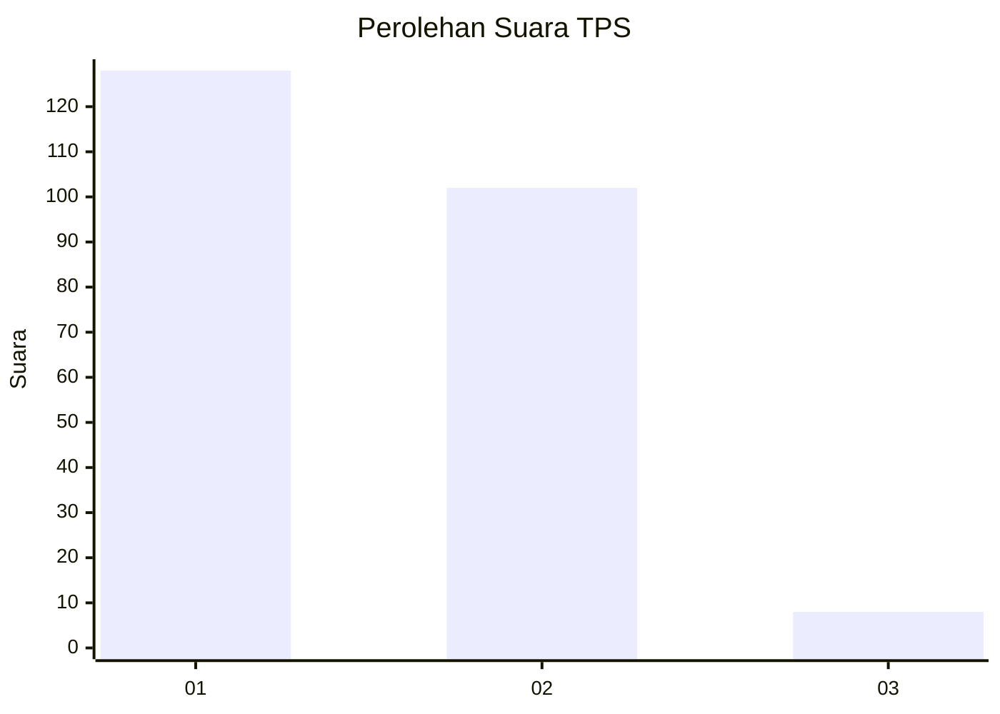
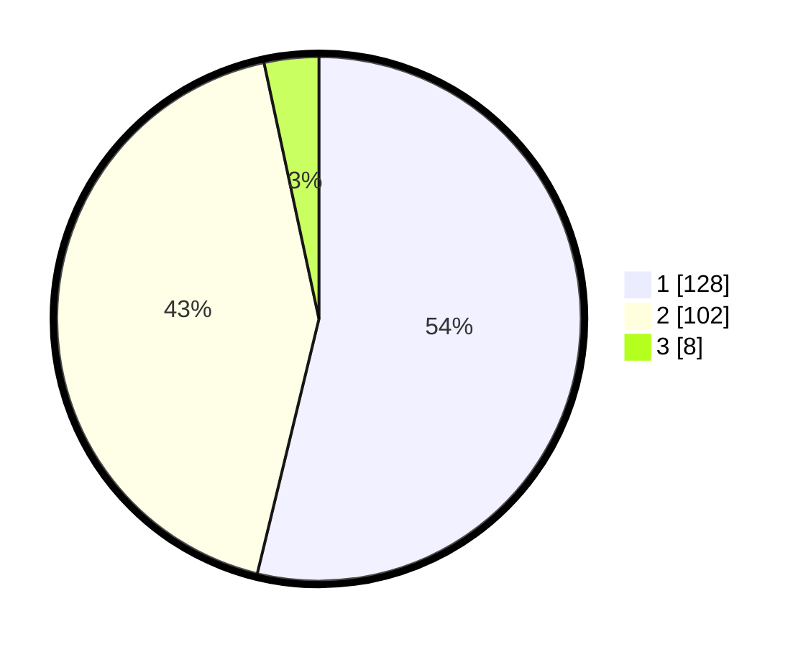

# Hasil

## Grafik

## Tabel

| No. | Nama Paslon    | Suara | Suara (raw) | Persentase |
|:--- |:-------------- | -----:| -----------:| ----------:|
| 1   | ANIES MUHAIMIN | 128   | [128][p-1]  | 53,78      |
| 2   | PRABOWO GIBRAN | 102   | [102][p-2]  | 42,86      |
| 3   | GANJAR MAHFUD  | 8     | [8][p-3]    | 3,36       |

[p-1]: https://github.com/gigit-pemilu/pemilu-2024/blob/main/pilpres/hitung-suara/sub/35-jawa-timur/sub/11-bondowoso/sub/15-cermee/sub/2002-kladi/sub/001-tps/sub/paslon-1.txt
[p-2]: https://github.com/gigit-pemilu/pemilu-2024/blob/main/pilpres/hitung-suara/sub/35-jawa-timur/sub/11-bondowoso/sub/15-cermee/sub/2002-kladi/sub/001-tps/sub/paslon-2.txt
[p-3]: https://github.com/gigit-pemilu/pemilu-2024/blob/main/pilpres/hitung-suara/sub/35-jawa-timur/sub/11-bondowoso/sub/15-cermee/sub/2002-kladi/sub/001-tps/sub/paslon-3.txt

## Foto C Plano

https://sirekap-obj-formc.kpu.go.id/6817/pemilu/ppwp/35/11/15/20/02/3511152002001-20240218-120252--095fce37-9c98-45e7-a213-55512acac685.jpg

https://sirekap-obj-formc.kpu.go.id/6817/pemilu/ppwp/35/11/15/20/02/3511152002001-20240218-115859--29e24ec8-81e0-483f-abbf-d23d6d1594bf.jpg

https://sirekap-obj-formc.kpu.go.id/6817/pemilu/ppwp/35/11/15/20/02/3511152002001-20240218-120033--9c664080-b3f9-4a88-bf8d-732aadefdbc8.jpg

## Metadata

| Key        | Value               |
| ---------- | ------------------- |
| Time Stamp | 2024-02-24 22:31:28 |

