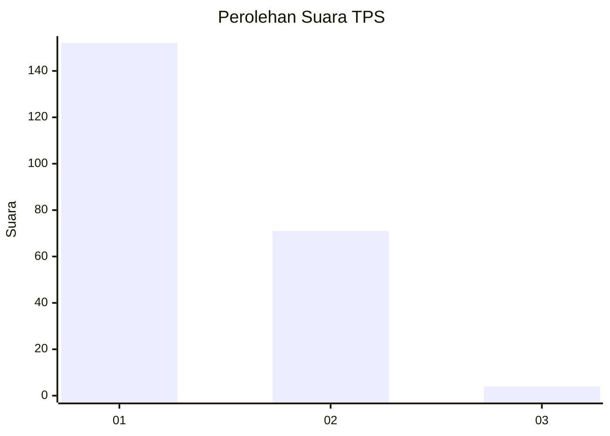
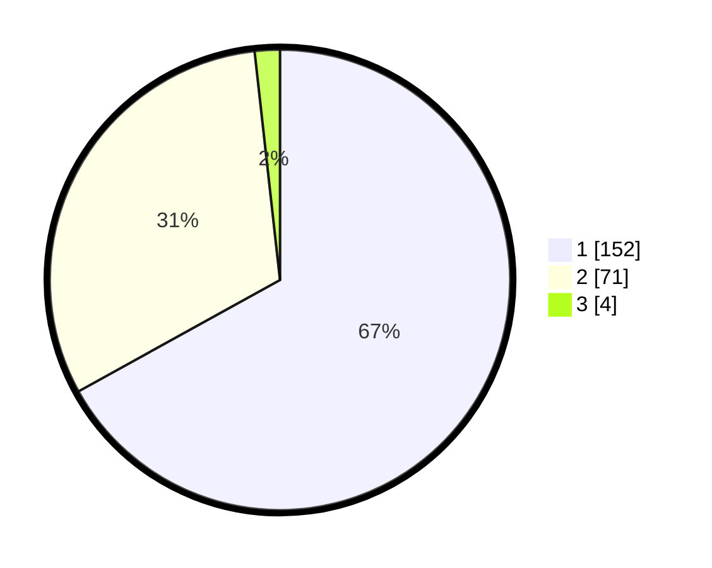

# Hasil

## Grafik

## Tabel

| No. | Nama Paslon    | Suara | Suara (raw) | Persentase |
|:--- |:-------------- | -----:| -----------:| ----------:|
| 1   | ANIES MUHAIMIN | 152   | [152][p-1]  | 66,96      |
| 2   | PRABOWO GIBRAN | 71    | [71][p-2]   | 31,28      |
| 3   | GANJAR MAHFUD  | 4     | [4][p-3]    | 1,76       |

[p-1]: https://github.com/gigit-pemilu/pemilu-2024-35-jawa-timur/blob/main/pilpres/hitung-suara/sub/35-jawa-timur/sub/11-bondowoso/sub/15-cermee/sub/2002-kladi/sub/002-tps/sub/paslon-1.txt
[p-2]: https://github.com/gigit-pemilu/pemilu-2024-35-jawa-timur/blob/main/pilpres/hitung-suara/sub/35-jawa-timur/sub/11-bondowoso/sub/15-cermee/sub/2002-kladi/sub/002-tps/sub/paslon-2.txt
[p-3]: https://github.com/gigit-pemilu/pemilu-2024-35-jawa-timur/blob/main/pilpres/hitung-suara/sub/35-jawa-timur/sub/11-bondowoso/sub/15-cermee/sub/2002-kladi/sub/002-tps/sub/paslon-3.txt

## Foto C Plano

https://sirekap-obj-formc.kpu.go.id/98ac/pemilu/ppwp/35/11/15/20/02/3511152002002-20240214-221756--2dc40090-d909-4042-9a47-2ac62f4f6954.jpg

https://sirekap-obj-formc.kpu.go.id/98ac/pemilu/ppwp/35/11/15/20/02/3511152002002-20240218-111541--b124597a-a044-4f09-9eb2-bc4827bc1e64.jpg

https://sirekap-obj-formc.kpu.go.id/98ac/pemilu/ppwp/35/11/15/20/02/3511152002002-20240218-110015--a402fd50-4797-45f6-bfb5-fab20f8d9460.jpg

## Metadata

| Key        | Value               |
| ---------- | ------------------- |
| Time Stamp | 2024-02-24 22:31:28 |

