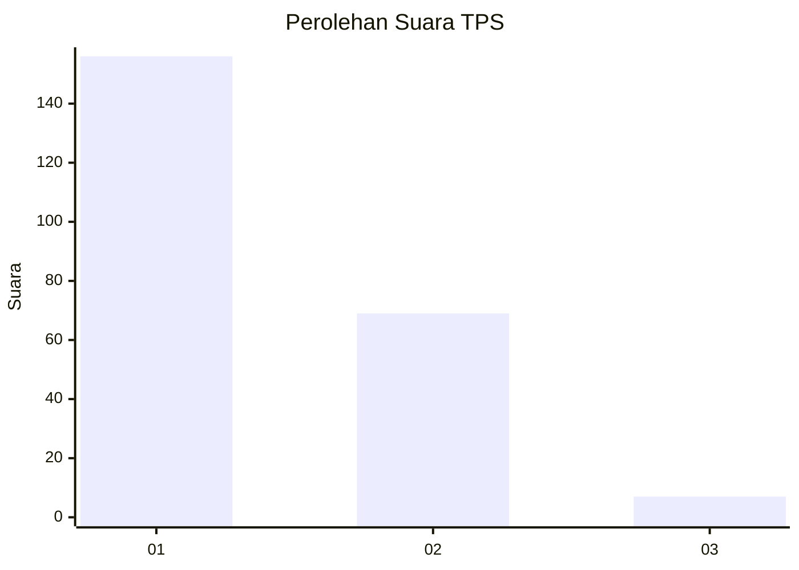
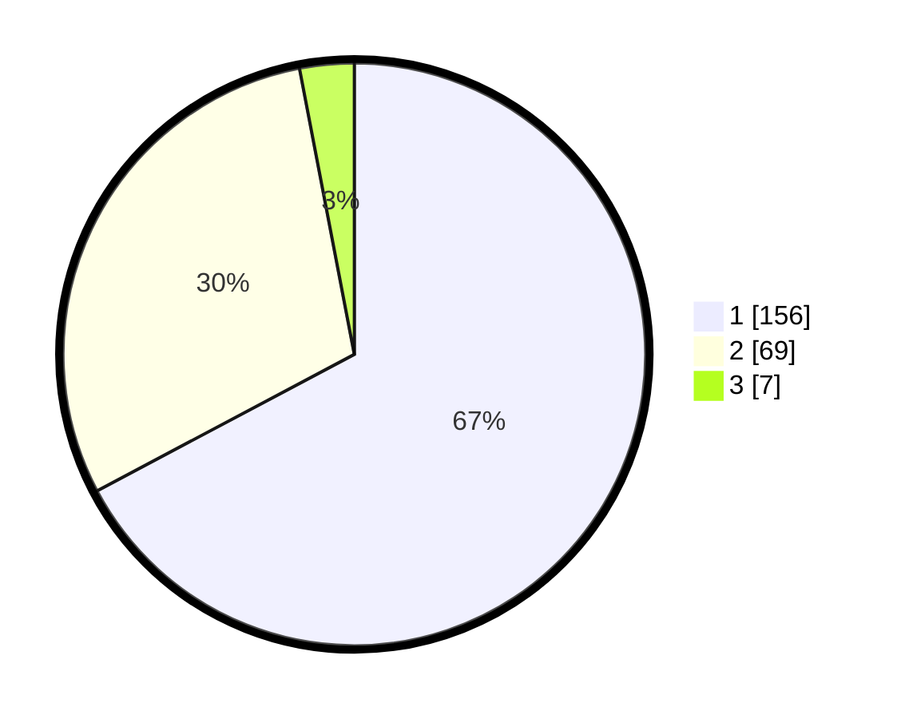

# Hasil

## Grafik

## Tabel

| No. | Nama Paslon    | Suara | Suara (raw) | Persentase |
|:--- |:-------------- | -----:| -----------:| ----------:|
| 1   | ANIES MUHAIMIN | 156   | [156][p-1]  | 67,24      |
| 2   | PRABOWO GIBRAN | 69    | [69][p-2]   | 29,74      |
| 3   | GANJAR MAHFUD  | 7     | [7][p-3]    | 3,02       |

[p-1]: https://github.com/gigit-pemilu/pemilu-2024-35-jawa-timur/blob/main/pilpres/hitung-suara/sub/35-jawa-timur/sub/11-bondowoso/sub/15-cermee/sub/2004-suling-wetan/sub/004-tps/sub/paslon-1.txt
[p-2]: https://github.com/gigit-pemilu/pemilu-2024-35-jawa-timur/blob/main/pilpres/hitung-suara/sub/35-jawa-timur/sub/11-bondowoso/sub/15-cermee/sub/2004-suling-wetan/sub/004-tps/sub/paslon-2.txt
[p-3]: https://github.com/gigit-pemilu/pemilu-2024-35-jawa-timur/blob/main/pilpres/hitung-suara/sub/35-jawa-timur/sub/11-bondowoso/sub/15-cermee/sub/2004-suling-wetan/sub/004-tps/sub/paslon-3.txt

## Foto C Plano

https://sirekap-obj-formc.kpu.go.id/e6dc/pemilu/ppwp/35/11/15/20/04/3511152004004-20240214-231130--d6b51f46-f268-46f7-8e84-57a34a1c74b3.jpg

https://sirekap-obj-formc.kpu.go.id/e6dc/pemilu/ppwp/35/11/15/20/04/3511152004004-20240214-231348--4c88a1dc-a4c0-492c-bd6d-b0b10b2506b5.jpg

https://sirekap-obj-formc.kpu.go.id/e6dc/pemilu/ppwp/35/11/15/20/04/3511152004004-20240214-231528--9a14a071-1640-4d86-988c-ddca1402a8b8.jpg

## Metadata

| Key        | Value               |
| ---------- | ------------------- |
| Time Stamp | 2024-02-24 22:31:28 |

