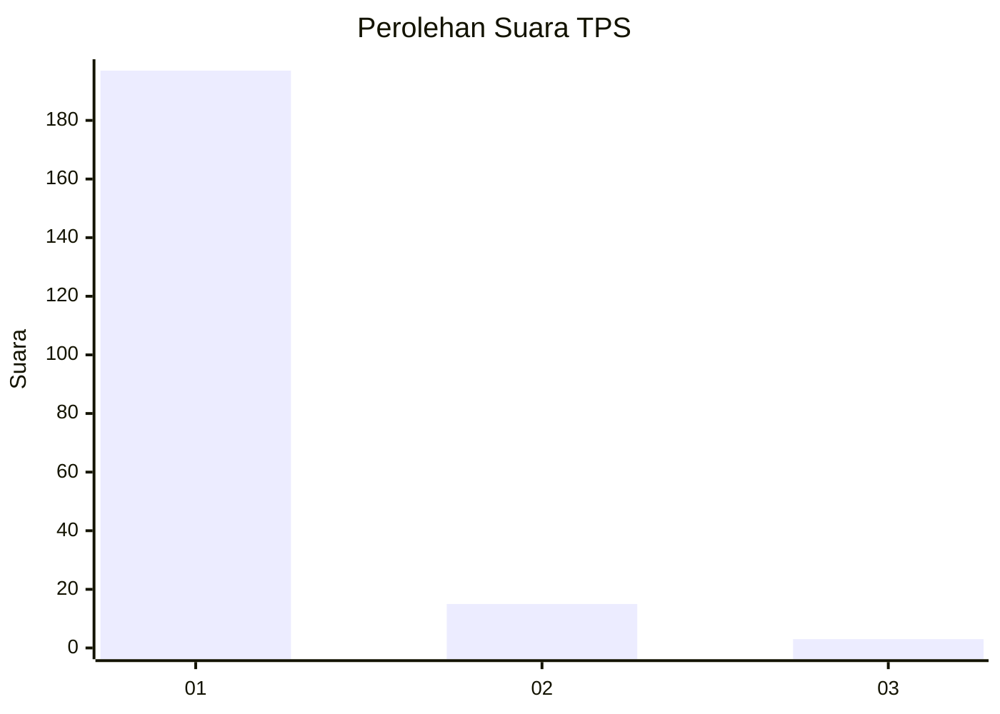
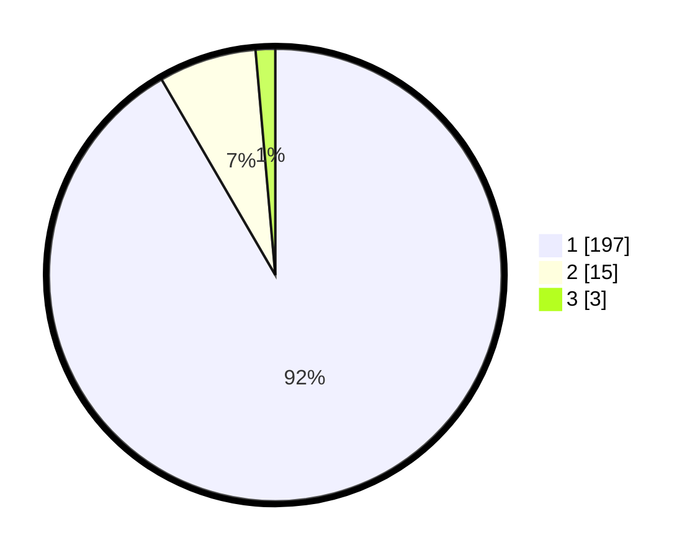

# Hasil

## Grafik

## Tabel

| No. | Nama Paslon    | Suara | Suara (raw) | Persentase |
|:--- |:-------------- | -----:| -----------:| ----------:|
| 1   | ANIES MUHAIMIN | 197   | [197][p-1]  | 91,63      |
| 2   | PRABOWO GIBRAN | 15    | [15][p-2]   | 6,98       |
| 3   | GANJAR MAHFUD  | 3     | [3][p-3]    | 1,40       |

[p-1]: https://github.com/gigit-pemilu/pemilu-2024-35-jawa-timur/blob/main/pilpres/hitung-suara/sub/35-jawa-timur/sub/11-bondowoso/sub/15-cermee/sub/2004-suling-wetan/sub/010-tps/sub/paslon-1.txt
[p-2]: https://github.com/gigit-pemilu/pemilu-2024-35-jawa-timur/blob/main/pilpres/hitung-suara/sub/35-jawa-timur/sub/11-bondowoso/sub/15-cermee/sub/2004-suling-wetan/sub/010-tps/sub/paslon-2.txt
[p-3]: https://github.com/gigit-pemilu/pemilu-2024-35-jawa-timur/blob/main/pilpres/hitung-suara/sub/35-jawa-timur/sub/11-bondowoso/sub/15-cermee/sub/2004-suling-wetan/sub/010-tps/sub/paslon-3.txt

## Foto C Plano

https://sirekap-obj-formc.kpu.go.id/ee13/pemilu/ppwp/35/11/15/20/04/3511152004010-20240215-013634--ca656703-9053-4e13-8b8d-3a1208b66c21.jpg

https://sirekap-obj-formc.kpu.go.id/ee13/pemilu/ppwp/35/11/15/20/04/3511152004010-20240215-015235--aec8513b-1965-4639-ba3e-630c8b7bb871.jpg

https://sirekap-obj-formc.kpu.go.id/ee13/pemilu/ppwp/35/11/15/20/04/3511152004010-20240215-015605--3239a1f0-db57-439c-b8ef-f06d76282c76.jpg

## Metadata

| Key        | Value               |
| ---------- | ------------------- |
| Time Stamp | 2024-02-24 22:31:28 |

