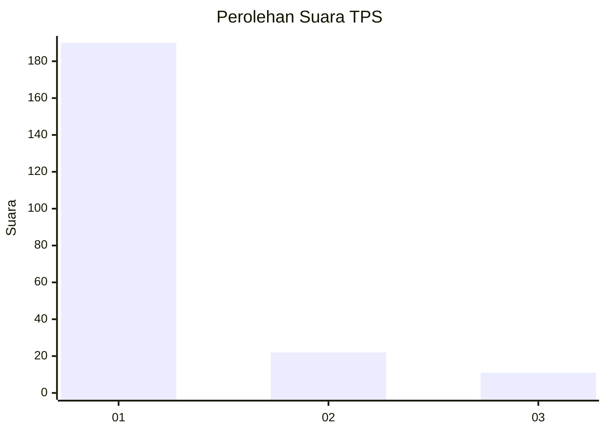
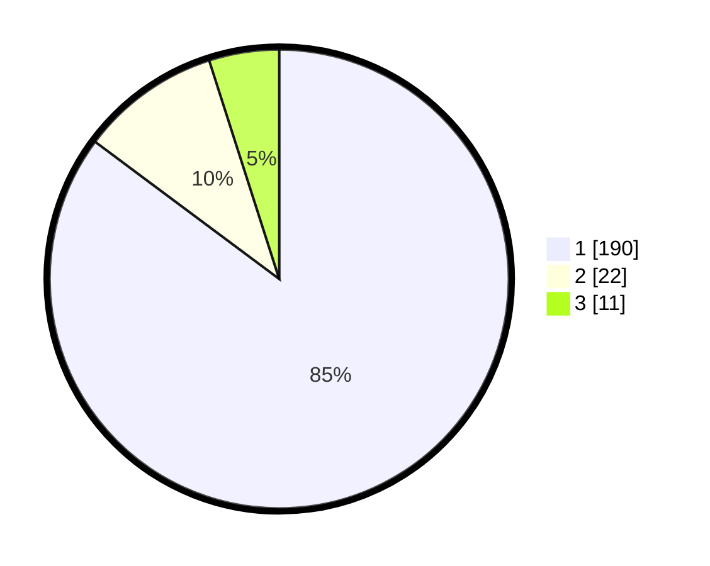

# Hasil

## Grafik

## Tabel

| No. | Nama Paslon    | Suara | Suara (raw) | Persentase |
|:--- |:-------------- | -----:| -----------:| ----------:|
| 1   | ANIES MUHAIMIN | 190   | [190][p-1]  | 85,20      |
| 2   | PRABOWO GIBRAN | 22    | [22][p-2]   | 9,87       |
| 3   | GANJAR MAHFUD  | 11    | [11][p-3]   | 4,93       |

[p-1]: https://github.com/gigit-pemilu/pemilu-2024/blob/main/pilpres/hitung-suara/sub/35-jawa-timur/sub/11-bondowoso/sub/15-cermee/sub/2004-suling-wetan/sub/011-tps/sub/paslon-1.txt
[p-2]: https://github.com/gigit-pemilu/pemilu-2024/blob/main/pilpres/hitung-suara/sub/35-jawa-timur/sub/11-bondowoso/sub/15-cermee/sub/2004-suling-wetan/sub/011-tps/sub/paslon-2.txt
[p-3]: https://github.com/gigit-pemilu/pemilu-2024/blob/main/pilpres/hitung-suara/sub/35-jawa-timur/sub/11-bondowoso/sub/15-cermee/sub/2004-suling-wetan/sub/011-tps/sub/paslon-3.txt

## Foto C Plano

https://sirekap-obj-formc.kpu.go.id/02f5/pemilu/ppwp/35/11/15/20/04/3511152004011-20240214-223533--6ad21078-9f0f-465d-8f14-b39b4bda2eb4.jpg

https://sirekap-obj-formc.kpu.go.id/02f5/pemilu/ppwp/35/11/15/20/04/3511152004011-20240214-223659--965f00eb-b839-4748-ae82-3b83c6592ae5.jpg

https://sirekap-obj-formc.kpu.go.id/02f5/pemilu/ppwp/35/11/15/20/04/3511152004011-20240214-223835--1ba6195c-3115-4386-ab68-90c8c72c8a4a.jpg

## Metadata

| Key        | Value               |
| ---------- | ------------------- |
| Time Stamp | 2024-02-16 16:25:10 |

