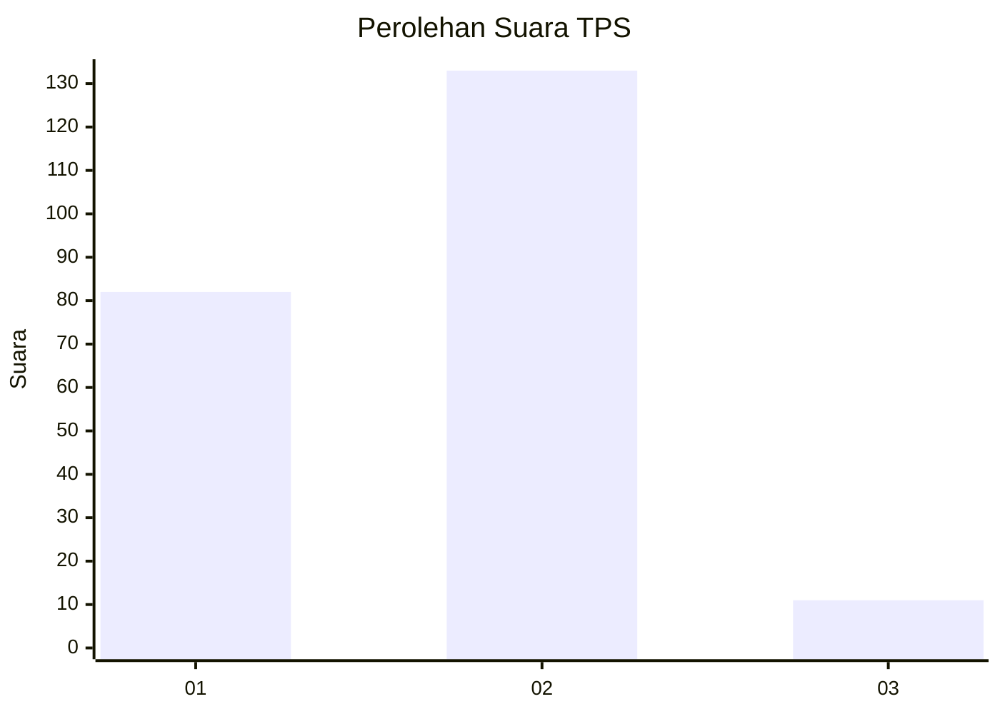
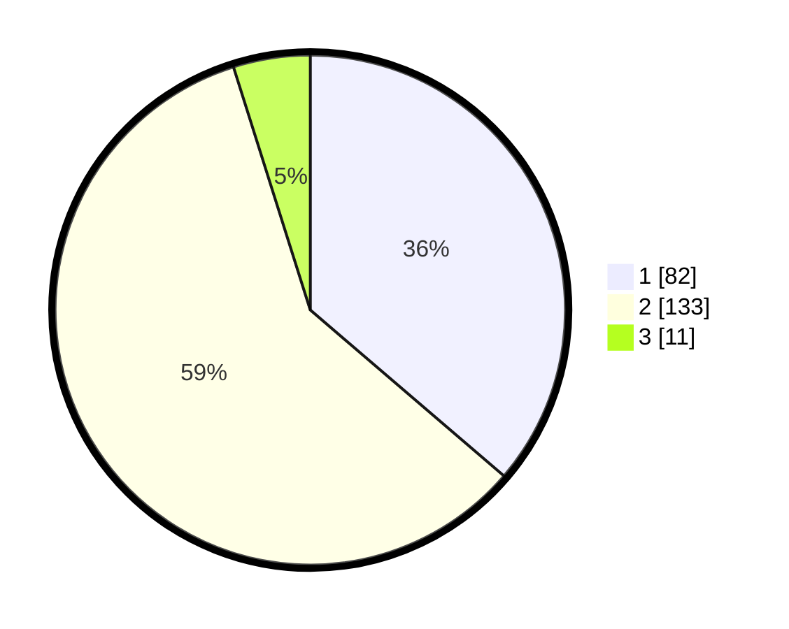

# Hasil

## Grafik

## Tabel

| No. | Nama Paslon    | Suara | Suara (raw) | Persentase |
|:--- |:-------------- | -----:| -----------:| ----------:|
| 1   | ANIES MUHAIMIN | 82    | [82][p-1]   | 36,28      |
| 2   | PRABOWO GIBRAN | 133   | [133][p-2]  | 58,85      |
| 3   | GANJAR MAHFUD  | 11    | [11][p-3]   | 4,87       |

[p-1]: https://github.com/gigit-pemilu/pemilu-2024-35-jawa-timur/blob/main/pilpres/hitung-suara/sub/35-jawa-timur/sub/11-bondowoso/sub/15-cermee/sub/2007-ramban-wetan/sub/005-tps/sub/paslon-1.txt
[p-2]: https://github.com/gigit-pemilu/pemilu-2024-35-jawa-timur/blob/main/pilpres/hitung-suara/sub/35-jawa-timur/sub/11-bondowoso/sub/15-cermee/sub/2007-ramban-wetan/sub/005-tps/sub/paslon-2.txt
[p-3]: https://github.com/gigit-pemilu/pemilu-2024-35-jawa-timur/blob/main/pilpres/hitung-suara/sub/35-jawa-timur/sub/11-bondowoso/sub/15-cermee/sub/2007-ramban-wetan/sub/005-tps/sub/paslon-3.txt

## Foto C Plano

https://sirekap-obj-formc.kpu.go.id/460f/pemilu/ppwp/35/11/15/20/07/3511152007005-20240215-011558--80a27f4e-70b7-484e-b33b-58cbee16094f.jpg

https://sirekap-obj-formc.kpu.go.id/460f/pemilu/ppwp/35/11/15/20/07/3511152007005-20240215-002747--d7633017-c0b2-4e0f-b0ad-ac59ace9ba5f.jpg

https://sirekap-obj-formc.kpu.go.id/460f/pemilu/ppwp/35/11/15/20/07/3511152007005-20240214-221110--3acd4fa5-19e6-474f-8caf-babdc358b9a4.jpg

## Metadata

| Key        | Value               |
| ---------- | ------------------- |
| Time Stamp | 2024-02-16 16:25:10 |

