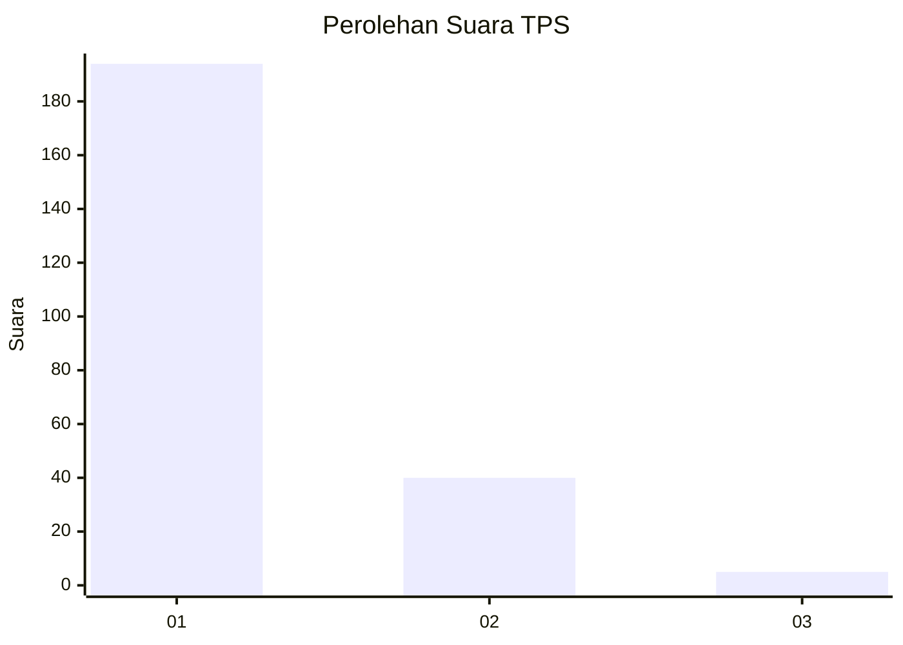
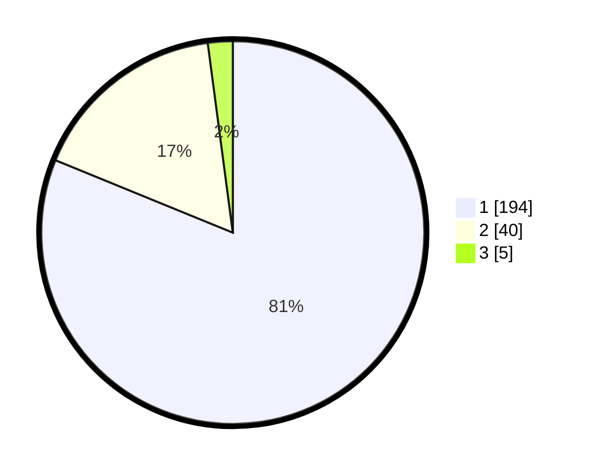

# Hasil

## Grafik

## Tabel

| No. | Nama Paslon    | Suara | Suara (raw) | Persentase |
|:--- |:-------------- | -----:| -----------:| ----------:|
| 1   | ANIES MUHAIMIN | 194   | [194][p-1]  | 81,17      |
| 2   | PRABOWO GIBRAN | 40    | [40][p-2]   | 16,74      |
| 3   | GANJAR MAHFUD  | 5     | [5][p-3]    | 2,09       |

[p-1]: https://github.com/gigit-pemilu/pemilu-2024/blob/main/pilpres/hitung-suara/sub/35-jawa-timur/sub/11-bondowoso/sub/15-cermee/sub/2007-ramban-wetan/sub/009-tps/sub/paslon-1.txt
[p-2]: https://github.com/gigit-pemilu/pemilu-2024/blob/main/pilpres/hitung-suara/sub/35-jawa-timur/sub/11-bondowoso/sub/15-cermee/sub/2007-ramban-wetan/sub/009-tps/sub/paslon-2.txt
[p-3]: https://github.com/gigit-pemilu/pemilu-2024/blob/main/pilpres/hitung-suara/sub/35-jawa-timur/sub/11-bondowoso/sub/15-cermee/sub/2007-ramban-wetan/sub/009-tps/sub/paslon-3.txt

## Foto C Plano

https://sirekap-obj-formc.kpu.go.id/9005/pemilu/ppwp/35/11/15/20/07/3511152007009-20240216-051018--151daa08-e86d-450c-9b11-2e0d3dbdba81.jpg

https://sirekap-obj-formc.kpu.go.id/9005/pemilu/ppwp/35/11/15/20/07/3511152007009-20240215-054859--83a29b99-5464-4b7b-9003-856e13fddbbf.jpg

https://sirekap-obj-formc.kpu.go.id/9005/pemilu/ppwp/35/11/15/20/07/3511152007009-20240215-055020--408ba8db-c288-4ec0-9795-696020b5ba01.jpg

## Metadata

| Key        | Value               |
| ---------- | ------------------- |
| Time Stamp | 2024-02-17 03:00:02 |

