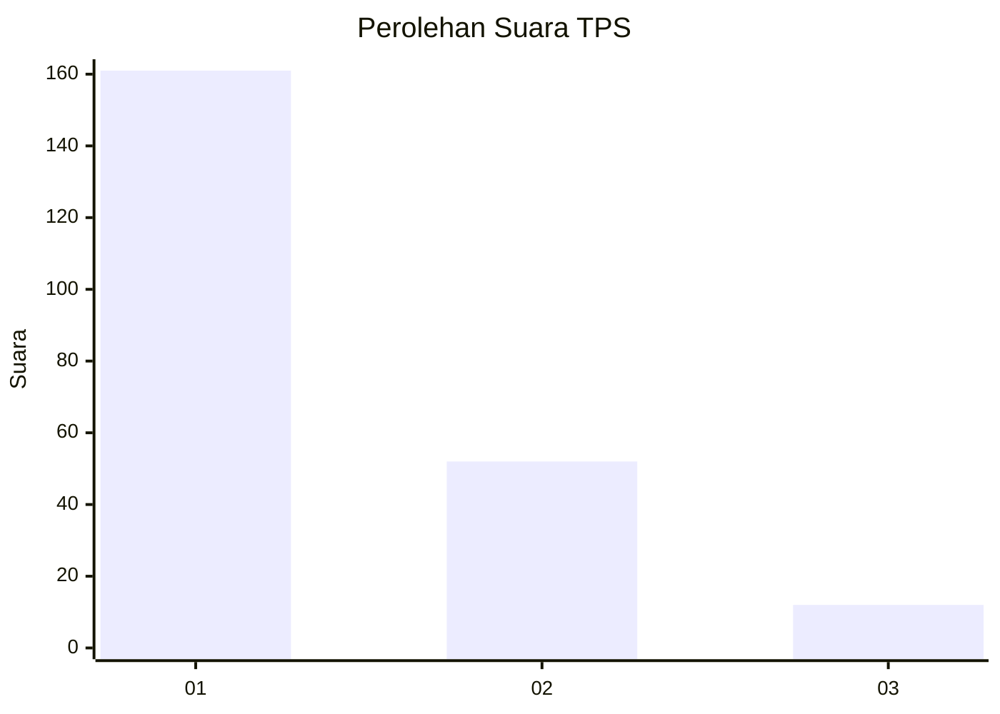
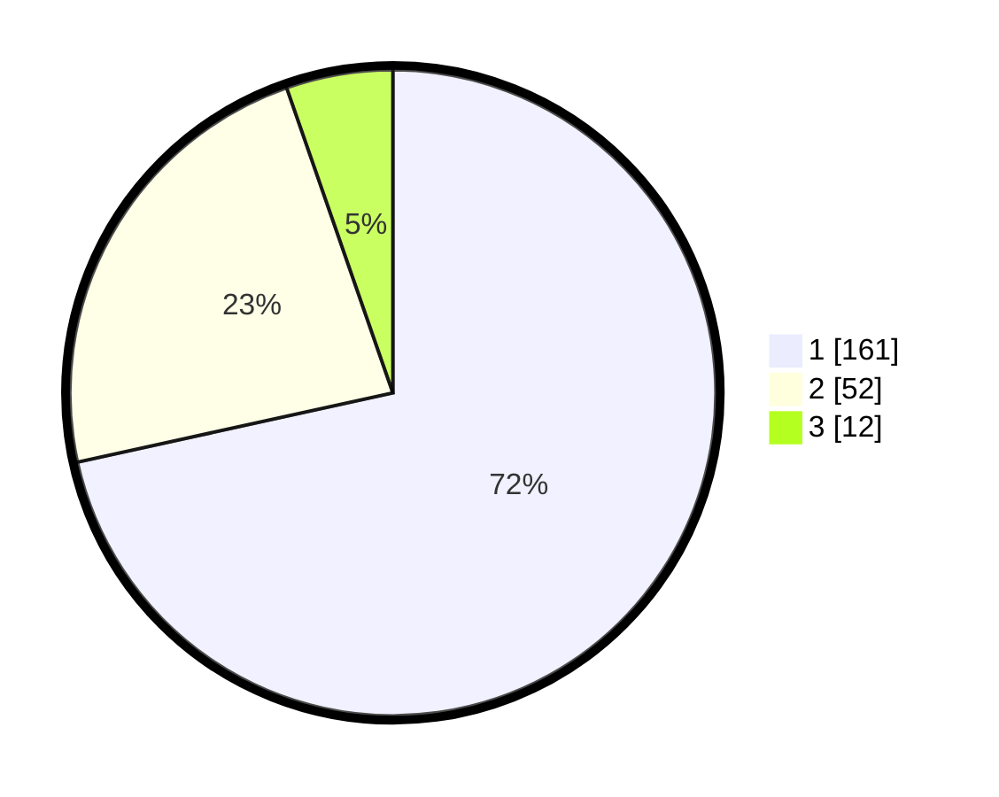

# Hasil

## Grafik

## Tabel

| No. | Nama Paslon    | Suara | Suara (raw) | Persentase |
|:--- |:-------------- | -----:| -----------:| ----------:|
| 1   | ANIES MUHAIMIN | 161   | [161][p-1]  | 71,56      |
| 2   | PRABOWO GIBRAN | 52    | [52][p-2]   | 23,11      |
| 3   | GANJAR MAHFUD  | 12    | [12][p-3]   | 5,33       |

[p-1]: https://github.com/gigit-pemilu/pemilu-2024-35-jawa-timur/blob/main/pilpres/hitung-suara/sub/35-jawa-timur/sub/11-bondowoso/sub/15-cermee/sub/2007-ramban-wetan/sub/010-tps/sub/paslon-1.txt
[p-2]: https://github.com/gigit-pemilu/pemilu-2024-35-jawa-timur/blob/main/pilpres/hitung-suara/sub/35-jawa-timur/sub/11-bondowoso/sub/15-cermee/sub/2007-ramban-wetan/sub/010-tps/sub/paslon-2.txt
[p-3]: https://github.com/gigit-pemilu/pemilu-2024-35-jawa-timur/blob/main/pilpres/hitung-suara/sub/35-jawa-timur/sub/11-bondowoso/sub/15-cermee/sub/2007-ramban-wetan/sub/010-tps/sub/paslon-3.txt

## Foto C Plano

https://sirekap-obj-formc.kpu.go.id/994b/pemilu/ppwp/35/11/15/20/07/3511152007010-20240214-224603--22815b52-6838-4592-a0ec-7fae369f471e.jpg

https://sirekap-obj-formc.kpu.go.id/994b/pemilu/ppwp/35/11/15/20/07/3511152007010-20240215-105722--693ad285-868c-44b7-9eca-2526f902ddaf.jpg

https://sirekap-obj-formc.kpu.go.id/994b/pemilu/ppwp/35/11/15/20/07/3511152007010-20240215-110032--190abcd9-2ff2-450c-a6f7-1d77a304ac55.jpg

## Metadata

| Key        | Value               |
| ---------- | ------------------- |
| Time Stamp | 2024-02-24 22:31:28 |

