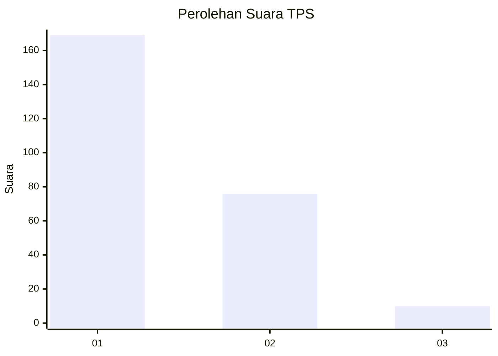
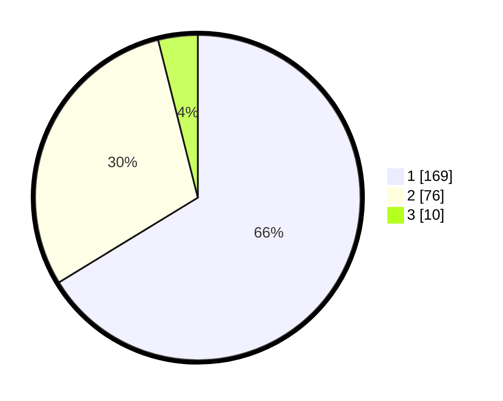

# Hasil

## Grafik

## Tabel

| No. | Nama Paslon    | Suara | Suara (raw) | Persentase |
|:--- |:-------------- | -----:| -----------:| ----------:|
| 1   | ANIES MUHAIMIN | 169   | [169][p-1]  | 66,27      |
| 2   | PRABOWO GIBRAN | 76    | [76][p-2]   | 29,80      |
| 3   | GANJAR MAHFUD  | 10    | [10][p-3]   | 3,92       |

[p-1]: https://github.com/gigit-pemilu/pemilu-2024/blob/main/pilpres/hitung-suara/sub/35-jawa-timur/sub/11-bondowoso/sub/15-cermee/sub/2007-ramban-wetan/sub/011-tps/sub/paslon-1.txt
[p-2]: https://github.com/gigit-pemilu/pemilu-2024/blob/main/pilpres/hitung-suara/sub/35-jawa-timur/sub/11-bondowoso/sub/15-cermee/sub/2007-ramban-wetan/sub/011-tps/sub/paslon-2.txt
[p-3]: https://github.com/gigit-pemilu/pemilu-2024/blob/main/pilpres/hitung-suara/sub/35-jawa-timur/sub/11-bondowoso/sub/15-cermee/sub/2007-ramban-wetan/sub/011-tps/sub/paslon-3.txt

## Foto C Plano

https://sirekap-obj-formc.kpu.go.id/6993/pemilu/ppwp/35/11/15/20/07/3511152007011-20240216-094605--618a4bdf-a955-4893-9aea-d86b31f561ba.jpg

https://sirekap-obj-formc.kpu.go.id/6993/pemilu/ppwp/35/11/15/20/07/3511152007011-20240215-050041--a87d1846-800b-4d13-b645-246d576656db.jpg

https://sirekap-obj-formc.kpu.go.id/6993/pemilu/ppwp/35/11/15/20/07/3511152007011-20240215-033146--e2f68899-8d62-44a9-8435-8eadcfee2d18.jpg

## Metadata

| Key        | Value               |
| ---------- | ------------------- |
| Time Stamp | 2024-02-24 22:31:28 |

