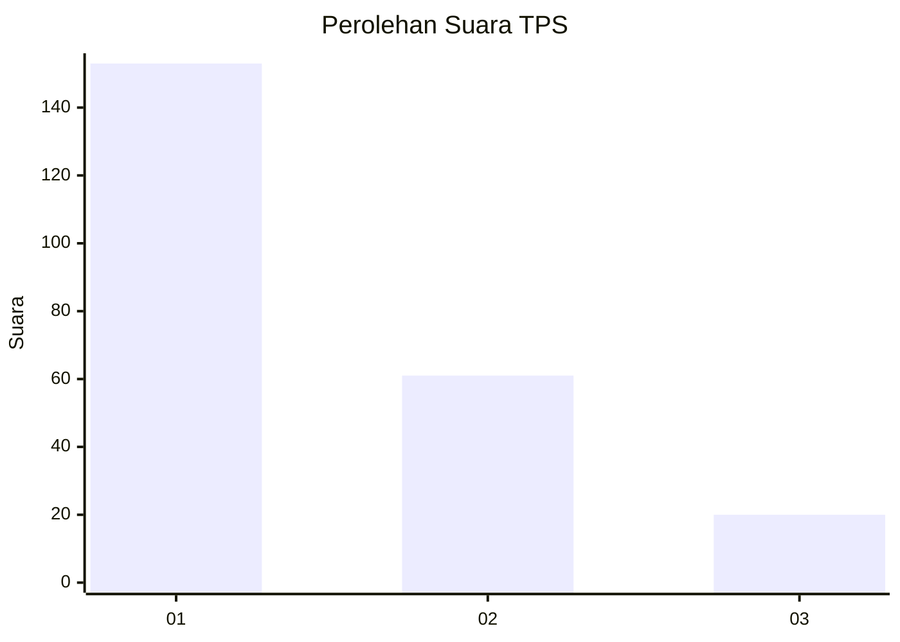
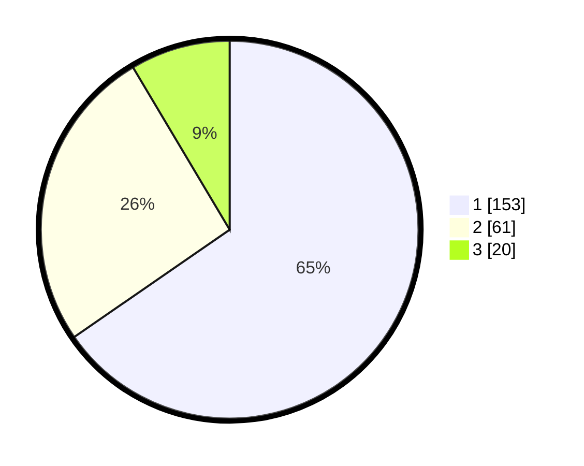

# Hasil

## Grafik

## Tabel

| No. | Nama Paslon    | Suara | Suara (raw) | Persentase |
|:--- |:-------------- | -----:| -----------:| ----------:|
| 1   | ANIES MUHAIMIN | 153   | [153][p-1]  | 65,38      |
| 2   | PRABOWO GIBRAN | 61    | [61][p-2]   | 26,07      |
| 3   | GANJAR MAHFUD  | 20    | [20][p-3]   | 8,55       |

[p-1]: https://github.com/gigit-pemilu/pemilu-2024-35-jawa-timur/blob/main/pilpres/hitung-suara/sub/35-jawa-timur/sub/11-bondowoso/sub/15-cermee/sub/2007-ramban-wetan/sub/014-tps/sub/paslon-1.txt
[p-2]: https://github.com/gigit-pemilu/pemilu-2024-35-jawa-timur/blob/main/pilpres/hitung-suara/sub/35-jawa-timur/sub/11-bondowoso/sub/15-cermee/sub/2007-ramban-wetan/sub/014-tps/sub/paslon-2.txt
[p-3]: https://github.com/gigit-pemilu/pemilu-2024-35-jawa-timur/blob/main/pilpres/hitung-suara/sub/35-jawa-timur/sub/11-bondowoso/sub/15-cermee/sub/2007-ramban-wetan/sub/014-tps/sub/paslon-3.txt

## Foto C Plano

https://sirekap-obj-formc.kpu.go.id/4abf/pemilu/ppwp/35/11/15/20/07/3511152007014-20240215-031421--50d5715c-3770-4081-afe8-1f4a9de6ce60.jpg

https://sirekap-obj-formc.kpu.go.id/4abf/pemilu/ppwp/35/11/15/20/07/3511152007014-20240215-031523--b710a700-5158-4348-a6aa-b35745b21ecf.jpg

https://sirekap-obj-formc.kpu.go.id/4abf/pemilu/ppwp/35/11/15/20/07/3511152007014-20240215-031626--9b4766a6-6b19-4330-93e3-5c4d8224955f.jpg

## Metadata

| Key        | Value               |
| ---------- | ------------------- |
| Time Stamp | 2024-02-19 06:16:00 |

