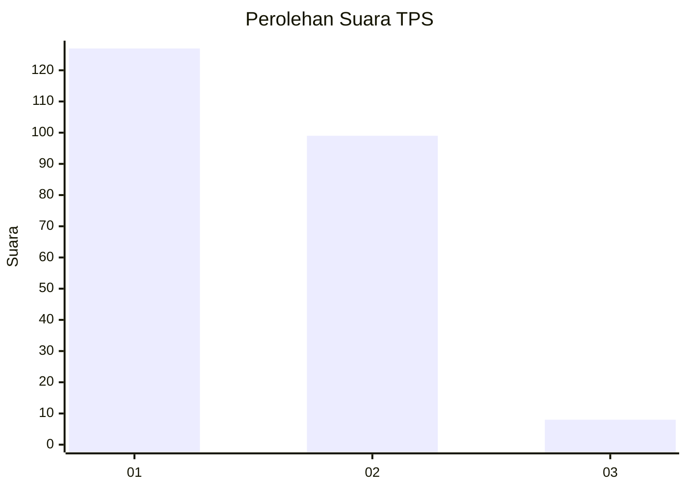
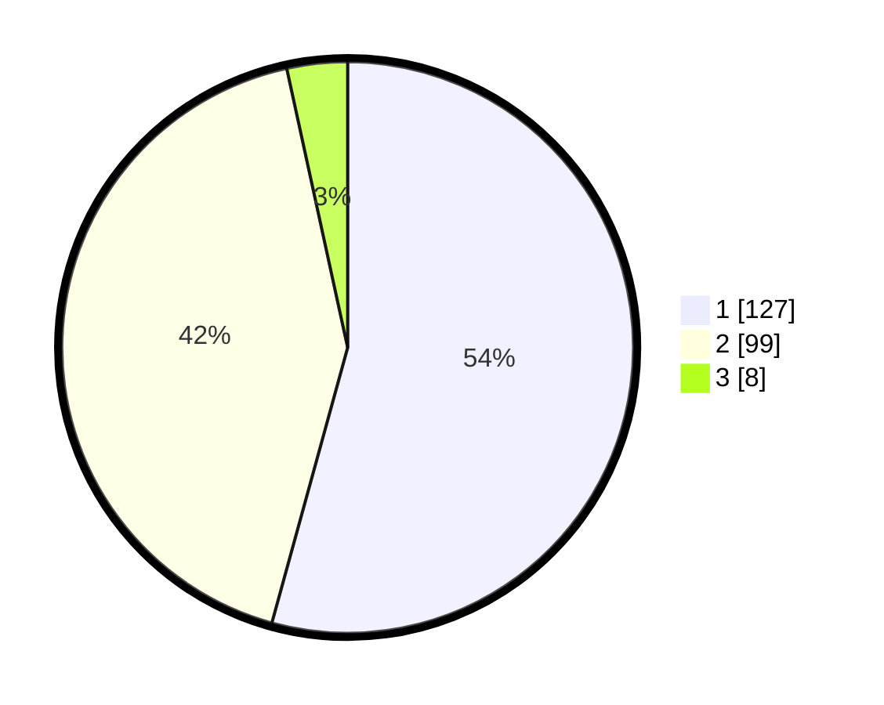

# Hasil

## Grafik

## Tabel

| No. | Nama Paslon    | Suara | Suara (raw) | Persentase |
|:--- |:-------------- | -----:| -----------:| ----------:|
| 1   | ANIES MUHAIMIN | 127   | [127][p-1]  | 54,27      |
| 2   | PRABOWO GIBRAN | 99    | [99][p-2]   | 42,31      |
| 3   | GANJAR MAHFUD  | 8     | [8][p-3]    | 3,42       |

[p-1]: https://github.com/gigit-pemilu/pemilu-2024/blob/main/pilpres/hitung-suara/sub/35-jawa-timur/sub/11-bondowoso/sub/15-cermee/sub/2009-ramban-kulon/sub/003-tps/sub/paslon-1.txt
[p-2]: https://github.com/gigit-pemilu/pemilu-2024/blob/main/pilpres/hitung-suara/sub/35-jawa-timur/sub/11-bondowoso/sub/15-cermee/sub/2009-ramban-kulon/sub/003-tps/sub/paslon-2.txt
[p-3]: https://github.com/gigit-pemilu/pemilu-2024/blob/main/pilpres/hitung-suara/sub/35-jawa-timur/sub/11-bondowoso/sub/15-cermee/sub/2009-ramban-kulon/sub/003-tps/sub/paslon-3.txt

## Foto C Plano

https://sirekap-obj-formc.kpu.go.id/ebf3/pemilu/ppwp/35/11/15/20/09/3511152009003-20240217-120630--f9a0f040-f194-4b31-ab57-4d6248afb3da.jpg

https://sirekap-obj-formc.kpu.go.id/ebf3/pemilu/ppwp/35/11/15/20/09/3511152009003-20240214-215803--1142d60d-9b80-4bfe-8244-3618cbc96363.jpg

https://sirekap-obj-formc.kpu.go.id/ebf3/pemilu/ppwp/35/11/15/20/09/3511152009003-20240214-215925--1e6287f3-4d78-4d05-9aae-5e4172238af8.jpg

## Metadata

| Key        | Value               |
| ---------- | ------------------- |
| Time Stamp | 2024-02-17 13:37:34 |

