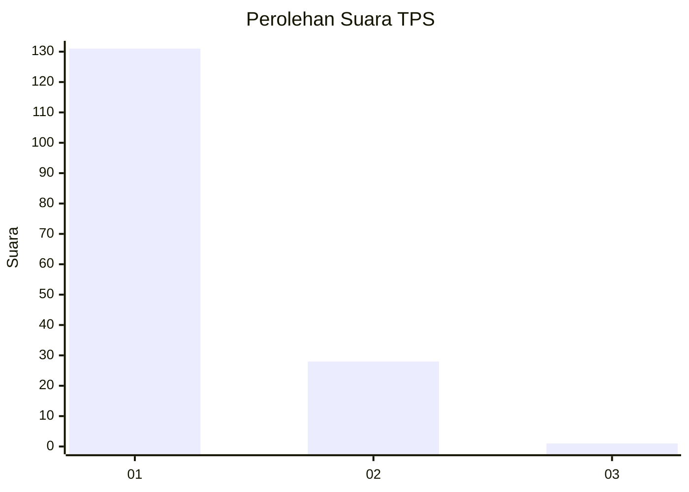
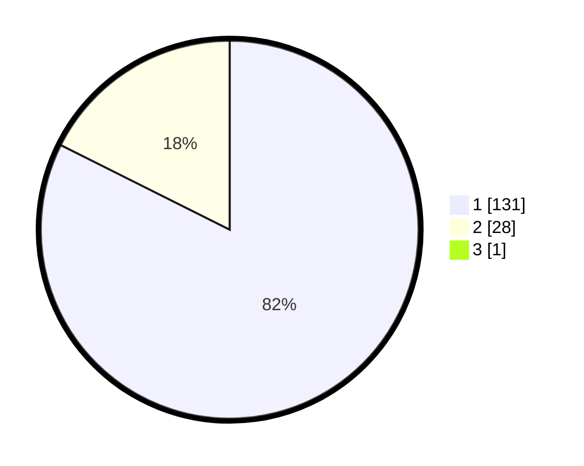

# Hasil

## Grafik

## Tabel

| No. | Nama Paslon    | Suara | Suara (raw) | Persentase |
|:--- |:-------------- | -----:| -----------:| ----------:|
| 1   | ANIES MUHAIMIN | 131   | [131][p-1]  | 81,88      |
| 2   | PRABOWO GIBRAN | 28    | [28][p-2]   | 17,50      |
| 3   | GANJAR MAHFUD  | 1     | [1][p-3]    | 0,63       |

[p-1]: https://github.com/gigit-pemilu/pemilu-2024-35-jawa-timur/blob/main/pilpres/hitung-suara/sub/35-jawa-timur/sub/11-bondowoso/sub/15-cermee/sub/2010-bajuran/sub/011-tps/sub/paslon-1.txt
[p-2]: https://github.com/gigit-pemilu/pemilu-2024-35-jawa-timur/blob/main/pilpres/hitung-suara/sub/35-jawa-timur/sub/11-bondowoso/sub/15-cermee/sub/2010-bajuran/sub/011-tps/sub/paslon-2.txt
[p-3]: https://github.com/gigit-pemilu/pemilu-2024-35-jawa-timur/blob/main/pilpres/hitung-suara/sub/35-jawa-timur/sub/11-bondowoso/sub/15-cermee/sub/2010-bajuran/sub/011-tps/sub/paslon-3.txt

## Foto C Plano

https://sirekap-obj-formc.kpu.go.id/af57/pemilu/ppwp/35/11/15/20/10/3511152010011-20240214-210340--4ab5f1d1-182b-44e2-ac17-50c9c752fd94.jpg

https://sirekap-obj-formc.kpu.go.id/af57/pemilu/ppwp/35/11/15/20/10/3511152010011-20240219-224018--acfb6f99-b8b2-4247-87a1-0af200401051.jpg

https://sirekap-obj-formc.kpu.go.id/af57/pemilu/ppwp/35/11/15/20/10/3511152010011-20240219-224115--4429dc64-70a7-4165-80f3-c677cc8f75eb.jpg

## Metadata

| Key        | Value               |
| ---------- | ------------------- |
| Time Stamp | 2024-02-24 22:31:28 |

