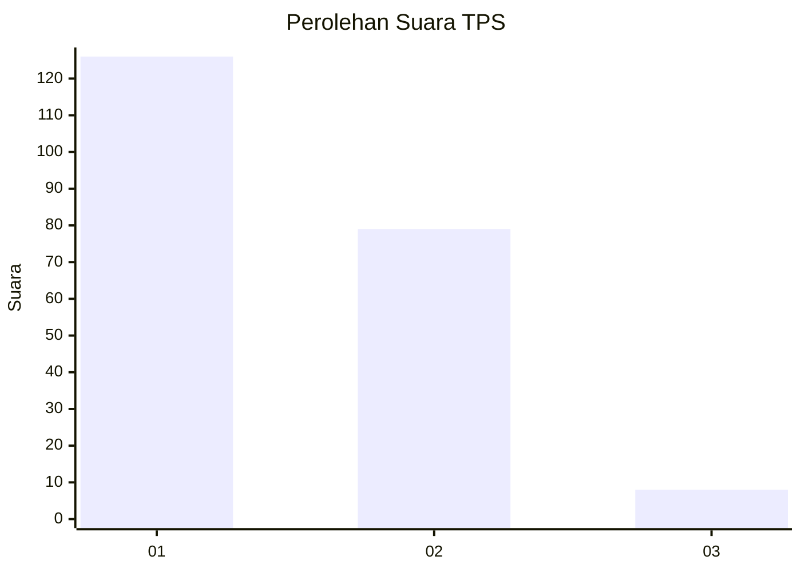
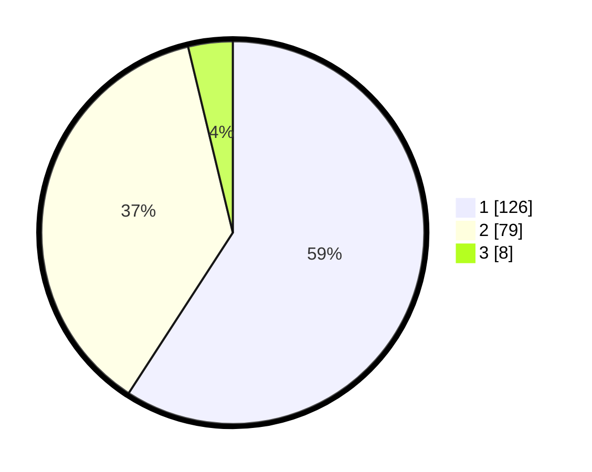

# Hasil

## Grafik

## Tabel

| No. | Nama Paslon    | Suara | Suara (raw) | Persentase |
|:--- |:-------------- | -----:| -----------:| ----------:|
| 1   | ANIES MUHAIMIN | 126   | [126][p-1]  | 59,15      |
| 2   | PRABOWO GIBRAN | 79    | [79][p-2]   | 37,09      |
| 3   | GANJAR MAHFUD  | 8     | [8][p-3]    | 3,76       |

[p-1]: https://github.com/gigit-pemilu/pemilu-2024-35-jawa-timur/blob/main/pilpres/hitung-suara/sub/35-jawa-timur/sub/11-bondowoso/sub/15-cermee/sub/2015-bercak-asri/sub/001-tps/sub/paslon-1.txt
[p-2]: https://github.com/gigit-pemilu/pemilu-2024-35-jawa-timur/blob/main/pilpres/hitung-suara/sub/35-jawa-timur/sub/11-bondowoso/sub/15-cermee/sub/2015-bercak-asri/sub/001-tps/sub/paslon-2.txt
[p-3]: https://github.com/gigit-pemilu/pemilu-2024-35-jawa-timur/blob/main/pilpres/hitung-suara/sub/35-jawa-timur/sub/11-bondowoso/sub/15-cermee/sub/2015-bercak-asri/sub/001-tps/sub/paslon-3.txt

## Foto C Plano

https://sirekap-obj-formc.kpu.go.id/aea1/pemilu/ppwp/35/11/15/20/15/3511152015001-20240214-214811--3684ed0e-30e3-4144-b032-c6de87d70041.jpg

https://sirekap-obj-formc.kpu.go.id/aea1/pemilu/ppwp/35/11/15/20/15/3511152015001-20240214-215002--1e338374-d7e5-4d2c-ab32-50ba496d1950.jpg

https://sirekap-obj-formc.kpu.go.id/aea1/pemilu/ppwp/35/11/15/20/15/3511152015001-20240214-215117--d04e3b57-3178-440a-ac3a-ff24f725732f.jpg

## Metadata

| Key        | Value               |
| ---------- | ------------------- |
| Time Stamp | 2024-02-24 22:31:28 |

