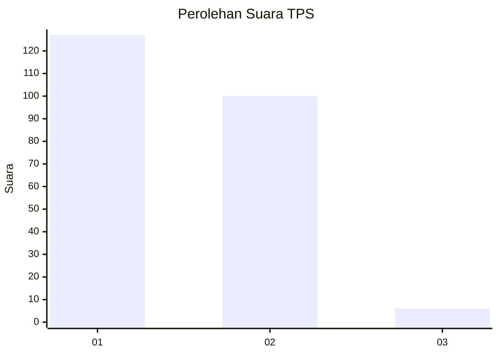
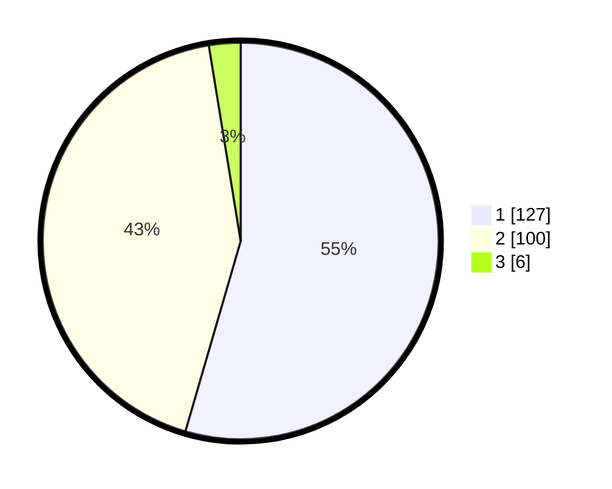

# Hasil

## Grafik

## Tabel

| No. | Nama Paslon    | Suara | Suara (raw) | Persentase |
|:--- |:-------------- | -----:| -----------:| ----------:|
| 1   | ANIES MUHAIMIN | 127   | [127][p-1]  | 54,51      |
| 2   | PRABOWO GIBRAN | 100   | [100][p-2]  | 42,92      |
| 3   | GANJAR MAHFUD  | 6     | [6][p-3]    | 2,58       |

[p-1]: https://github.com/gigit-pemilu/pemilu-2024-35-jawa-timur/blob/main/pilpres/hitung-suara/sub/35-jawa-timur/sub/11-bondowoso/sub/15-cermee/sub/2015-bercak-asri/sub/004-tps/sub/paslon-1.txt
[p-2]: https://github.com/gigit-pemilu/pemilu-2024-35-jawa-timur/blob/main/pilpres/hitung-suara/sub/35-jawa-timur/sub/11-bondowoso/sub/15-cermee/sub/2015-bercak-asri/sub/004-tps/sub/paslon-2.txt
[p-3]: https://github.com/gigit-pemilu/pemilu-2024-35-jawa-timur/blob/main/pilpres/hitung-suara/sub/35-jawa-timur/sub/11-bondowoso/sub/15-cermee/sub/2015-bercak-asri/sub/004-tps/sub/paslon-3.txt

## Foto C Plano

https://sirekap-obj-formc.kpu.go.id/b0ce/pemilu/ppwp/35/11/15/20/15/3511152015004-20240214-230225--327364b2-feb5-448d-9d1f-e59ce9ab5370.jpg

https://sirekap-obj-formc.kpu.go.id/b0ce/pemilu/ppwp/35/11/15/20/15/3511152015004-20240214-230430--a3363e26-45d0-4d81-ab70-70212307e487.jpg

https://sirekap-obj-formc.kpu.go.id/b0ce/pemilu/ppwp/35/11/15/20/15/3511152015004-20240214-230953--cb713561-0481-4037-804f-2bd712e67167.jpg

## Metadata

| Key        | Value               |
| ---------- | ------------------- |
| Time Stamp | 2024-02-24 22:31:28 |

