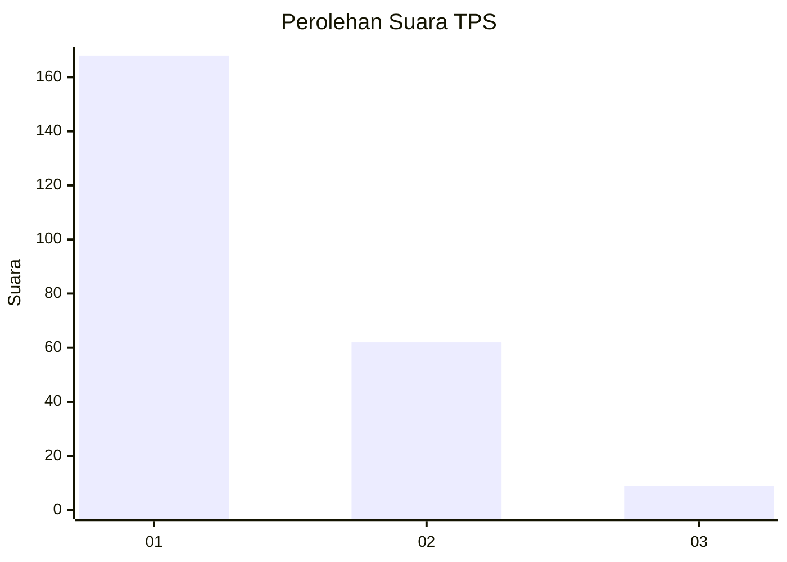
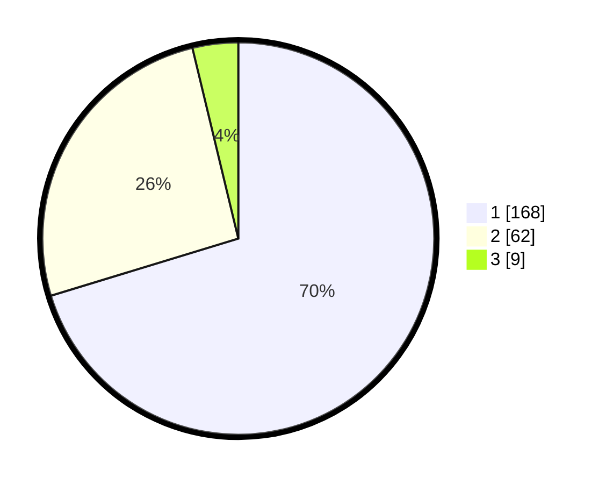

# Hasil

## Grafik

## Tabel

| No. | Nama Paslon    | Suara | Suara (raw) | Persentase |
|:--- |:-------------- | -----:| -----------:| ----------:|
| 1   | ANIES MUHAIMIN | 168   | [168][p-1]  | 70,29      |
| 2   | PRABOWO GIBRAN | 62    | [62][p-2]   | 25,94      |
| 3   | GANJAR MAHFUD  | 9     | [9][p-3]    | 3,77       |

[p-1]: https://github.com/gigit-pemilu/pemilu-2024-35-jawa-timur/blob/main/pilpres/hitung-suara/sub/35-jawa-timur/sub/11-bondowoso/sub/15-cermee/sub/2015-bercak-asri/sub/008-tps/sub/paslon-1.txt
[p-2]: https://github.com/gigit-pemilu/pemilu-2024-35-jawa-timur/blob/main/pilpres/hitung-suara/sub/35-jawa-timur/sub/11-bondowoso/sub/15-cermee/sub/2015-bercak-asri/sub/008-tps/sub/paslon-2.txt
[p-3]: https://github.com/gigit-pemilu/pemilu-2024-35-jawa-timur/blob/main/pilpres/hitung-suara/sub/35-jawa-timur/sub/11-bondowoso/sub/15-cermee/sub/2015-bercak-asri/sub/008-tps/sub/paslon-3.txt

## Foto C Plano

https://sirekap-obj-formc.kpu.go.id/3cac/pemilu/ppwp/35/11/15/20/15/3511152015008-20240215-003355--cf530136-38c6-491e-8b1a-74973205d23b.jpg

https://sirekap-obj-formc.kpu.go.id/3cac/pemilu/ppwp/35/11/15/20/15/3511152015008-20240215-003801--940fafac-0fb2-4878-a9bd-03ca7226b0f9.jpg

https://sirekap-obj-formc.kpu.go.id/3cac/pemilu/ppwp/35/11/15/20/15/3511152015008-20240215-003607--e1270378-4dae-4df9-b43e-8cb0370a4e64.jpg

## Metadata

| Key        | Value               |
| ---------- | ------------------- |
| Time Stamp | 2024-02-16 08:30:27 |

