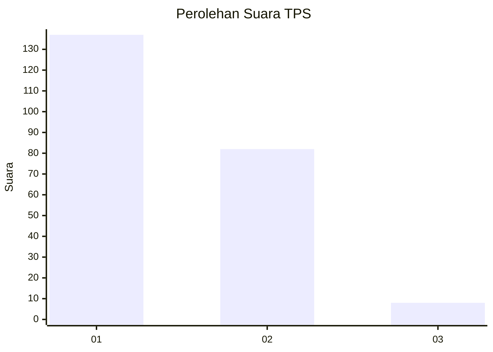
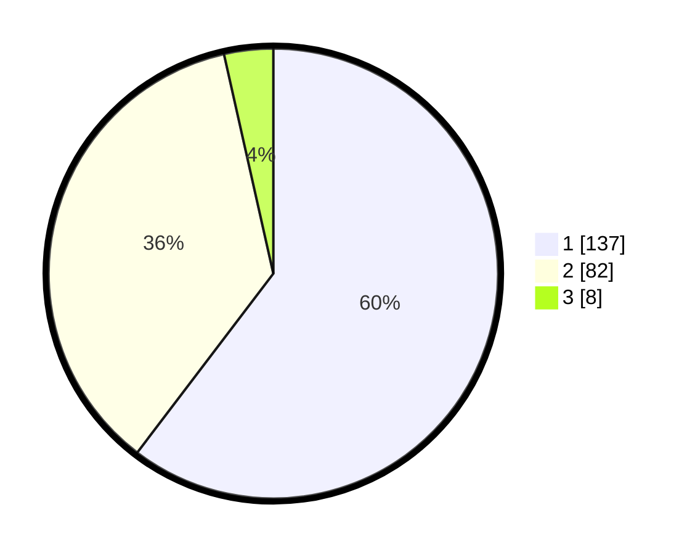

# Hasil

## Grafik

## Tabel

| No. | Nama Paslon    | Suara | Suara (raw) | Persentase |
|:--- |:-------------- | -----:| -----------:| ----------:|
| 1   | ANIES MUHAIMIN | 137   | [137][p-1]  | 60,35      |
| 2   | PRABOWO GIBRAN | 82    | [82][p-2]   | 36,12      |
| 3   | GANJAR MAHFUD  | 8     | [8][p-3]    | 3,52       |

[p-1]: https://github.com/gigit-pemilu/pemilu-2024-35-jawa-timur/blob/main/pilpres/hitung-suara/sub/35-jawa-timur/sub/11-bondowoso/sub/16-prajekan/sub/2001-bandilan/sub/011-tps/sub/paslon-1.txt
[p-2]: https://github.com/gigit-pemilu/pemilu-2024-35-jawa-timur/blob/main/pilpres/hitung-suara/sub/35-jawa-timur/sub/11-bondowoso/sub/16-prajekan/sub/2001-bandilan/sub/011-tps/sub/paslon-2.txt
[p-3]: https://github.com/gigit-pemilu/pemilu-2024-35-jawa-timur/blob/main/pilpres/hitung-suara/sub/35-jawa-timur/sub/11-bondowoso/sub/16-prajekan/sub/2001-bandilan/sub/011-tps/sub/paslon-3.txt

## Foto C Plano

https://sirekap-obj-formc.kpu.go.id/e8d0/pemilu/ppwp/35/11/16/20/01/3511162001011-20240219-231059--3555772a-038d-45b5-aacc-9c611c47d23b.jpg

https://sirekap-obj-formc.kpu.go.id/e8d0/pemilu/ppwp/35/11/16/20/01/3511162001011-20240219-231228--f7a3f3f1-4d46-430a-9b9e-a9112770cc46.jpg

https://sirekap-obj-formc.kpu.go.id/e8d0/pemilu/ppwp/35/11/16/20/01/3511162001011-20240219-231417--44d47e23-e792-432a-a070-5957c7e27e82.jpg

## Metadata

| Key        | Value               |
| ---------- | ------------------- |
| Time Stamp | 2024-02-24 22:31:28 |

