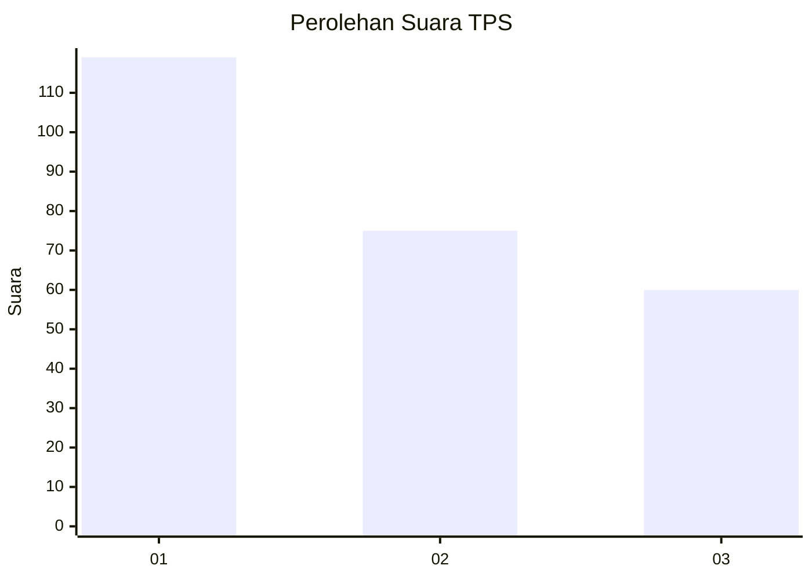
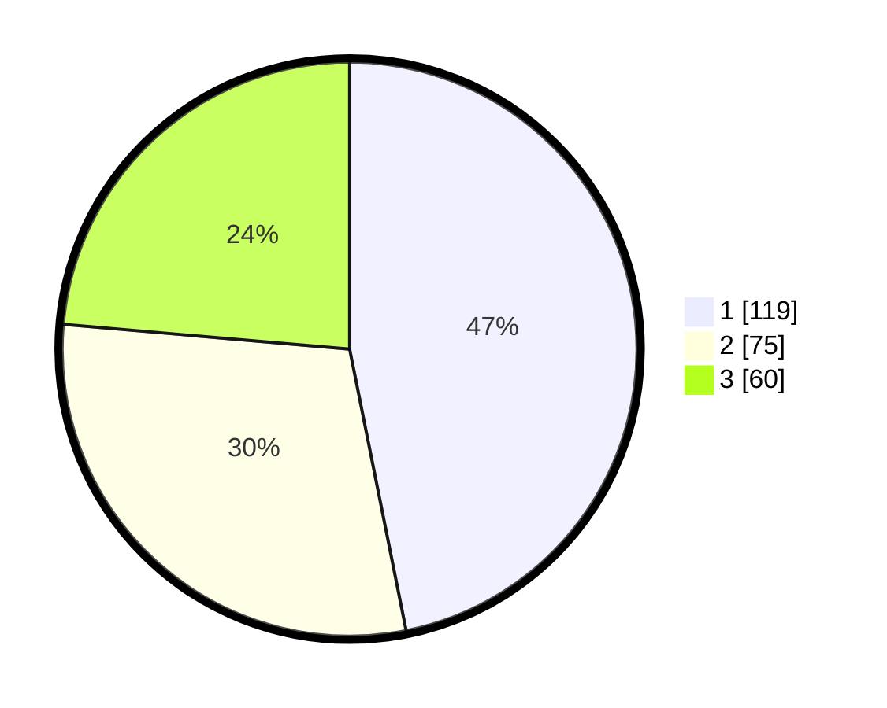

# Hasil

## Grafik

## Tabel

| No. | Nama Paslon    | Suara | Suara (raw) | Persentase |
|:--- |:-------------- | -----:| -----------:| ----------:|
| 1   | ANIES MUHAIMIN | 119   | [119][p-1]  | 46,85      |
| 2   | PRABOWO GIBRAN | 75    | [75][p-2]   | 29,53      |
| 3   | GANJAR MAHFUD  | 60    | [60][p-3]   | 23,62      |

[p-1]: https://github.com/gigit-pemilu/pemilu-2024/blob/main/pilpres/hitung-suara/sub/35-jawa-timur/sub/11-bondowoso/sub/16-prajekan/sub/2003-tarum/sub/001-tps/sub/paslon-1.txt
[p-2]: https://github.com/gigit-pemilu/pemilu-2024/blob/main/pilpres/hitung-suara/sub/35-jawa-timur/sub/11-bondowoso/sub/16-prajekan/sub/2003-tarum/sub/001-tps/sub/paslon-2.txt
[p-3]: https://github.com/gigit-pemilu/pemilu-2024/blob/main/pilpres/hitung-suara/sub/35-jawa-timur/sub/11-bondowoso/sub/16-prajekan/sub/2003-tarum/sub/001-tps/sub/paslon-3.txt

## Foto C Plano

https://sirekap-obj-formc.kpu.go.id/b66d/pemilu/ppwp/35/11/16/20/03/3511162003001-20240214-232955--52d9152d-e6ec-4a42-bfcc-1de5dccea2fd.jpg

https://sirekap-obj-formc.kpu.go.id/b66d/pemilu/ppwp/35/11/16/20/03/3511162003001-20240214-234003--fa55d139-e2b0-4b06-ab14-b6c54fc49590.jpg

https://sirekap-obj-formc.kpu.go.id/b66d/pemilu/ppwp/35/11/16/20/03/3511162003001-20240214-233227--8c028a46-9920-4169-94db-9779bdd9ab97.jpg

## Metadata

| Key        | Value               |
| ---------- | ------------------- |
| Time Stamp | 2024-02-17 03:00:02 |

