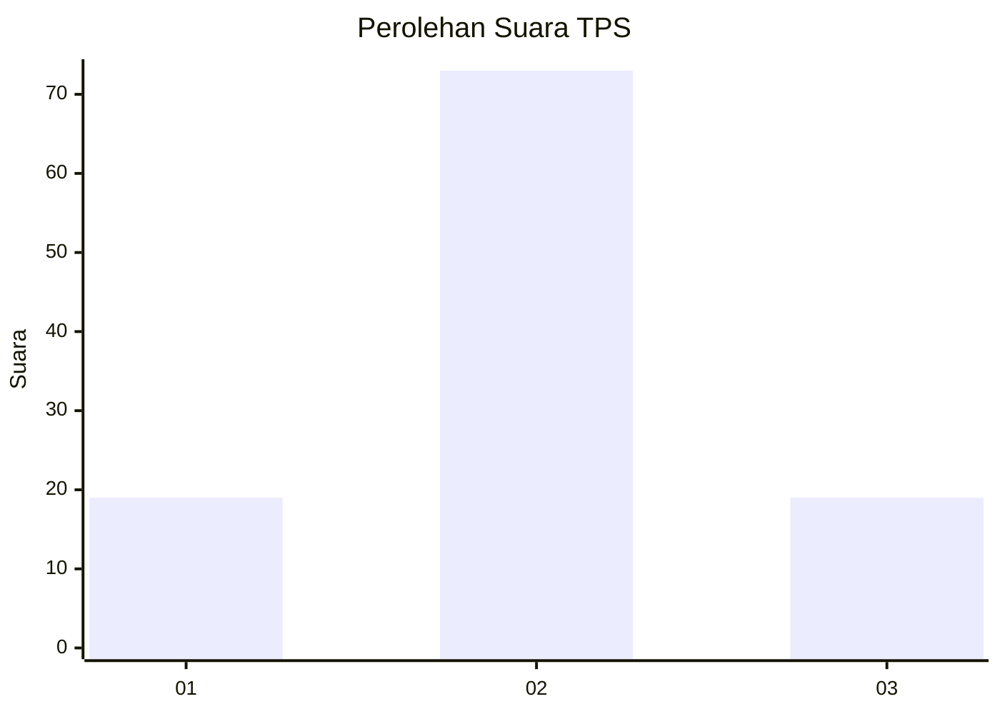
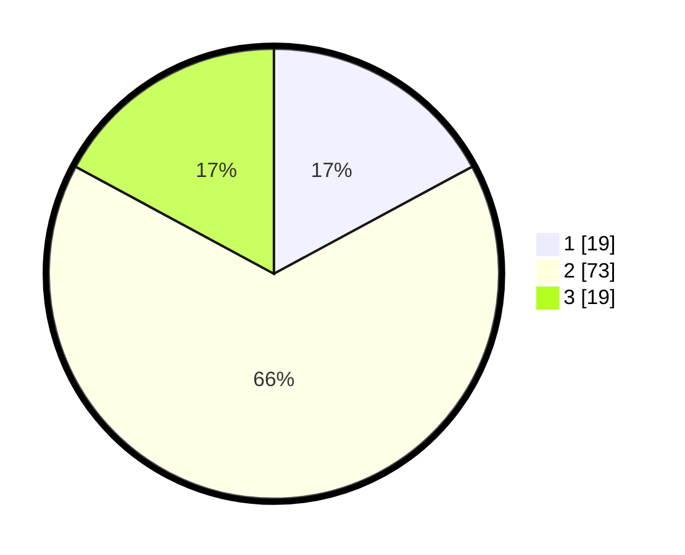

# Hasil

## Grafik

## Tabel

| No. | Nama Paslon    | Suara | Suara (raw) | Persentase |
|:--- |:-------------- | -----:| -----------:| ----------:|
| 1   | ANIES MUHAIMIN | 19    | [19][p-1]   | 17,12      |
| 2   | PRABOWO GIBRAN | 73    | [73][p-2]   | 65,77      |
| 3   | GANJAR MAHFUD  | 19    | [19][p-3]   | 17,12      |

[p-1]: https://github.com/gigit-pemilu/pemilu-2024/blob/main/pilpres/hitung-suara/sub/35-jawa-timur/sub/11-bondowoso/sub/17-pakem/sub/2001-andungsari/sub/001-tps/sub/paslon-1.txt
[p-2]: https://github.com/gigit-pemilu/pemilu-2024/blob/main/pilpres/hitung-suara/sub/35-jawa-timur/sub/11-bondowoso/sub/17-pakem/sub/2001-andungsari/sub/001-tps/sub/paslon-2.txt
[p-3]: https://github.com/gigit-pemilu/pemilu-2024/blob/main/pilpres/hitung-suara/sub/35-jawa-timur/sub/11-bondowoso/sub/17-pakem/sub/2001-andungsari/sub/001-tps/sub/paslon-3.txt

## Foto C Plano

https://sirekap-obj-formc.kpu.go.id/c9fe/pemilu/ppwp/35/11/17/20/01/3511172001001-20240216-105003--66015904-fa2f-40bc-971f-9020476284a6.jpg

https://sirekap-obj-formc.kpu.go.id/c9fe/pemilu/ppwp/35/11/17/20/01/3511172001001-20240219-113513--9f73accc-7187-4f6d-ac70-c76bf45ff1f4.jpg

https://sirekap-obj-formc.kpu.go.id/c9fe/pemilu/ppwp/35/11/17/20/01/3511172001001-20240219-123601--0b03a3c5-8d1f-4eba-8cf5-2e56fd4188e8.jpg

## Metadata

| Key        | Value               |
| ---------- | ------------------- |
| Time Stamp | 2024-02-19 13:00:00 |

## DATA PEMILIH TETAP

Jumlah pemilih dalam DPT: **153**.
 * L: **78**.
 * P: **75**.

## DATA PENGGUNA HAK PILIH

Jumlah pengguna hak pilih dalam DPT: **115**.
 * L: **59**.
 * P: **56**.

Jumlah pengguna hak pilih dalam DPTb: **1**.
 * L: **1**.
 * P: **0**.

Jumlah pengguna hak pilih dalam DPK: **3**.
 * L: **2**.
 * P: **1**.

Jumlah pengguna hak pilih: **119**.
 * L: **62**.
 * P: **57**.

## JUMLAH SUARA SAH DAN TIDAK SAH

JUMLAH SELURUH SUARA SAH: **111**.

JUMLAH SUARA TIDAK SAH: **8**.

JUMLAH SELURUH SUARA SAH DAN SUARA TIDAK SAH: **119**.

