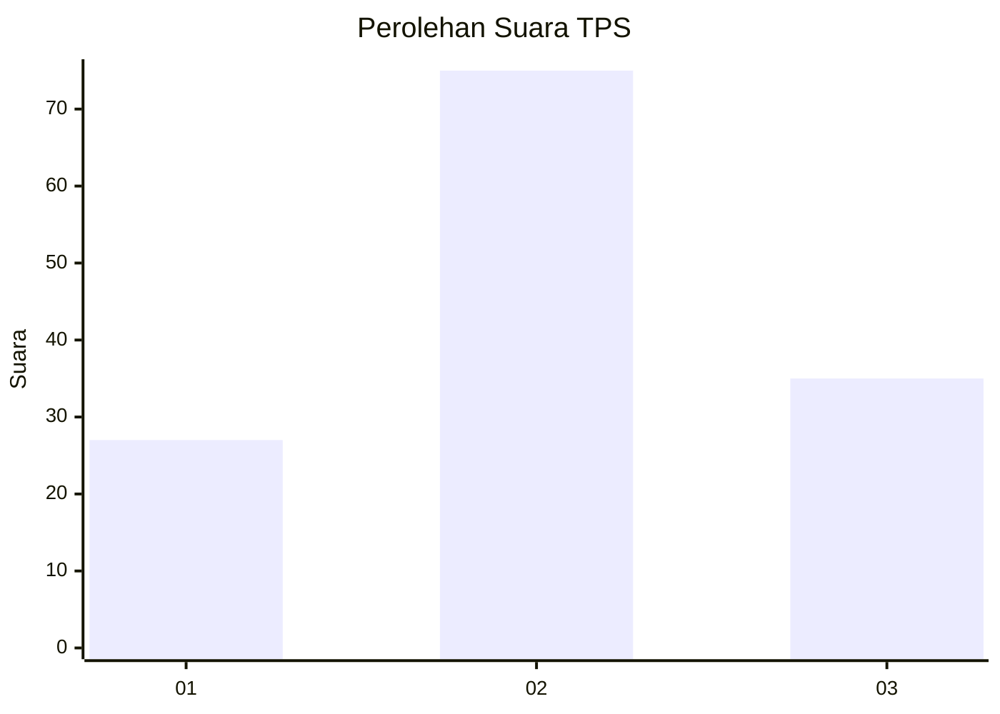
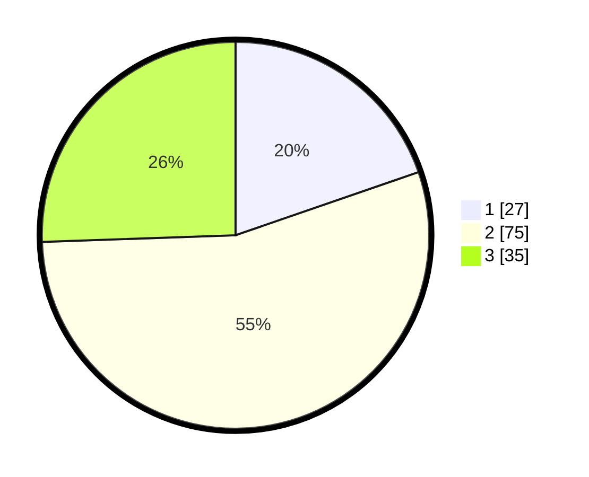

# Hasil

## Grafik

## Tabel

| No. | Nama Paslon    | Suara | Suara (raw) | Persentase |
|:--- |:-------------- | -----:| -----------:| ----------:|
| 1   | ANIES MUHAIMIN | 27    | [27][p-1]   | 19,71      |
| 2   | PRABOWO GIBRAN | 75    | [75][p-2]   | 54,74      |
| 3   | GANJAR MAHFUD  | 35    | [35][p-3]   | 25,55      |

[p-1]: https://github.com/gigit-pemilu/pemilu-2024-35-jawa-timur/blob/main/pilpres/hitung-suara/sub/35-jawa-timur/sub/11-bondowoso/sub/17-pakem/sub/2001-andungsari/sub/005-tps/sub/paslon-1.txt
[p-2]: https://github.com/gigit-pemilu/pemilu-2024-35-jawa-timur/blob/main/pilpres/hitung-suara/sub/35-jawa-timur/sub/11-bondowoso/sub/17-pakem/sub/2001-andungsari/sub/005-tps/sub/paslon-2.txt
[p-3]: https://github.com/gigit-pemilu/pemilu-2024-35-jawa-timur/blob/main/pilpres/hitung-suara/sub/35-jawa-timur/sub/11-bondowoso/sub/17-pakem/sub/2001-andungsari/sub/005-tps/sub/paslon-3.txt

## Foto C Plano

https://sirekap-obj-formc.kpu.go.id/57b2/pemilu/ppwp/35/11/17/20/01/3511172001005-20240214-141839--f2de306f-ae02-4025-9225-fed852387bde.jpg

https://sirekap-obj-formc.kpu.go.id/57b2/pemilu/ppwp/35/11/17/20/01/3511172001005-20240217-135742--ba726073-db19-43d4-9825-304dddf347b9.jpg

## Metadata

| Key        | Value               |
| ---------- | ------------------- |
| Time Stamp | 2024-02-17 14:45:18 |

