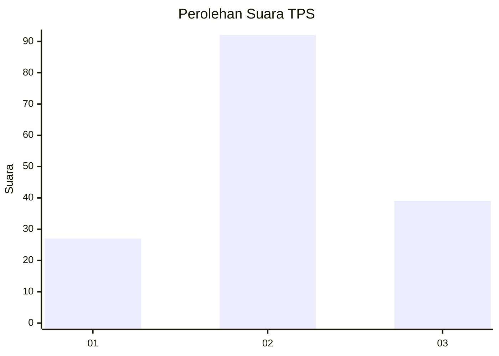
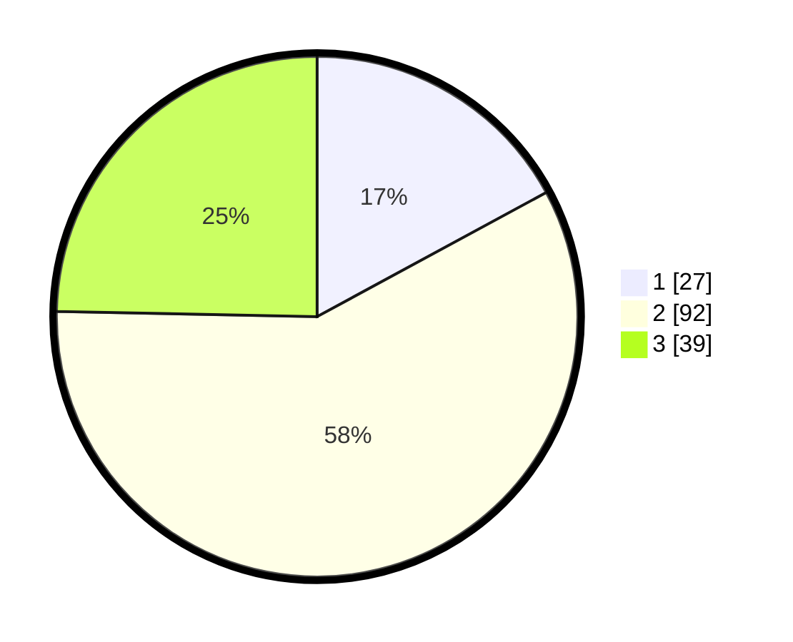

# Hasil

## Grafik

## Tabel

| No. | Nama Paslon    | Suara | Suara (raw) | Persentase |
|:--- |:-------------- | -----:| -----------:| ----------:|
| 1   | ANIES MUHAIMIN | 27    | [27][p-1]   | 17,09      |
| 2   | PRABOWO GIBRAN | 92    | [92][p-2]   | 58,23      |
| 3   | GANJAR MAHFUD  | 39    | [39][p-3]   | 24,68      |

[p-1]: https://github.com/gigit-pemilu/pemilu-2024-35-jawa-timur/blob/main/pilpres/hitung-suara/sub/35-jawa-timur/sub/11-bondowoso/sub/17-pakem/sub/2005-pakem/sub/003-tps/sub/paslon-1.txt
[p-2]: https://github.com/gigit-pemilu/pemilu-2024-35-jawa-timur/blob/main/pilpres/hitung-suara/sub/35-jawa-timur/sub/11-bondowoso/sub/17-pakem/sub/2005-pakem/sub/003-tps/sub/paslon-2.txt
[p-3]: https://github.com/gigit-pemilu/pemilu-2024-35-jawa-timur/blob/main/pilpres/hitung-suara/sub/35-jawa-timur/sub/11-bondowoso/sub/17-pakem/sub/2005-pakem/sub/003-tps/sub/paslon-3.txt

## Foto C Plano

https://sirekap-obj-formc.kpu.go.id/7557/pemilu/ppwp/35/11/17/20/05/3511172005003-20240214-215738--84f577ed-651d-4895-9eb1-e9e60b6d7809.jpg

https://sirekap-obj-formc.kpu.go.id/7557/pemilu/ppwp/35/11/17/20/05/3511172005003-20240214-215959--494ec4e5-babb-4583-bcba-0e23e3241cec.jpg

https://sirekap-obj-formc.kpu.go.id/7557/pemilu/ppwp/35/11/17/20/05/3511172005003-20240214-220203--9cc312cc-8a17-4f24-bb18-cbb5f1fdadf2.jpg

## Metadata

| Key        | Value               |
| ---------- | ------------------- |
| Time Stamp | 2024-02-15 21:30:27 |

