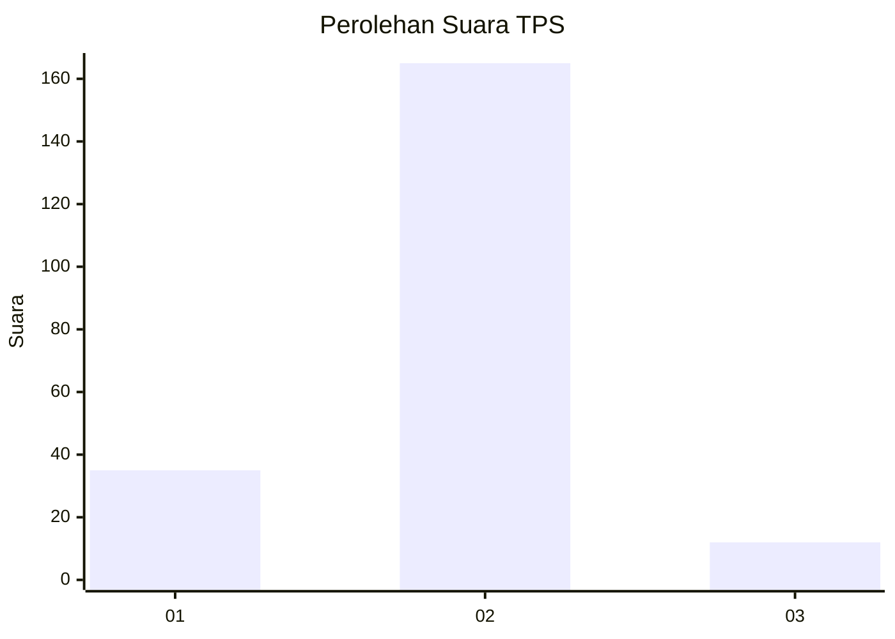
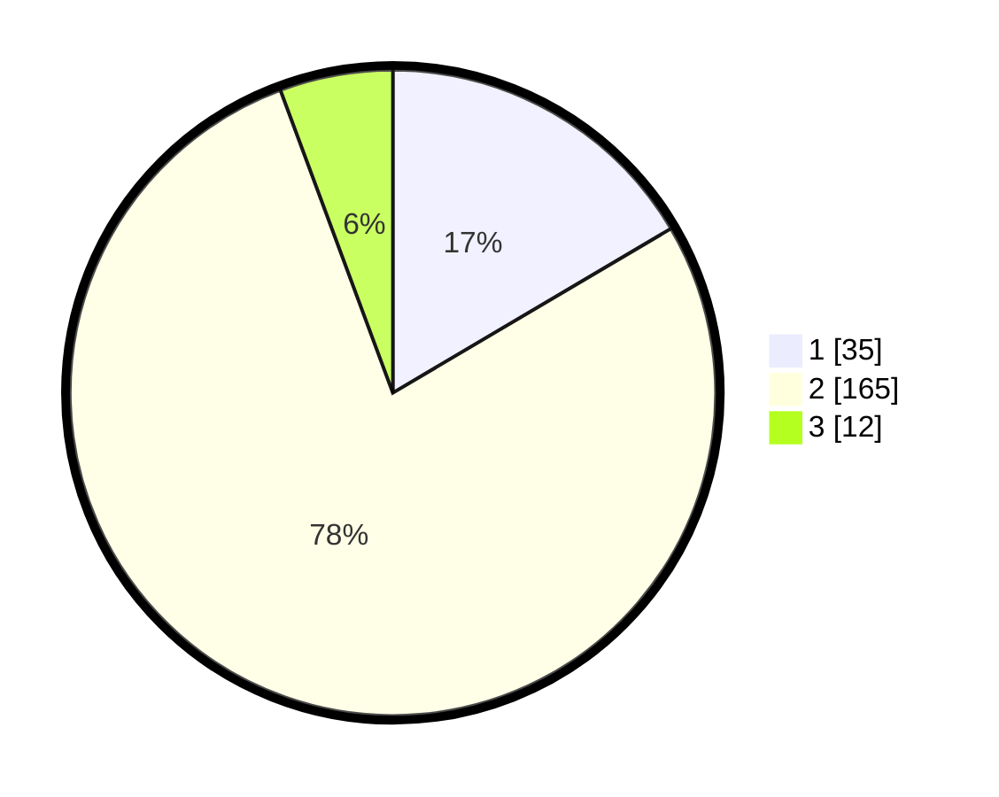

# Hasil

## Grafik

## Tabel

| No. | Nama Paslon    | Suara | Suara (raw) | Persentase |
|:--- |:-------------- | -----:| -----------:| ----------:|
| 1   | ANIES MUHAIMIN | 35    | [35][p-1]   | 16,51      |
| 2   | PRABOWO GIBRAN | 165   | [165][p-2]  | 77,83      |
| 3   | GANJAR MAHFUD  | 12    | [12][p-3]   | 5,66       |

[p-1]: https://github.com/gigit-pemilu/pemilu-2024-35-jawa-timur/blob/main/pilpres/hitung-suara/sub/35-jawa-timur/sub/11-bondowoso/sub/18-sumberwringin/sub/2001-sukorejo/sub/004-tps/sub/paslon-1.txt
[p-2]: https://github.com/gigit-pemilu/pemilu-2024-35-jawa-timur/blob/main/pilpres/hitung-suara/sub/35-jawa-timur/sub/11-bondowoso/sub/18-sumberwringin/sub/2001-sukorejo/sub/004-tps/sub/paslon-2.txt
[p-3]: https://github.com/gigit-pemilu/pemilu-2024-35-jawa-timur/blob/main/pilpres/hitung-suara/sub/35-jawa-timur/sub/11-bondowoso/sub/18-sumberwringin/sub/2001-sukorejo/sub/004-tps/sub/paslon-3.txt

## Foto C Plano

https://sirekap-obj-formc.kpu.go.id/4ff4/pemilu/ppwp/35/11/18/20/01/3511182001004-20240214-211633--6ce7b673-1283-4e76-989c-dc677efd11fe.jpg

https://sirekap-obj-formc.kpu.go.id/4ff4/pemilu/ppwp/35/11/18/20/01/3511182001004-20240214-214303--8f11a376-b95c-4399-9dd8-0f6f0ea587e8.jpg

https://sirekap-obj-formc.kpu.go.id/4ff4/pemilu/ppwp/35/11/18/20/01/3511182001004-20240214-214331--5cb934c0-c1a6-466e-9e2c-ab12d1ff7b4a.jpg

## Metadata

| Key        | Value               |
| ---------- | ------------------- |
| Time Stamp | 2024-02-16 08:30:27 |

