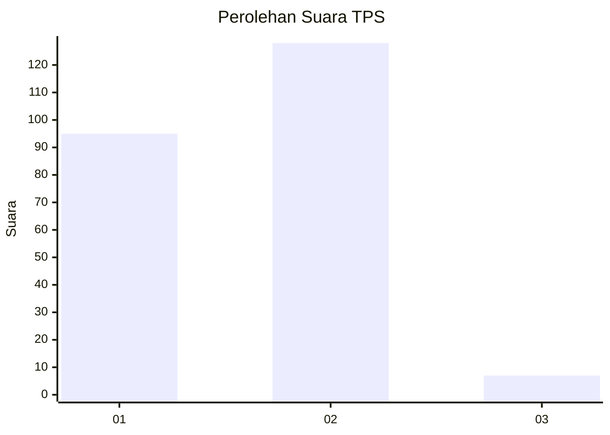
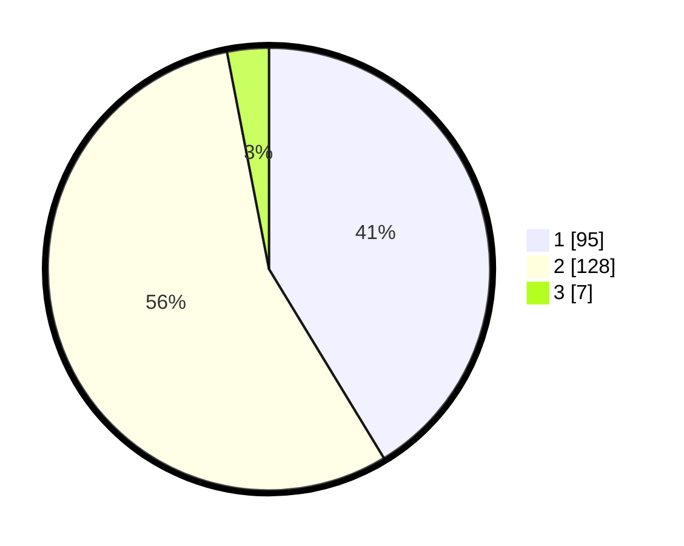

# Hasil

## Grafik

## Tabel

| No. | Nama Paslon    | Suara | Suara (raw) | Persentase |
|:--- |:-------------- | -----:| -----------:| ----------:|
| 1   | ANIES MUHAIMIN | 95    | [95][p-1]   | 41,30      |
| 2   | PRABOWO GIBRAN | 128   | [128][p-2]  | 55,65      |
| 3   | GANJAR MAHFUD  | 7     | [7][p-3]    | 3,04       |

[p-1]: https://github.com/gigit-pemilu/pemilu-2024-35-jawa-timur/blob/main/pilpres/hitung-suara/sub/35-jawa-timur/sub/11-bondowoso/sub/18-sumberwringin/sub/2002-sumber-gading/sub/007-tps/sub/paslon-1.txt
[p-2]: https://github.com/gigit-pemilu/pemilu-2024-35-jawa-timur/blob/main/pilpres/hitung-suara/sub/35-jawa-timur/sub/11-bondowoso/sub/18-sumberwringin/sub/2002-sumber-gading/sub/007-tps/sub/paslon-2.txt
[p-3]: https://github.com/gigit-pemilu/pemilu-2024-35-jawa-timur/blob/main/pilpres/hitung-suara/sub/35-jawa-timur/sub/11-bondowoso/sub/18-sumberwringin/sub/2002-sumber-gading/sub/007-tps/sub/paslon-3.txt

## Foto C Plano

https://sirekap-obj-formc.kpu.go.id/0686/pemilu/ppwp/35/11/18/20/02/3511182002007-20240215-003504--9cc652df-3c9e-4721-a0d9-f06ed8a7fa6d.jpg

https://sirekap-obj-formc.kpu.go.id/0686/pemilu/ppwp/35/11/18/20/02/3511182002007-20240215-003605--ff7ea96c-1059-4b31-90d0-eb9e44b446cd.jpg

https://sirekap-obj-formc.kpu.go.id/0686/pemilu/ppwp/35/11/18/20/02/3511182002007-20240215-003652--bc575bb3-b974-45cf-9846-14ace14cddea.jpg

## Metadata

| Key        | Value               |
| ---------- | ------------------- |
| Time Stamp | 2024-02-16 09:30:28 |

