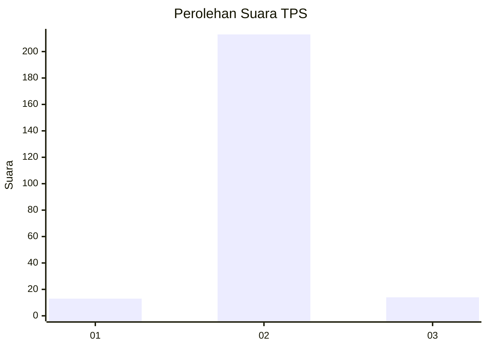
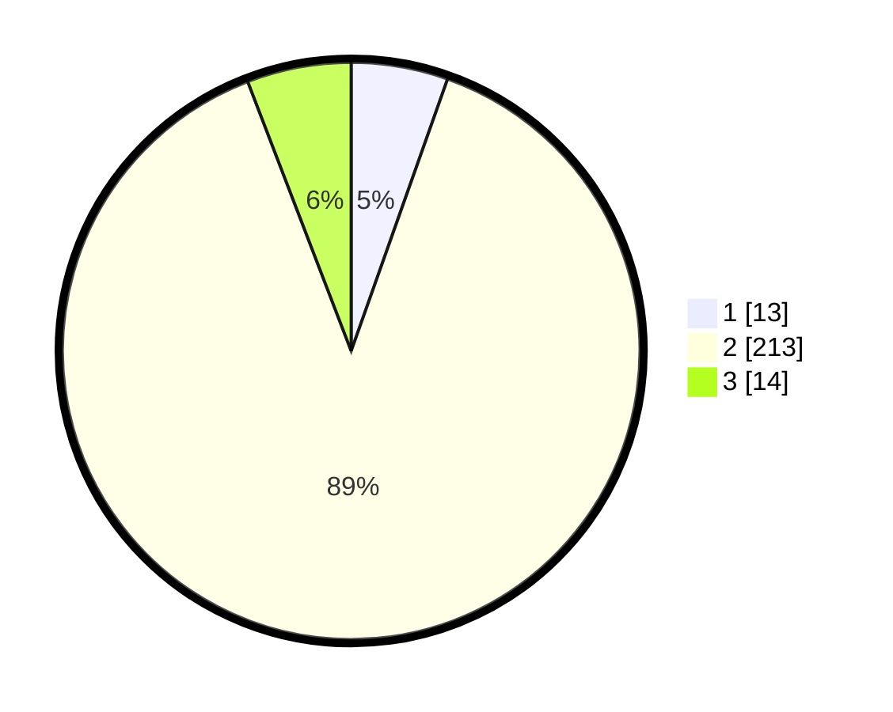

# Hasil

## Grafik

## Tabel

| No. | Nama Paslon    | Suara | Suara (raw) | Persentase |
|:--- |:-------------- | -----:| -----------:| ----------:|
| 1   | ANIES MUHAIMIN | 13    | [13][p-1]   | 5,42       |
| 2   | PRABOWO GIBRAN | 213   | [213][p-2]  | 88,75      |
| 3   | GANJAR MAHFUD  | 14    | [14][p-3]   | 5,83       |

[p-1]: https://github.com/gigit-pemilu/pemilu-2024-35-jawa-timur/blob/main/pilpres/hitung-suara/sub/35-jawa-timur/sub/11-bondowoso/sub/18-sumberwringin/sub/2005-rejo-agung/sub/002-tps/sub/paslon-1.txt
[p-2]: https://github.com/gigit-pemilu/pemilu-2024-35-jawa-timur/blob/main/pilpres/hitung-suara/sub/35-jawa-timur/sub/11-bondowoso/sub/18-sumberwringin/sub/2005-rejo-agung/sub/002-tps/sub/paslon-2.txt
[p-3]: https://github.com/gigit-pemilu/pemilu-2024-35-jawa-timur/blob/main/pilpres/hitung-suara/sub/35-jawa-timur/sub/11-bondowoso/sub/18-sumberwringin/sub/2005-rejo-agung/sub/002-tps/sub/paslon-3.txt

## Foto C Plano

https://sirekap-obj-formc.kpu.go.id/da53/pemilu/ppwp/35/11/18/20/05/3511182005002-20240214-223837--1004aef3-9223-4b68-b12c-91505d17ade2.jpg

https://sirekap-obj-formc.kpu.go.id/da53/pemilu/ppwp/35/11/18/20/05/3511182005002-20240214-225000--5472e51e-54c4-490c-8a67-bfbdcf9bd176.jpg

https://sirekap-obj-formc.kpu.go.id/da53/pemilu/ppwp/35/11/18/20/05/3511182005002-20240214-225111--03b6b8fa-ce9b-4997-b762-0d7e82866a82.jpg

## Metadata

| Key        | Value               |
| ---------- | ------------------- |
| Time Stamp | 2024-02-16 08:30:27 |

