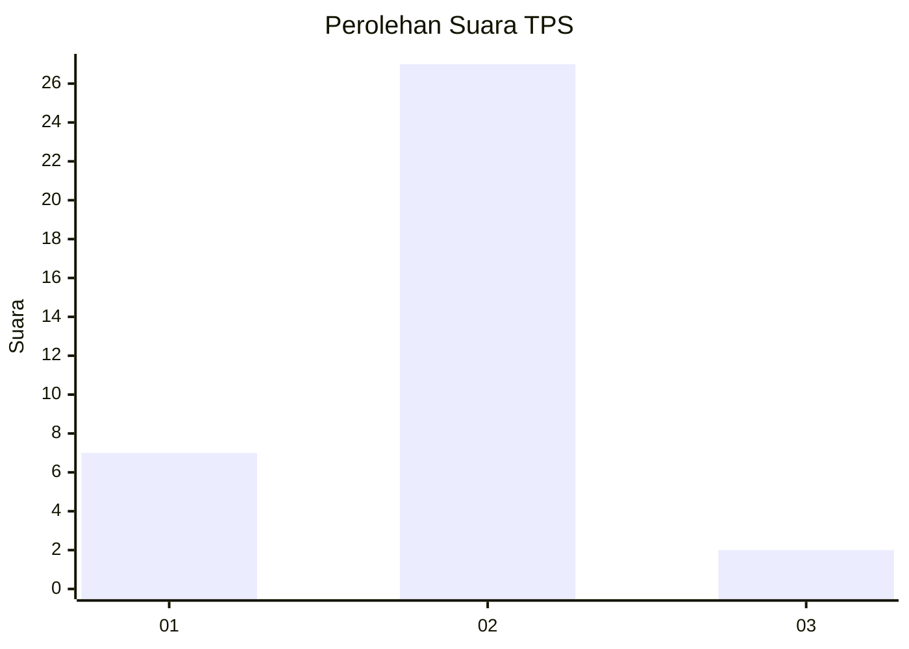
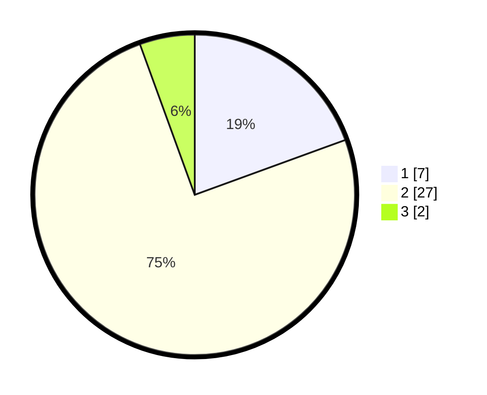

# Hasil

## Grafik

## Tabel

| No. | Nama Paslon    | Suara | Suara (raw) | Persentase |
|:--- |:-------------- | -----:| -----------:| ----------:|
| 1   | ANIES MUHAIMIN | 7     | [7][p-1]    | 19,44      |
| 2   | PRABOWO GIBRAN | 27    | [27][p-2]   | 75,00      |
| 3   | GANJAR MAHFUD  | 2     | [2][p-3]    | 5,56       |

[p-1]: https://github.com/gigit-pemilu/pemilu-2024-35-jawa-timur/blob/main/pilpres/hitung-suara/sub/35-jawa-timur/sub/11-bondowoso/sub/18-sumberwringin/sub/2005-rejo-agung/sub/020-tps/sub/paslon-1.txt
[p-2]: https://github.com/gigit-pemilu/pemilu-2024-35-jawa-timur/blob/main/pilpres/hitung-suara/sub/35-jawa-timur/sub/11-bondowoso/sub/18-sumberwringin/sub/2005-rejo-agung/sub/020-tps/sub/paslon-2.txt
[p-3]: https://github.com/gigit-pemilu/pemilu-2024-35-jawa-timur/blob/main/pilpres/hitung-suara/sub/35-jawa-timur/sub/11-bondowoso/sub/18-sumberwringin/sub/2005-rejo-agung/sub/020-tps/sub/paslon-3.txt

## Foto C Plano

https://sirekap-obj-formc.kpu.go.id/978c/pemilu/ppwp/35/11/18/20/05/3511182005020-20240215-145805--b64688b5-b39c-4f72-9539-78c9f57352d5.jpg

https://sirekap-obj-formc.kpu.go.id/978c/pemilu/ppwp/35/11/18/20/05/3511182005020-20240215-150133--91ef13d2-48f8-4076-a05c-7ed011472a53.jpg

https://sirekap-obj-formc.kpu.go.id/978c/pemilu/ppwp/35/11/18/20/05/3511182005020-20240215-145825--fe076c26-5e83-42f1-a0f4-e55953c18be9.jpg

## Metadata

| Key        | Value               |
| ---------- | ------------------- |
| Time Stamp | 2024-02-16 09:30:28 |

